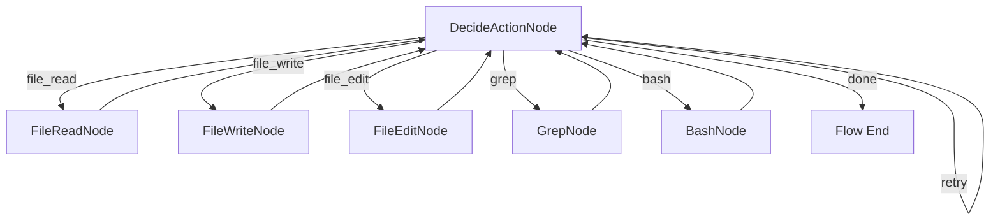

# PaperClaw v0.01：最小 ReAct 编码 Agent SOP

> 版本：v0.01  
> 状态：已完成 
> 类型：首个工程实施 SOP  
> 日期：2026-07-13  
> 目标：使用 PocketFlow 实现可以理解指令、读写文件并执行代码的最小 ReAct Agent  
> 范围约束：本 SOP 只定义实施步骤，不在本轮实现代码

## 目录

- [1. 任务结论](#1-任务结论)
- [2. 背景与目标](#2-背景与目标)
- [3. 范围与非目标](#3-范围与非目标)
- [4. 技术基线](#4-技术基线)
- [5. ReAct 闭环](#5-react-闭环)
- [6. 工具契约](#6-工具契约)
- [7. 最小状态契约](#7-最小状态契约)
- [8. 目录与文件规划](#8-目录与文件规划)
- [9. 分阶段实施步骤](#9-分阶段实施步骤)
- [10. Prompt 与输出契约](#10-prompt-与输出契约)
- [11. 安全与失败边界](#11-安全与失败边界)
- [12. 测试与验收](#12-测试与验收)
- [13. 交付物](#13-交付物)
- [14. 完成定义](#14-完成定义)
- [15. 后续版本边界](#15-后续版本边界)
- [16. 参考资料](#16-参考资料)

---

## 1. 任务结论

v0.01 只实现一个最小但真实可运行的 Coding Agent 地基：

```text
用户任务
  ↓
模型观察任务与历史
  ↓
模型选择一个工具并给出结构化参数
  ↓
PocketFlow 按 action 路由到工具节点
  ↓
工具执行并返回 Observation
  ↓
结果写入 history
  ↓
继续下一轮，或由模型返回 done
```

完成后，Agent 应能够执行如下演示任务：

> 在工作区创建一个 Python 文件，实现两个整数相加；运行文件验证输出。如果结果错误，定位并修改，最后报告完成。

本版本不追求自主规划、长期记忆、上下文压缩、TUI、RAG 或多 Agent。v0.01 的唯一目标是证明 **Reasoning → Acting → Observation → Reasoning** 闭环真实成立。

---

## 2. 背景与目标

### 2.1 背景

PaperClaw 的后续 Context、Permission、Session、Trace、Eval 和 SeededResearch 都依赖一个稳定的 Agent Loop。如果最小工具循环没有独立跑通，过早加入复杂能力只会扩大调试面。

PocketFlow 官方核心提供：

- `Node.prep(shared)`：从共享状态准备输入；
- `Node.exec(prep_res)`：执行节点核心逻辑；
- `Node.post(shared, prep_res, exec_res)`：写回状态并返回 action；
- `Flow`：根据 action 在节点之间路由；
- `shared`：在节点间传递状态。

官方 Coding Agent 示例同样采用“决策节点选择一个工具、工具节点执行、再回到决策节点”的循环。本项目 v0.01 采用相同的最小控制思想，但工具契约、路径安全、错误模型和测试由 PaperClaw 自己定义。

### 2.2 本版本目标

- 接收一条自然语言 Coding 任务；
- 模型每轮只选择一个工具；
- 支持读、写、精确编辑、搜索和命令执行；
- 工具结果进入下一轮模型上下文；
- 支持明确的 `done` 结束动作；
- 对非法工具、非法参数、越界路径和命令超时给出可恢复 Observation；
- 对循环设置硬上限，确保 Agent 有界退出；
- 使用 fixture / fake model 完成离线确定性回归；
- 至少使用一个真实模型完成一次手工 smoke test。

---

## 3. 范围与非目标

### 3.1 In Scope

- PocketFlow `Node / Flow / shared / action routing`；
- 最小 ReAct 循环；
- `FileReadTool`；
- `FileWriteTool`；
- `FileEditTool`；
- `GrepTool`；
- `BashTool`；
- 内部结束动作 `done`；
- 工作区路径边界；
- 工具参数校验；
- 最大步数、命令超时和输出截断；
- 结构化 history；
- 单元测试、离线 Agent Loop 测试和一个真实模型 smoke test。

### 3.2 Out of Scope

以下能力明确延后，不得在 v0.01 顺手加入：

- Context Compaction；
- 长期 Memory；
- Session Resume 和数据库；
- 完整 Permission Engine 和 Human-in-the-loop 弹窗；
- TUI / Web UI；
- RAG、QueryEngine 和联网搜索；
- 多 Agent、Subagent 和 Reflection；
- 自动加载 Skill；
- AGENTS.md 分层解析；
- MCP；
- Git 自动提交；
- 复杂 Patch SubFlow、模糊匹配或 AST Edit；
- 流式模型输出；
- 多 Provider fallback。

若执行中发现上述需求，只记录到 v0.02+ 候选，不扩张当前 SOP。

---

## 4. 技术基线

### 4.1 运行环境

- Python：遵循 `pyproject.toml` 已声明版本；若尚未声明明确下限，执行前固定为 Python 3.11+；
- 操作系统：Windows 11 / PowerShell；
- 控制流：`pocketflow`；
- 数据模型：优先使用项目已有方案；若项目尚无约定，v0.01 可使用标准库 `dataclasses` 与显式 validator；
- 测试：`pytest`；
- 模型接口：定义最小 `ChatModel` Protocol，具体 Provider 放在 adapter 中。

### 4.2 PocketFlow 使用边界

v0.01 使用 PocketFlow 负责：

- 节点生命周期；
- action routing；
- ReAct 循环控制；
- 共享状态传递。

PocketFlow 不负责：

- 工具实现；
- 路径安全；
- Shell 安全；
- 模型 JSON 校验；
- Trace 持久化；
- 权限策略；
- Session 和 Memory。

不得把所有业务逻辑堆进单个 PocketFlow Node，也不得直接修改 PocketFlow 源码来适配本项目。

### 4.3 依赖策略

执行前先确认 PocketFlow 的安装方式和当前版本，再进行依赖变更。依赖必须固定到可复现范围并记录实际版本。不得复制官方仓库整份 Coding Agent 进入项目。

---

## 5. ReAct 闭环

### 5.1 最小节点

v0.01 只需要两个节点类型：

1. `DecideActionNode`
   - 读取任务、工具说明和 history；
   - 调用模型；
   - 解析并校验单个 `ToolCall`；
   - 返回工具名称作为 PocketFlow action；
   - 模型返回 `done` 或达到最大步数时结束。

2. `ExecuteToolNode`
   - 每个工具一个清晰节点，或共享一个基类；
   - 从 `shared.current_tool_call` 读取参数；
   - 调用 Tool Registry 中对应工具；
   - 将结构化结果追加到 history；
   - 返回默认 action，重新进入 `DecideActionNode`。

### 5.2 Flow 路由



### 5.3 一轮循环定义

一次 step 由以下动作组成：

1. 编译最小 Prompt；
2. 调用一次模型；
3. 解析一个 Tool Call；
4. 执行零个或一个工具；
5. 记录一个 Observation；
6. 增加 `step_count`；
7. 路由到下一节点或结束。

禁止模型在一个响应中提交多个并行工具调用。并行工具属于后续版本。

---

## 6. 工具契约

所有工具实现统一接口：

```python
class Tool(Protocol):
    name: str
    description: str

    def validate(self, arguments: dict) -> None: ...
    def execute(self, arguments: dict, context: ToolContext) -> ToolResult: ...
```

统一结果：

```python
@dataclass
class ToolResult:
    ok: bool
    output: str
    error_code: str | None = None
    metadata: dict = field(default_factory=dict)
```

工具抛出的可预期错误必须转换成 `ToolResult(ok=False)`，作为 Observation 返回模型，不能使整个 Flow crash。

### 6.1 `FileReadTool`

| 项目 | 约束 |
|---|---|
| 功能 | 读取工作区内文本文件 |
| 必填参数 | `path` |
| 可选参数 | `start_line`、`end_line` |
| 输出 | 带行号文本和文件元数据 |
| 边界 | 只允许工作区内规范化后的文件路径 |
| 错误 | 文件不存在、路径越界、不是文件、无法解码、范围非法 |

要求：

- 默认限制最大读取行数或字符数；
- 输出被截断时必须标记 `truncated=true`；
- 不读取目录；
- 不静默替换编码错误。

### 6.2 `FileWriteTool`

| 项目 | 约束 |
|---|---|
| 功能 | 创建或覆写工作区内文本文件 |
| 必填参数 | `path`、`content` |
| 可选参数 | `overwrite`，默认 `false` |
| 输出 | 写入路径、字符数、created/overwritten 状态 |
| 边界 | 只允许工作区内路径；父目录策略必须显式 |
| 错误 | 路径越界、文件已存在且未允许覆写、父目录不存在、写入失败 |

要求：

- 创建与覆写语义必须区分；
- 默认不得静默覆盖已有文件；
- v0.01 不自动创建任意多层父目录，除非参数契约明确允许；
- 写入采用 UTF-8；
- 原子写入可延后，但必须登记为 v0.02 风险。

### 6.3 `FileEditTool`

| 项目 | 约束 |
|---|---|
| 功能 | 在单个文件中精确替换一个片段 |
| 必填参数 | `path`、`old_text`、`new_text` |
| 输出 | 修改路径与替换次数 |
| 成功条件 | `old_text` 在文件中恰好出现一次 |
| 错误 | 0 次匹配、多次匹配、路径越界、解码或写入失败 |

要求：

- v0.01 只做 exact replacement；
- 0 次和多次匹配都拒绝修改，并把原因返回模型；
- 不实现 fuzzy patch；
- 不用全文件重写伪装“精确编辑”；
- 修改后再次读取目标片段应可验证结果。

### 6.4 `GrepTool`

| 项目 | 约束 |
|---|---|
| 功能 | 在工作区文件中进行正则搜索 |
| 必填参数 | `pattern` |
| 可选参数 | `path`、`glob`、`max_results` |
| 输出 | `path:line:content` 列表 |
| 边界 | 只搜索工作区内文件 |
| 错误 | 非法正则、路径越界、不可读文件 |

要求：

- 优先调用系统 `rg`；若不可用，使用明确的 Python fallback；
- 默认跳过 `.git`、虚拟环境、构建目录和二进制文件；
- 结果达到上限时标记截断；
- “无匹配”是成功结果，不是异常。

### 6.5 `BashTool`

`BashTool` 是 Agent 侧通用名称。在 Windows 环境中，底层可以使用 PowerShell / 当前项目 shell adapter，但工具契约保持稳定。

| 项目 | 约束 |
|---|---|
| 功能 | 在工作区作为 `cwd` 执行单条命令 |
| 必填参数 | `command` |
| 可选参数 | `timeout_seconds`，不得超过系统上限 |
| 输出 | `stdout`、`stderr`、`exit_code`、`timed_out`、`duration_ms` |
| 边界 | cwd 固定在工作区；环境变量采用显式 allowlist |
| 错误 | 超时、无法启动、输出过长、非零退出码 |

要求：

- 非零退出码作为正常 ToolResult 返回模型，不使 Flow crash；
- 默认超时建议 30 秒，系统硬上限建议 60 秒；
- stdout/stderr 必须限制长度并注明截断；
- 不把 `.env`、API Key 或完整环境变量注入结果；
- v0.01 不支持后台常驻进程和交互命令；
- v0.01 不允许 Agent 自主安装依赖。若任务确需安装，返回明确受限错误，留到 Permission 版本处理；
- 对明显越界或破坏性命令执行最小 denylist 防护，但必须注明这不是完整 Permission Engine。

#### BashTool 设计复核与后续演进

参考 Claude Code 的 BashTool 后，确认 Bash 不应长期停留在 `subprocess.run()` 的薄封装，而应逐步演进为正式的命令执行子系统。v0.01 不追求完整实现，但必须保留以下扩展边界：

- **语义分类**：命令进入执行器前应可分类为 `read`、`search`、`list`、`test`、`build`、`package`、`git`、`write`、`destructive` 或 `unknown`；分类结果供 Permission、Trace 和 TUI 使用。
- **专用工具优先**：已存在 FileRead、Grep、FileEdit 等专用工具时，Prompt 应引导模型优先使用专用工具；Bash 不是绕过工具契约和路径策略的后门。
- **结构化执行结果**：除 stdout/stderr 外，预留 `command_class`、`task_id`、`started_at`、`duration_ms`、`exit_code`、`timed_out`、`truncated` 和 `termination_reason`。
- **命令解析边界**：不得只靠字符串包含关系判断安全；后续版本应解析管道、重定向、逻辑操作符和多命令组合。无法可靠解析时按较高风险处理。
- **任务化执行**：长测试、构建和服务进程最终进入 Shell Task 系统，支持前台/后台、进度、通知、中断和结果回流；v0.01 仍只允许前台、非交互、短命令。
- **Sandbox / Read-only**：后续由 Permission 与 Harness 层决定是否进入 sandbox、是否限制为只读，以及是否需要用户确认；BashTool 本身不能成为唯一策略拥有者。
- **平台适配**：Agent 侧继续使用稳定的 `BashTool` 名称，Windows 后端明确记录实际 shell 为 PowerShell，不能假设 POSIX Bash 语法成立。

v0.01 的验收不追加后台任务、完整 AST 安全分析或 sandbox，避免追改已经完成的最小地基；上述能力分别进入 Verify/Reflection、Harness 与 Claw 交互层版本。

### 6.6 内部 `done` 动作

`done` 是 Flow 的终止动作，不进入 Tool Registry。

参数：

```json
{
  "result": "完成了什么",
  "verification": "如何验证",
  "remaining_issues": []
}
```

如果模型未提供验证证据，允许结束，但 `verification_status` 必须标记为 `unverified`。

---

## 7. 最小状态契约

PocketFlow `shared` 只保存本轮运行需要的结构化状态：

```python
shared = {
    "task": str,
    "workspace": Path,
    "history": list[HistoryEntry],
    "current_tool_call": ToolCall | None,
    "step_count": int,
    "max_steps": int,
    "result": str | None,
    "stop_reason": str | None,
}
```

建议的历史项：

```python
@dataclass
class HistoryEntry:
    step: int
    tool: str
    arguments: dict
    reason: str
    result: ToolResult
```

约束：

- `shared` 不存放模型 client、打开的文件句柄或 subprocess；
- 工具参数和结果必须可序列化，为后续 Trace / Replay 留接口；
- 不在 v0.01 引入长期 Session Store；
- 不把模型自由文本 Reasoning 当成可信状态；只保存简短 `reason` 作为可观察决策说明。

---

## 8. 目录与文件规划

执行者应先检查实际仓库结构，再在不破坏现有约定的前提下采用以下建议：

```text
src/paperclaw/
├── agent/
│   ├── flow.py
│   ├── nodes.py
│   ├── state.py
│   └── prompts.py
├── models/
│   ├── base.py
│   └── adapters/
├── tools/
│   ├── base.py
│   ├── registry.py
│   ├── file_read.py
│   ├── file_write.py
│   ├── file_edit.py
│   ├── grep.py
│   └── bash.py
└── cli.py

tests/
├── fixtures/
│   └── react_workspace/
├── unit/
│   ├── test_file_tools.py
│   ├── test_grep_tool.py
│   ├── test_bash_tool.py
│   └── test_action_parser.py
└── integration/
    └── test_minimal_react_loop.py
```

如果当前仓库尚未采用 `src` layout，执行者不得为本 SOP 单独引入目录风格冲突；应先记录现状并选择最小一致方案。

---

## 9. 分阶段实施步骤

### Phase A：工程基线与依赖

- [x] A1. 阅读根 `AGENTS.md`、`CLAUDE.md` 和本 SOP。
- [x] A2. 检查 `pyproject.toml`、Python 版本、测试命令和现有 package layout。
- [x] A3. 记录执行前 `git status --short`；若仓库尚未初始化 Git，则记录该事实，不自行初始化。
- [x] A4. 核对 PocketFlow 当前安装方式和版本，加入最小依赖。
- [x] A5. 建立最小 package 与测试目录，不创建 TUI、数据库或 RAG 目录。
- [x] A6. 验证 `import pocketflow` 和空测试集可运行。

Phase A Gate：PocketFlow 可导入，项目测试入口明确，目录方案与现有仓库一致。

### Phase B：工具公共契约

- [x] B1. 定义 `Tool`、`ToolContext`、`ToolResult` 和工具错误类型。
- [x] B2. 实现 Tool Registry，工具名重复注册必须失败。
- [x] B3. 实现工作区路径规范化函数。
- [x] B4. 拒绝绝对越界路径、`..` 穿越和符号链接 / junction 逃逸。
- [x] B5. 为工具参数实现显式校验，不依赖模型自觉。
- [x] B6. 为输出统一实现长度上限与截断元数据。

Phase B Gate：所有工具共享相同调用与错误模型；路径安全测试通过。

### Phase C：五个工具

- [x] C1. 实现 `FileReadTool` 及行范围、截断测试。
- [x] C2. 实现 `FileWriteTool` 及创建、拒绝静默覆写测试。
- [x] C3. 实现 `FileEditTool` 及唯一匹配、零匹配、多匹配测试。
- [x] C4. 实现 `GrepTool` 及正则、无匹配、结果上限测试。
- [x] C5. 实现 `BashTool` 及成功、非零退出、超时、输出截断测试。
- [x] C6. 验证五个工具都无法访问工作区外路径。
- [x] C7. 验证工具错误都转化为 Observation，不导致测试进程崩溃。

Phase C Gate：五个工具的正向和关键失败路径均有单元测试。

### Phase D：模型输出与决策节点

- [x] D1. 定义最小 `ChatModel` Protocol。
- [x] D2. 定义 `ToolCall` 和 `DoneAction` Schema。
- [x] D3. 编写最小 System Prompt 和工具描述编译器。
- [x] D4. 实现 JSON 提取、Schema 校验和未知工具处理。
- [x] D5. 实现一次 repair retry；仍失败则生成可解释错误并有界退出或重试。
- [x] D6. 实现 `DecideActionNode.prep/exec/post`。
- [x] D7. 使用 FakeModel 测试 read → write → bash → done 决策序列。

Phase D Gate：模型输出无效 JSON、缺字段、未知工具时不会 crash；合法输出准确路由。

### Phase E：PocketFlow ReAct Loop

- [x] E1. 为五个工具建立 PocketFlow 执行节点。
- [x] E2. 使用 action routing 连接 `DecideActionNode` 和工具节点。
- [x] E3. 工具执行后将 Observation 追加到 history，并返回决策节点。
- [x] E4. 实现 `done` 终止动作。
- [x] E5. 实现 `max_steps` 硬上限和明确 `stop_reason=max_steps`。
- [x] E6. 实现最小 CLI 入口：接收任务、工作区和最大步数。
- [x] E7. 确认 CLI 只调用 Runtime，不直接实现工具业务逻辑。

Phase E Gate：离线 FakeModel 可以稳定完成完整工具循环，或在最大步数时有界退出。

### Phase F：端到端验证

- [x] F1. 建立临时 fixture workspace，不在真实项目文件上运行写测试。
- [x] F2. 离线执行“创建 Python 文件并运行验证”案例。
- [x] F3. 离线执行“读取已有错误代码、精确修改并重新运行”案例。
- [x] F4. 离线执行“搜索函数位置、读取、编辑、测试”案例。
- [x] F5. 执行路径逃逸、命令超时、非法 JSON、未知工具和死循环测试。
- [x] F6. 使用用户当前可用的真实模型执行一次受控 smoke test。
- [x] F7. 保存真实运行的工具序列、输出、耗时和最终状态。
- [x] F8. 对照验收矩阵判断 GO / REVISE / NO-GO。

Phase F Gate：至少两个离线端到端案例稳定通过；真实模型案例能完成或给出可解释失败证据。

### Phase G：留档与审查

- [x] G1. 更新 README 的最小运行说明，但不提前描述后续能力。
- [x] G2. 在 `artifacts/v0_01/` 保存测试摘要、演示 Trace 和已知限制。
- [x] G3. 检查实现与本 SOP、`docs/desgin` 是否一致。
- [x] G4. 按根 `AGENTS.md` 要求运行 SOP 完成度检查。
- [x] G5. 完成独立代码 Review，重点检查路径边界、Shell 执行、错误恢复和测试真实性。
- [x] G6. 仅在用户明确要求时执行 Git commit / push；不得因旧规则自动提交。

---

## 10. Prompt 与输出契约

### 10.1 最小 Prompt 分区

v0.01 Prompt 只包含：

```text
[Identity]
你是工作区内的最小 Coding Agent。

[Rules]
先观察再修改；一次只选一个工具；不得声称未执行的结果。

[Workspace]
工作区根路径与平台信息。

[Tools]
工具名称、用途和参数 Schema。

[Task]
用户当前任务。

[History]
此前工具调用和 Observation。

[Output Contract]
只返回一个合法 JSON object。
```

禁止在 v0.01 System Prompt 中加入长篇科研规则、Memory、TUI、RAG 或未来 Roadmap。

### 10.2 Tool Call 输出

```json
{
  "action": "file_read",
  "arguments": {
    "path": "src/example.py",
    "start_line": 1,
    "end_line": 200
  },
  "reason": "先阅读文件，确认现有实现后再修改"
}
```

约束：

- `action` 必须是五个工具之一或 `done`；
- `arguments` 必须是 object；
- `reason` 是简短可审计说明，不要求或保存自由 Chain-of-Thought；
- 输出中出现额外 prose 时由 parser 拒绝或 repair，不静默猜测多个动作。

### 10.3 Observation 编译

下一轮只向模型提供必要字段：

```text
[Step 3]
Tool: bash
Arguments: {"command": "python demo.py"}
Status: failed
Exit code: 1
Output:
Traceback ...
```

输出过长必须截断，并向模型明确说明可通过更精确的 Read / Grep 再获取信息。

---

## 11. 安全与失败边界

### 11.1 最小安全基线

v0.01 尚无完整 Permission Engine，但以下边界不可省略：

- 所有文件工具限定在 `workspace_root`；
- 路径检查使用解析后的最终路径，而不是字符串前缀；
- Bash cwd 固定为工作区；
- 命令设置硬超时和输出上限；
- 不向模型或 Trace 泄露 `.env`、API Key 和完整环境；
- 不允许后台进程和等待用户输入的交互命令；
- 不允许自主安装依赖；
- 测试写入只发生在临时 fixture workspace；
- 工具返回不得假装成功。

### 11.2 失败分类

| 类型 | 示例 | v0.01 行为 |
|---|---|---|
| `validation_error` | 缺少 path | 返回 Observation，允许模型修正 |
| `path_denied` | `../../secret` | 拒绝执行并记录 |
| `not_found` | 文件不存在 | 返回 Observation |
| `conflict` | Edit 多重匹配 | 拒绝修改并要求更多上下文 |
| `command_failed` | exit code 1 | 返回 stdout/stderr/exit code |
| `timeout` | 命令超时 | 终止子进程并返回 timed_out |
| `invalid_model_output` | 非法 JSON | repair 一次，然后有界处理 |
| `unknown_action` | 不存在的工具 | 返回合法工具列表 |
| `max_steps` | 循环未结束 | 强制终止并标记未完成 |
| `internal_error` | 未预期异常 | 记录错误类型，停止当前运行 |

### 11.3 硬停止条件

- 达到 `max_steps`；
- 同一非法模型输出连续达到配置上限；
- 工作区状态无法确定；
- 工具执行出现可能影响工作区外数据的异常；
- 内部状态契约损坏。

---

## 12. 测试与验收

### 12.1 单元测试矩阵

| 编号 | 对象 | 场景 | 通过标准 |
|---|---|---|---|
| U-01 | Path Guard | 工作区内相对路径 | 正确解析 |
| U-02 | Path Guard | `..` 越界 | 拒绝 |
| U-03 | Path Guard | symlink/junction 逃逸 | 拒绝 |
| U-04 | FileRead | 正常读取和行范围 | 内容与行号正确 |
| U-05 | FileRead | 大文件 | 截断且带元数据 |
| U-06 | FileWrite | 创建新文件 | UTF-8 内容正确 |
| U-07 | FileWrite | 默认覆写已有文件 | 拒绝 |
| U-08 | FileEdit | 唯一匹配 | 只替换一次 |
| U-09 | FileEdit | 0 次或多次匹配 | 不修改文件 |
| U-10 | Grep | 合法正则 | 返回路径和行号 |
| U-11 | Grep | 无匹配 | 成功返回空结果 |
| U-12 | Grep | 非法正则 | validation error |
| U-13 | Bash | 成功命令 | exit code 0 |
| U-14 | Bash | 失败命令 | 保留非零退出码 |
| U-15 | Bash | 超时命令 | 子进程终止 |
| U-16 | Parser | 合法 Tool Call | Schema 正确 |
| U-17 | Parser | 非法 JSON / 未知工具 | 可解释失败，不 crash |

### 12.2 离线 Agent Loop 测试

使用 FakeModel 返回固定动作序列，不消耗 API：

| 编号 | 动作序列 | 最终状态 |
|---|---|---|
| I-01 | write → bash → done | 文件创建、输出正确、完成 |
| I-02 | read → edit → bash → done | 文件修改、测试通过 |
| I-03 | grep → read → edit → bash → done | 定位、修改、验证成功 |
| I-04 | read 越界 → read 合法 → done | 错误可恢复 |
| I-05 | 未知 action → 合法 action → done | 路由可恢复 |
| I-06 | 重复无效动作 | `max_steps` 有界退出 |

### 12.3 真实模型 Smoke Test

真实模型只在临时 fixture workspace 内执行：

```text
任务：创建 hello.py，使其输出 "PaperClaw v0.01 OK"，运行并验证结果。
```

通过标准：

- 模型选择合法工具；
- 文件位于 fixture workspace；
- 命令真实执行；
- stdout 包含目标字符串；
- 最终 `done.verification` 引用真实工具结果；
- 总步数不超过 8；
- 无工作区外写入；
- 无依赖安装。

### 12.4 MVP 验收门槛

| 指标 | 门槛 |
|---|---:|
| 五个工具单元测试 | 全部通过 |
| 路径逃逸测试 | 0 次成功逃逸 |
| 离线 ReAct 用例 | 6/6 通过 |
| 非预期 crash | 0 |
| 最大步数执行 | 100% 生效 |
| 命令超时执行 | 100% 生效 |
| 真实模型 smoke | 至少 1 次完成，或有完整可解释失败 Trace |
| 未执行结果伪报 | 0 |

### 12.5 GO / REVISE / NO-GO

- `GO`：五个工具、离线 Loop 和安全边界全部通过，真实模型至少能完成受控任务。
- `REVISE`：核心循环成立，但模型输出稳定性或某个非安全工具路径仍需修复。
- `NO-GO`：存在工作区逃逸、命令无法终止、工具结果被伪造，或 Flow 无法有界退出。

安全相关失败不得以“Demo 能跑”为由降级通过。

---

## 13. 交付物

执行完成后，`artifacts/v0_01/` 至少包含：

```text
artifacts/v0_01/
├── implementation_summary.md
├── test_report.md
├── demo_trace.json
├── known_limitations.md
└── file_manifest.txt
```

交付物要求：

- `implementation_summary.md`：实际实现、关键取舍、与 SOP 的偏差；
- `test_report.md`：命令、通过数、失败数和环境；
- `demo_trace.json`：真实或离线演示的结构化动作序列；
- `known_limitations.md`：v0.01 明确未解决的问题；
- `file_manifest.txt`：本 Phase 新增和修改的文件列表。

不得在交付物中保存 API Key、`.env` 内容或无截断的敏感命令输出。

---

## 14. 完成定义

只有同时满足以下条件，v0.01 才能宣告完成：

- [x] PocketFlow 依赖可复现安装和导入；
- [x] ReAct Flow 真实使用 PocketFlow action routing；
- [x] 五个工具均实现统一契约；
- [x] `FileWriteTool` 不会默认静默覆写；
- [x] `FileEditTool` 只允许唯一 exact match；
- [x] 文件工具无法逃逸工作区；
- [x] `BashTool` 有 cwd、超时和输出上限；
- [x] 模型每轮最多调用一个工具；
- [x] 工具 Observation 进入下一轮 history；
- [x] 非法 JSON 和未知工具不会导致未处理 crash；
- [x] `done` 和 `max_steps` 都能正确结束 Flow；
- [x] FakeModel 离线回归全部通过；
- [x] 至少完成一次真实模型 smoke，或保存可解释失败证据；
- [x] README 只描述真实完成的能力；
- [x] `artifacts/v0_01/` 交付物齐全；
- [x] SOP 完成度 hook 已运行并报告结果；
- [x] 独立 Review 已检查安全边界和测试真实性。

---

## 15. 后续版本边界

v0.01 完成后按以下顺序推进：

- `v0.02`：Verify / Reflection，建立行动后的客观验证和有界反思；
- `v0.03`：MultiAgent，加入 Coordinator、Worker、Reviewer 的分工协作；
- `v0.04`：Context Engineering，加入 Task State、ContextItem、压缩与恢复；
- `v0.05`：Harness Engineering，加入 QueryEngine、Runtime Event、Permission、Trace、预算和任务治理；
- `v0.06`：Claw 交互层，加入 TUI、权限交互、Session 操作和可观察面板。

版本号不是当前承诺；应根据 v0.01 验证结果调整。

---

## 16. 参考资料

- [PocketFlow 官方仓库](https://github.com/The-Pocket/PocketFlow)
- [PocketFlow Coding Agent 示例](https://github.com/The-Pocket/PocketFlow/tree/main/cookbook/pocketflow-coding-agent)
- [`pocketflow/__init__.py`](https://github.com/The-Pocket/PocketFlow/blob/main/pocketflow/__init__.py)
- [Claude Code BashTool 解析](https://xuanyuancode.com/learn-claude-code/tutorials/cc14)
- [`docs/desgin/PaperClaw_项目方向路径与约束.md`](../docs/desgin/PaperClaw_项目方向路径与约束.md)
- [`docs/desgin/PaperClaw_上下文系统与提示词工程骨架.md`](../docs/desgin/PaperClaw_上下文系统与提示词工程骨架.md)
- [`docs/desgin/PaperAgent_校招向AgentRuntime_一周MVP与一月Roadmap.md`](../docs/desgin/PaperAgent_校招向AgentRuntime_一周MVP与一月Roadmap.md)

本 SOP 对 PocketFlow 的使用只基于其公开 `Node / Flow / shared / action routing` 契约。官方 Coding Agent 的 Memory、History Compaction、AGENTS.md 加载和 Patch SubFlow 仅作为后续参考，不属于 v0.01 验收范围。
