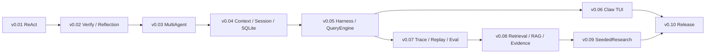

# PaperClaw v0.02–v0.10 SOP 总路线与风险推演

> 状态：v0.04/v0.05 已有实现提交；v0.06 已收缩为 MVP 草案；完成状态仍以各版本 hook、测试与交接物审计为准
> 日期：2026-07-13  
> 目标：把 PaperClaw 从最小 ReAct Loop 推进到可观测、可评估、可恢复、可演示的 Coding / Research Agent Harness

## 目录

- [版本标题与依赖关系](#1-冻结标题)
- [横切能力与技术选型](#3-横切能力的最早进入点)
- [遗漏检查与总体风险](#5-用户最初未显式考虑的位置)
- [SOP 固定结构与延期边界](#7-每份-sop-固定章节)
- [版本、终局与待确认决策](#9-版本号预案)
- [面试证据与草案使用方式](#12-面试追问与可展示证据)
- [后续草案拆分预警](#14-后续草案拆分预警)

## 1. 冻结标题

| 版本 | 标题 | 核心证明 |
|---|---|---|
| v0.02 | Verify 与 Reflection Agent | Agent 不靠自报完成，能基于证据修复和重验 |
| v0.03 | MultiAgent 分工协作 | 拆解、并行、冲突治理和独立 Reviewer 有真实收益 |
| v0.04 | Context、Session 与 SQLite MVP | 上下文可预算、可持久化，并只从安全边界恢复 |
| v0.05 | 最小 Harness 与 QueryEngine MVP | 现有 Agent Runtime 通过一个薄、稳定入口运行 |
| v0.06 | Claw TUI MVP | 用户能提交任务、观察关键事件、请求停止并可靠回退 CLI |
| v0.07 | Trace、Replay 与分层 Eval | 运行事实可追踪、回放、比较和形成回归数据 |
| v0.08 | Retrieval、RAG 与 Evidence Engine | Query、检索、核验、Evidence 和 Context 有强契约与指标 |
| v0.09 | SeededResearch 学术裁缝垂直切片 | 通用 Runtime 能支撑真实科研决策 domain |
| v0.10 | Reliability、Security、Packaging 与 Release | 干净环境可安装、可恢复、可审计、可演示和可发布 |

## 2. 依赖关系



v0.06 可以和 v0.07 的文档并行推进，但正式验收都依赖 v0.05 的 Command/Event/Snapshot API。

### 文档索引

- [v0.02 Verify 与 Reflection](PaperClaw_v0.02_Verify与ReflectionAgent_SOP.md)
- [v0.03 MultiAgent](PaperClaw_v0.03_MultiAgent分工协作_SOP.md)
- [v0.04 Context / Session / SQLite](drafts/PaperClaw_v0.04_ContextSessionSQLite_SOP草案.md)
- [v0.04 Post-MVP 增强候选池](drafts/PaperClaw_v0.04.1_RuntimeProtocolRecovery_SOP草案.md)
- [v0.05 Harness / QueryEngine 正式 MVP SOP](PaperClaw_v0.05_HarnessQueryEngine_MVP_SOP.md)
- [v0.05 Post-MVP 增强候选池](drafts/PaperClaw_v0.05.1_Harness增强候选池.md)
- [v0.06 Claw CLI / TUI](drafts/PaperClaw_v0.06_Claw交互层_SOP草案.md)
- [v0.06 Post-MVP 交互增强候选池](drafts/PaperClaw_v0.06.1_Claw交互增强候选池.md)
- [v0.07 Trace / Replay / Eval](drafts/PaperClaw_v0.07_TraceReplay与分层Eval_SOP草案.md)
- [v0.08 Retrieval / RAG / Evidence](drafts/PaperClaw_v0.08_RetrievalRAG与EvidenceEngine_SOP草案.md)
- [v0.09 SeededResearch](drafts/PaperClaw_v0.09_SeededResearch学术裁缝垂直切片_SOP草案.md)
- [v0.10 Reliability / Security / Release](drafts/PaperClaw_v0.10_ReliabilitySecurityPackagingRelease_SOP草案.md)
- [跨领域修复型测试题集 v0.01](testsets/PaperClaw_跨领域修复型测试题集_v0.01.md)：图像识别、大语言模型、三维重建各 1 题

## 3. 横切能力的最早进入点

不能等到标题所属版本才第一次考虑所有能力：

| 能力 | 最早出现 | 正式完成 |
|---|---|---|
| Verify Evidence | v0.02 | v0.02 |
| EventEnvelope | v0.02 minimal v1 | v0.07 Trace contract |
| Permission | v0.03 Lite allow/deny | v0.05 复用基础 Gate；完整交互按需增强 |
| Idempotency | v0.03 接口 | v0.04 事件去重；副作用 ledger 按真实恢复需求增强 |
| Context | v0.01 history | v0.04 ContextBuilder |
| Trace | v0.01 JSON demo | v0.07 append-only store / exporter |
| Eval | v0.02 completion metrics | v0.07 framework |
| Retrieval | v0.08 | v0.08 |
| Security | 每个版本 fail-closed | v0.10 release gate |

## 4. 主要技术选型

| 领域 | 推荐 | 暂缓 |
|---|---|---|
| 控制流 | PocketFlow action routing | 全量 LangGraph 化 |
| 并发 | Python `asyncio` | 分布式队列 |
| 状态 | dataclasses + explicit validator | 早期全面 ORM / schema framework |
| 持久化 | SQLite + WAL + migration | PostgreSQL / cloud DB |
| 本地检索 | SQLite FTS5 / BM25 | 先上独立搜索服务 |
| Dense Retrieval | adapter，可选 embedding | 强绑定单一模型或向量库 |
| Hybrid | BM25 + Dense + RRF | 复杂学习排序作为前置 |
| TUI | Textual optional extra | 首周 React Web |
| Trace | 内部 Event/Span + SQLite | LangSmith 成为事实源 |
| Eval | Code evaluator 优先，Human/LLM/Pairwise 补充 | 单一总分 |
| Packaging | setuptools 延续，后期 clean wheel/sdist | 早期多种构建工具并存 |
| Sandbox | native-first + optional adapter | 宣称 regex denylist 是 sandbox |

## 5. 用户最初未显式考虑的位置

### 5.1 安全与信任

- 本地用户可信，不代表 README、PDF、网页、工具输出和下载代码可信；
- Prompt injection 必须在 Context trust 层和 Permission 执行层同时处理；
- Permission、denylist、WSL 都不等于 OS sandbox；
- Secret 可能从异常、命令输出、Trace、HTTP body、dataclass repr 泄漏；
- 非交互 CI 遇到 `ask` 必须 fail-closed，不能永久挂起。

### 5.2 副作用与恢复

- 最难的不是“重启 Loop”，而是工具已产生副作用但成功事件未落盘的 `unknown_outcome`；
- Replay 默认重放 Observation 和 reducer，不重放真实 write/bash；
- FileLease 不能替代 expected hash；
- SQLite Checkpoint 不是数据库备份；
- WAL 模式不能粗暴复制 `.db` 作为可靠备份。

### 5.3 契约演进

- Event、DB、Tool、Prompt、Skill、Dataset、Index 都需要版本；
- 消费者应忽略未知可选字段；字段删除或改义必须升级 contract；
- Config、Prompt、Model、Tool、Dataset 和 commit fingerprint 必须进入 EvalRun；
- v0.x 可以快速演进，但不能没有 migration。

### 5.4 Agent 质量证明

- MultiAgent 需要单 Agent baseline，否则“拆了更多 Agent”不是贡献；
- LLM Judge 只能评质量，不能覆盖安全、权限和 Schema hard failure；
- RAG 必须分 Retrieval 与 Generation/Grounding Eval；
- 最终状态正确时不强制唯一 gold trajectory；
- `pass@k` 与 `pass^k` 含义不同。

### 5.5 数据生命周期

- Message、Trace、Artifact、PDF、Context Snapshot 保存多久；
- 用户删除 Session 后本地、LangSmith 和导出副本如何处理；
- 大对象使用 content-addressed ArtifactRef，而不是塞进 Event；
- Sampling 只能减少远程 export，不能破坏本地审计链。

### 5.6 产品与交互

- TUI 断连时 pending Permission 的语义；
- 用户取消的 request / accepted / propagated / terminal 四阶段；
- 不展示隐藏 CoT，只展示 reason summary、Evidence 和 reason_code；
- 无 TTY、TERM=dumb、窄终端和 Windows Unicode 降级；
- CLI stdout/stderr 和 JSON mode 稳定契约。

### 5.7 发布与知识产权

- Roadmap `v0.01` 与包版本 `0.0.1` 的映射；
- PaperClaw 自身 LICENSE 与 vendored PocketFlow attribution；
- Draftpaper-loop 许可和商标不能默认按普通开源复制；
- wheel 可能误带 `.env`、绝对路径、fixture secret 和 artifacts；
- dirty worktree 不能作为正式 release source。

## 6. 总体风险预案

| 风险 | 影响 | 通用预案 |
|---|---|---|
| Permission 绕过 | 数据或环境破坏 | fail-closed、执行时重验、policy version、sandbox adapter |
| 重复工具调用 | 重复副作用 | operation_id、idempotency ledger、unknown_outcome reconcile |
| Event 漂移 | TUI/Replay/Eval 失效 | schema_version、contract tests、upcaster |
| Context 漂移 | 约束/事实错误 | typed item、pinned evidence、compaction validation |
| SQLite lock/损坏 | Session 丢失 | WAL、busy_timeout、短事务、backup/restore drill |
| Provider 429/差异 | Loop 不稳定 | capability negotiation、error taxonomy、budgeted retry |
| MultiAgent 冲突 | 覆盖用户修改 | lease + expected_hash + atomic replace |
| TUI 背压 | UI 卡死拖累 Runtime | bounded queue、delta coalescing、snapshot recovery |
| RAG 假证据 | 错误科研结论 | candidate→verified 状态机、citation locator、counter-evidence |
| Eval 污染 | 指标虚高 | dataset split/version、Code evaluator、Human calibration |
| Trace 泄密 | Secret / 隐私泄露 | central redactor、ArtifactRef、remote export opt-in |
| Release 漂移 | 无法复现 | clean tree、manifest、lock、SBOM、clean install smoke |

## 7. 每份 SOP 固定章节

后续正式 SOP 采用两层结构。

当前 MVP 必须包含：

1. 一个用户可见故事；
2. 必做与明确延期；
3. 两种技术路径与选择；
4. 最小契约；
5. 最多三个实施 Phase；
6. 最小测试、GO / NO-GO；
7. 一条可复现演示；
8. 既有实现参考与风险。

Post-MVP 能力进入独立候选池。只有真实失败或下游用户故事证明必要性时，才提取一个候选重新写成 SOP。不得为了模板完整性，强迫每个 MVP 同时实现 Migration、Recovery、Eval、Permission、Cancel 和 Failure Injection 全家桶。

## 8. 必须延期的能力

一个月 MVP 不承诺：

- 完整 OS sandbox；
- 多租户云隔离；
- 分布式 Worker；
- exactly-once；
- 任意第三方插件动态加载；
- 插件市场；
- 完整 MCP 生态兼容；
- 跨项目长期 Memory；
- Knowledge Graph；
- 生产计费和云账号；
- 自动 Git push / 发布；
- 所有 shell 方言统一解析。

这些只能描述为接口预留、风险建模或 optional adapter，不能在面试中说成已经实现。

## 9. 版本号预案

目前：

```text
Roadmap milestone：v0.01、v0.02 ...
Python package：0.0.1
```

在 v0.10 前必须选择并统一：

- 方案 A：milestone v0.10 → package `0.10.0`；
- 方案 B：milestone v0.10 → package `0.0.10`。

推荐方案 A，语义更直观。版本唯一来源放在 package metadata，CLI、User-Agent、Trace 和 Release Manifest 通过 `importlib.metadata` 读取，禁止多处硬编码。

## 10. 终局完成定义

v0.10 不是“功能很多”，而是能提供以下证据：

- 干净 Windows 环境一条命令安装；
- Offline fixture 无网络完成演示；
- Agent 真实读、改、运行、验证、反思；
- MultiAgent 有单 Agent baseline 和冲突治理；
- Session 可压缩、恢复且不重复副作用；
- Permission 在执行层强制；
- Trace 可重放，Eval 绑定版本；
- RAG 的 query、candidate、citation 可追溯；
- SeededResearch 可输出 GO / REVISE / NO-GO；
- wheel、license、SBOM、checksum 和 known limitations 齐全；
- 所有演示 Claim 都能指向代码、测试、Trace 或 Eval。

## 11. 冻结前需要用户确认的决策

这些不阻塞当前草案，但进入对应正式 SOP 前需要确认：

| 决策 | 推荐默认 | 最晚确认版本 |
|---|---|---|
| milestone 与 package version 映射 | v0.10 → `0.10.0` | v0.10 |
| PaperClaw 自身许可证 | 选择明确开源许可证并拆分 third-party NOTICE | v0.10 |
| LangSmith remote export | 默认关闭，显式 opt-in | v0.07 |
| Dense embedding / VectorIndex 实现 | Protocol 先行，小规模 optional adapter | v0.08 |
| TUI 启动模式 | Windows 默认 full-screen，保留 CLI | v0.06 |
| native / WSL / container 信任级别 | native application-level 默认，sandbox opt-in | v0.10 |
| Session / Trace retention | 本地可配置，删除需覆盖 Artifact 和 exporter 映射 | v0.07 |
| SeededResearch PDF 保留策略 | 本地优先、记录来源、不默认远程上传 | v0.09 |

## 12. 面试追问与可展示证据

| 版本 | 典型追问 | 应展示的证据 |
|---|---|---|
| v0.02 | Reflection 会不会只是多调一次模型？ | False completion fixture、Verify Evidence、bounded repair Trace |
| v0.03 | MultiAgent 为什么比单 Agent 好？ | 单/多 Agent 成功率、时延、token、冲突/重复率对照 |
| v0.04 | 为什么 SQLite？恢复边界是什么？ | Context budget、Session reopen、safe resume / recovery_required 演示 |
| v0.05 | QueryEngine 会不会是 God Object？ | 薄 façade 依赖图、budget 与 Permission bypass test |
| v0.06 | 为什么 TUI 不直接做 Web？ | QueryEngine 薄客户端、关键事件时间线、CLI fallback smoke |
| v0.07 | LangSmith 和自建 Trace 怎么分工？ | Local TraceStore、export outage、deterministic replay、Eval version manifest |
| v0.08 | 为什么 Hybrid 优于只用向量库？ | BM25/Dense/RRF ablation、Recall/MRR/nDCG、降级链 |
| v0.09 | 学术裁缝如何避免伪创新？ | BaselineCard、Compatibility、EvidenceLink、falsifier、NO-GO case |
| v0.10 | Permission 是否等于 sandbox？ | isolation_level、policy corpus、native limitation、optional sandbox adapter |

## 13. 草案使用方式

- 不要一次性执行 v0.04–v0.10；
- 每完成一个前置版本，先用真实 Trace 重审下一份草案；
- 每份草案先收缩为一个 MVP 用户故事，其余能力移入 Post-MVP 候选池；
- 候选池没有默认执行顺序，一次只允许提取一个小型 SOP；
- 将已验证条目转成 checkbox，将不再适用的假设删除或记录偏差；
- 每份正式 SOP 只承诺当期可验证能力；
- 远期草案中的具体库和性能数值均是候选，不是既定依赖或完成事实。

## 14. 后续草案拆分预警

以下是 2026-07-14 的文档体量审计，不代表已经修改正文。每份草案进入执行前必须重新收缩：

| 版本 | 当前过度设计风险 | 建议 MVP | 后置候选 |
|---|---|---|---|
| v0.06 | 同时做完整 TUI、MultiAgent、Permission、Context、Trace 面板 | 对话输入、关键事件时间线、结构化终态、CLI fallback | Permission、Shell stream、高级面板、Session Picker、完整任务可视化 |
| v0.07 | Trace、Replay、Agent/RAG/Context/MultiAgent Eval 全部打包 | 本地 TraceStore + 一组 repair dataset 回归 | LangSmith、在线 Eval、RAG/多 Agent 专项评估 |
| v0.08 | Sparse、Dense、RRF、Reranker、多源在线检索同时进入 | SQLite FTS5 + Evidence identity + 一个离线评估集 | Dense、Reranker、多源联网和缓存体系 |
| v0.09 | 多模式、Skill 矩阵和完整科研 Pipeline 同时落地 | 一组 Seed → 核验 → 单一方法建议 → NO-GO | topic-only、并行 lanes、完整学术 Skill 编排 |
| v0.10 | 安全、跨平台、供应链、CI、发布全部作为单一 Gate | Windows clean install + offline demo + version/license | SBOM、跨平台矩阵、sandbox 与完整安全加固 |

优先级：v0.07 风险最高；v0.06 已完成文档拆分，v0.07 启动前必须生成对应 MVP 收口版和 Post-MVP 候选池。
