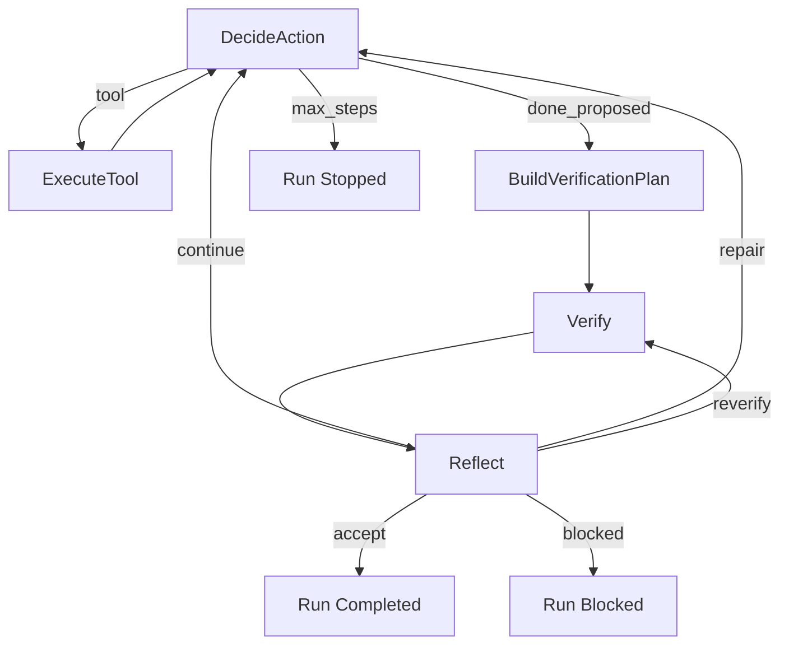

# PaperClaw v0.02：Verify 与 Reflection Agent SOP

> 版本：v0.02  
> 状态：已完成 
> 类型：第二个工程实施 SOP  
> 日期：2026-07-13  
> 前置：`v0.01` 最小 PocketFlow ReAct Agent 已通过验收  
> 目标：让 Agent 在行动后用客观证据验证结果，并通过有界 Reflection 决定继续、修复或结束

## 目录

- [1. 核心结论](#1-核心结论)
- [2. Verify 与 Reflection 的区别](#2-verify-与-reflection-的区别)
- [3. 范围与非目标](#3-范围与非目标)
- [4. 目标控制流](#4-目标控制流)
- [5. 状态与输出契约](#5-状态与输出契约)
- [6. Verify Engine](#6-verify-engine)
- [7. Reflection Gate](#7-reflection-gate)
- [8. 完成协议](#8-完成协议)
- [9. Trace 与可观察性](#9-trace-与可观察性)
- [10. 分阶段实施](#10-分阶段实施)
- [11. 测试与验收](#11-测试与验收)
- [12. 工程化注释要求](#12-工程化注释要求)
- [13. 交付物与完成定义](#13-交付物与完成定义)
- [14. 风险与停止条件](#14-风险与停止条件)
- [15. 后续边界](#15-后续边界)

---

## 1. 核心结论

`v0.01` 已经能够：

```text
Reason → Act → Observation → Reason → done
```

但当前 `done` 主要依赖模型自报完成，`verification_status` 只检查“模型填写了 verification，并且历史中有成功 Bash”。它不能证明：

- Bash 执行的命令是否真的验证了当前任务；
- 文件是否包含用户要求的内容；
- 测试是否在修改之后运行；
- Agent 是否忽略失败测试或剩余问题；
- 一个成功命令是否只是 `echo ok`；
- 修改是否破坏已有功能。

v0.02 将完成协议改为：

```text
模型提出 done
    ↓
Verify Engine 生成或执行客观检查
    ↓
Reflection 根据任务、历史和 VerificationResult 判断
    ↓
accept / continue / repair / blocked
```

核心原则：

> Verify 负责产生事实，Reflection 负责根据事实做决策。Reflection 不能替代测试，也不能把解释写得合理就视为成功。

---

## 2. Verify 与 Reflection 的区别

| 层 | 性质 | 输入 | 输出 | 是否允许自由判断 |
|---|---|---|---|---|
| Verify | 尽量确定性 | 任务、改动、工具结果、验证计划 | VerificationResult | 低 |
| Reflection | 结构化模型判断 | 任务、关键历史、VerificationResult | ReflectionDecision | 有界 |

### 2.1 Verify

Verify 回答：

- 文件是否真实存在；
- 内容是否满足明确要求；
- 命令是否真实执行；
- exit code 是否为 0；
- 测试通过数和失败数是多少；
- 验证发生在最后一次修改之后还是之前；
- 是否仍有未覆盖的验收条件。

### 2.2 Reflection

Reflection 回答：

- 当前证据是否足以接受完成；
- 失败是实现错误、验证错误还是环境阻塞；
- 下一步最小修复动作是什么；
- 是否在重复无效尝试；
- 是否应继续、重新验证、降级报告或停止。

### 2.3 禁止混淆

- Reflection 说“看起来正确”不等于 verified；
- 测试 exit code 0 不自动代表所有用户约束满足；
- 模型自报 verification 不作为客观证据；
- Verify 不负责提出大规模新方案；
- 不保存或要求自由 Chain-of-Thought，只记录结构化判断依据。

---

## 3. 范围与非目标

### 3.1 In Scope

- `done` 从终止动作改为完成提议；
- `VerificationPlan`、`VerificationCheck`、`VerificationResult`；
- 文件、命令、测试、任务约束四类 Verify；
- `VerifyNode` 与 `ReflectNode`；
- 有界 Reflection，默认最多 2 轮；
- 修改后验证时序检查；
- 失败分类与最小下一步；
- 重复失败检测；
- Verify / Reflect Runtime Event；
- FakeModel 和真实模型回归；
- CLI 显示验证状态和停止原因。

### 3.2 Out of Scope

- MultiAgent；
- 长期 Session 和数据库；
- Context Compaction；
- 完整 QueryEngine；
- 完整 Permission Engine；
- 后台 Shell Task；
- Docker / OS Sandbox；
- TUI；
- RAG；
- LLM-as-a-Judge 作为唯一验收器；
- 自动生成大规模测试；
- 多轮开放式自我批判。

### 3.3 既有实现参考（执行前必读）

完整索引见 [`PaperClaw_参考项目与可复用模块索引.md`](../docs/reference/PaperClaw_参考项目与可复用模块索引.md)。本 SOP 执行前至少阅读：

| 参考项目 | 必读路径 | 借鉴目标 | 禁止照搬 |
|---|---|---|---|
| AutoResearchClaw | `researchclaw/pipeline/contracts.py`、`stages.py` | Gate、DoD、retry、pivot、status | 23-stage domain 常量 |
| AutoResearchClaw | `researchclaw/pipeline/verified_registry.py` | 客观事实注册，Reflection 不可改写 | 论文实验专属字段 |
| AutoResearchClaw | `researchclaw/experiment/sandbox.py` | timeout、entry、metric、run isolation | 同步执行与完整 sandbox 实现 |
| AutoResearchClaw | `researchclaw/pipeline/experiment_diagnosis.py`、`experiment_repair.py` | failure taxonomy、定向修复和重验 | 与科研指标强耦合的 action |
| Draftpaper-loop | `draftpaper_cli/core_evidence.py`、`review_revision.py` | Evidence-first Gate、repair / revise 路由 | 论文生成 stage 和受限代码 |

执行时记录参考仓库 commit / dirty 状态，并在 `implementation_summary.md` 说明实际借鉴点。

---

## 4. 目标控制流



### 4.1 路由规则

- 普通工具执行后仍回到 `DecideAction`；
- 模型提出 `done` 时不能直接结束，必须进入 Verify；
- Verify 自身不修改项目文件；
- Reflection 不能直接执行工具，只能输出下一状态和建议动作；
- `accept` 必须满足硬性 Verify Gate；
- Reflection 次数达到上限仍不满足时，输出 `blocked` 或 `verification_failed`，不得无限循环。

---

## 5. 状态与输出契约

### 5.1 VerificationPlan

```python
@dataclass
class VerificationPlan:
    task_claims: list[TaskClaim]
    checks: list[VerificationCheck]
    generated_from: str
    created_after_step: int
```

### 5.2 TaskClaim

```python
@dataclass
class TaskClaim:
    claim_id: str
    description: str
    checkable: bool
    required: bool
    source: str  # user | inferred | project_rule
```

### 5.3 VerificationCheck

```python
@dataclass
class VerificationCheck:
    check_id: str
    claim_ids: list[str]
    check_type: str  # file_exists | file_contains | command | tests | history
    arguments: dict
    required: bool
```

### 5.4 VerificationEvidence

```python
@dataclass
class VerificationEvidence:
    evidence_id: str
    check_id: str
    status: str  # passed | failed | error | skipped
    observed: str
    source_tool: str | None
    source_step: int | None
    exit_code: int | None
    timestamp: datetime
```

### 5.5 VerificationResult

```python
@dataclass
class VerificationResult:
    status: str  # passed | failed | incomplete | error
    checks: list[VerificationEvidence]
    passed_claim_ids: list[str]
    failed_claim_ids: list[str]
    uncovered_claim_ids: list[str]
    verified_after_last_write: bool
    summary: str
```

### 5.6 ReflectionDecision

```python
@dataclass
class ReflectionDecision:
    decision: str  # accept | continue | repair | reverify | blocked
    evidence_ids: list[str]
    failed_claim_ids: list[str]
    next_action: str | None
    reason_code: str
    confidence: float
```

`reason` 只保存简短、可审计的决策理由，不保存隐藏 Chain-of-Thought。

---

## 6. Verify Engine

### 6.1 验证计划来源

优先级：

```text
用户明确验收条件
  > 项目已有测试/构建命令
  > 工具执行产生的可检查结果
  > 模型提出的验证建议
```

模型可以建议 VerificationPlan，但必须经过确定性 validator，不能直接提交任意 Shell。

### 6.2 文件验证

支持：

- 文件存在；
- 文件位于工作区；
- 内容包含目标字符串；
- 内容不包含禁止字符串；
- 最后写入发生在验证之前；
- 读取 hash 与验证时 hash 一致。

Verify 应复用 FileRead / Path Guard，不复制文件访问逻辑。

### 6.3 命令验证

命令验证必须记录：

- command；
- command class；
- cwd；
- exit code；
- stdout/stderr；
- started/finished time；
- 是否发生在最后一次修改之后；
- 是否被截断；
- 是否超时。

`echo ok`、`pwd` 等与任务无关的成功命令不能自动满足功能 Claim。

### 6.4 测试验证

第一版只识别项目已有测试入口，不自动发明大型测试：

- `pytest`；
- 项目 README / pyproject 明确声明的测试命令；
- 用户指定命令；
- fixture 自带验证脚本。

测试结果至少提取：

```text
exit_code
passed_count
failed_count
skipped_count
duration
failed_test_names（截断）
```

无法解析统计时仍保留原始 exit code 和摘要，不伪造数量。

### 6.5 Task Claim 覆盖

Verify 不只看命令成功，还要回答每个 required Claim 是否有证据。

例如：

```text
任务：创建 hello.py，输出 "PaperClaw OK"，并运行验证。

C1 文件存在               → FileExists
C2 文件会输出目标字符串   → Bash stdout
C3 命令真实运行           → Bash execution record
C4 修改没有越界           → workspace path evidence
```

只有 required Claim 全部通过，结果才能是 `passed`。

---

## 7. Reflection Gate

### 7.1 触发条件

Reflection 只在以下节点触发：

- 模型提出 `done`；
- Verify 失败或不完整；
- 同类工具错误重复出现；
- 接近 step / time 预算；
- 运行即将以 blocked 结束。

普通成功工具调用后不执行 Reflection，避免每一步都额外调用模型。

### 7.2 Reflection 输入

只提供：

- 原始任务；
- Required Claims；
- 最近相关工具结果；
- VerificationResult；
- 当前预算；
- 最近失败签名和次数；
- 当前完成提议。

不把全部历史无差别塞入 Reflection Prompt。

### 7.3 Reflection 输出

模型必须返回一个结构化决定：

```json
{
  "decision": "repair",
  "evidence_ids": ["ev-3"],
  "failed_claim_ids": ["claim-output"],
  "next_action": "读取 hello.py 并修正输出字符串，然后重新运行",
  "reason_code": "verification_failed",
  "confidence": 0.95
}
```

### 7.4 有界规则

- 默认 `max_reflection_rounds=2`；
- 同一 failure signature 连续两轮未变化，第三次不再自由反思；
- Reflection 不能扩大用户任务；
- Reflection 不能降低 required Claim；
- Reflection 不能把 failed 改写成 passed；
- Reflection 不能直接修改工具历史或 VerificationEvidence；
- 预算不足时优先给出 blocked + 未解决项。

---

## 8. 完成协议

### 8.1 DoneProposal

原 `DoneAction` 改为：

```python
@dataclass
class DoneProposal:
    result: str
    claimed_verification: str
    remaining_issues: list[str]
```

它只代表模型认为可以结束，不代表 Runtime 接受完成。

### 8.2 接受条件

只有同时满足以下条件才能 `run.completed`：

- Required Claims 全部有 passed Evidence；
- Verify 发生在最后一次写操作之后；
- 没有 required check 为 failed/error/skipped；
- 没有未披露的 fatal tool error；
- ReflectionDecision 为 `accept`；
- 未触发安全或预算硬停止。

### 8.3 停止原因

```text
completed_verified
verification_failed
verification_incomplete
reflection_limit
repeated_failure
max_steps
timeout
blocked_environment
cancelled
internal_error
```

CLI 不再只显示 `verified/unverified`，还要显示失败 Claim、关键证据和 stop reason。

---

## 9. Trace 与可观察性

v0.02 引入最小结构化事件：

```text
done.proposed
verification.planned
verification.started
verification.check.completed
verification.completed
reflection.started
reflection.completed
run.completed
run.blocked
```

每个事件包含：

```text
run_id
sequence
step
event_type
timestamp
payload
```

事件暂时可保存在内存并导出 JSON；SQLite Session 和完整 EventBus 延后到 Harness 版本。

---

## 10. 分阶段实施

### Phase A：现状冻结

- [x] A1. 运行 v0.01 全量测试并记录基线。
- [x] A2. 审计当前 `DoneAction`、`verification_status`、history 和 Bash metadata。
- [x] A3. 确认 v0.01 行为在功能开关关闭时保持兼容。
- [x] A4. 为新增公共接口写工程化 docstring 和设计注释。

### Phase B：验证契约

- [x] B1. 定义 TaskClaim、VerificationPlan、VerificationCheck。
- [x] B2. 定义 VerificationEvidence、VerificationResult。
- [x] B3. 定义 DoneProposal 和 ReflectionDecision。
- [x] B4. 增加 Schema validator 和序列化测试。
- [x] B5. 定义 verification / reflection stop reason。

### Phase C：确定性 Verify

- [x] A3. 确认 v0.01 行为在功能开关关闭时保持兼容。
- [x] C1. 实现文件存在、内容和 hash 检查。
- [x] C2. 实现 Bash 执行时序和 exit code 检查。
- [x] C3. 实现 pytest / 指定命令结果摘要。
- [x] C4. 实现 required Claim 覆盖判断。
- [x] C5. 拒绝用无关成功命令满足任务 Claim。
- [x] C6. Verify 只读，不修改项目文件。

### Phase D：Reflection

- [x] D1. 实现有界 Reflection Prompt。
- [x] D2. 实现 Reflection 输出解析和 validator。
- [x] D3. 实现 accept / repair / continue / reverify / blocked 路由。
- [x] D4. 实现 failure signature 和重复失败检测。
- [x] D5. 强制 Reflection 不得删除 required Claim 或篡改 Evidence。

### Phase E：Flow 集成

- [x] E1. 将 `done` 改为 `done_proposed` 路由。
- [x] E2. 加入 BuildVerificationPlan、Verify、Reflect 节点。
- [x] E3. 将 Verify / Reflect 结果写入结构化 state。
- [x] E4. 实现 Reflection 和 Reverify 轮数上限。
- [x] E5. 保持原工具节点职责不变。
- [x] E6. CLI 展示完成、失败、blocked 和关键 Evidence。

### Phase F：回归与真实验证

- [x] F1. 原 v0.01 测试保持通过或有明确兼容变更。
- [x] F2. FakeModel 覆盖错误完成提议被拒绝。
- [x] F3. 覆盖修改后未重跑测试的场景。
- [x] F4. 覆盖测试失败 → Reflection → 修复 → 重验 → 完成。
- [x] F5. 覆盖重复失败和 Reflection 上限。
- [x] F6. 完成一次真实模型受控演示。
- [x] F7. 导出 Verify / Reflection Trace。

### Phase G：留档与 Review

- [x] G1. 更新 README，仅描述真实完成能力。
- [x] G2. 生成 `artifacts/v0_02/` 交付物。
- [x] G3. 运行 SOP completion hook。
- [x] G4. Review Verify 是否真的产生客观证据。
- [x] G5. Review Reflection 是否可能绕过失败 Gate。

---

## 11. 测试与验收

| 编号 | 场景 | 通过标准 |
|---|---|---|
| V-01 | 文件未创建却提出 done | Verify failed |
| V-02 | 文件存在且内容正确 | 文件 Claim passed |
| V-03 | 修改后未运行命令 | `verified_after_last_write=false` |
| V-04 | `echo ok` 冒充测试 | 不满足功能 Claim |
| V-05 | pytest exit 1 | 不允许 accept |
| V-06 | pytest 通过 | 保留 exit code 和统计 |
| V-07 | 输出截断 | 标记 truncated，不伪造完整结果 |
| R-01 | Verify 全通过 | Reflection accept |
| R-02 | 单项失败 | Reflection 给出最小 repair |
| R-03 | 证据不足 | reverify 或 blocked |
| R-04 | 同一失败重复 | 达到上限后停止 |
| R-05 | Reflection 试图删除 Claim | validator 拒绝 |
| I-01 | 写错 → 测试失败 → 修复 → 通过 | verified completion |
| I-02 | 模型虚报完成 | 不能 run.completed |
| I-03 | 环境无测试依赖 | blocked_environment，证据完整 |

验收门槛：

- Required Claim 无证据完成率：0；
- 修改后未重新验证却通过率：0；
- Reflection 超预算率：0；
- 原 v0.01 工具安全边界回归：全部通过；
- Offline fixture 结果可重复；
- 至少一个真实模型案例完成“失败—修复—重验”。

---

## 12. 工程化注释要求

本版本必须执行根 `AGENTS.md` 的注释规范，重点包括：

- Verify 和 Reflection 分层原因；
- required Claim 不可被 Reflection 降级的原因；
- 验证时序与最后一次写操作的关系；
- failure signature 的计算边界；
- 为什么某些命令不能作为功能验证；
- retry / reverify / blocked 的选择条件；
- 兼容 v0.01 的临时逻辑和解除条件。

禁止用注释逐行复述字段赋值，也禁止留下与 Gate 实际行为不一致的说明。

---

## 13. 交付物与完成定义

```text
artifacts/v0_02/
├── implementation_summary.md
├── verification_contract.md
├── test_report.md
├── verify_reflection_trace.json
├── failure_cases.md
└── file_manifest.txt
```

完成定义：

- [x] `done` 已成为完成提议而非直接终止；
- [x] Verify 产生结构化客观 Evidence；
- [x] Required Claims 全部受 Gate 约束；
- [x] 验证发生在最后一次修改之后；
- [x] Reflection 只消费 Evidence，不替代 Evidence；
- [x] Reflection 次数有硬上限；
- [x] 重复失败可识别并有界停止；
- [x] CLI 能解释为什么完成或为什么未完成；
- [x] 原工具安全测试通过；
- [x] 离线和真实模型验收完成；
- [x] 工程化注释审查通过；
- [x] 交付物齐全；
- [x] SOP completion hook 已运行。

---

## 14. 风险与停止条件

| 风险 | 处理 |
|---|---|
| Reflection 只是重复调用模型 | 仅在 Gate 触发，限制轮数 |
| 模型给自己打高分 | Verify 与 Reflection 分离 |
| 测试命令与任务无关 | Claim—Check 映射 |
| 修改后沿用旧测试结果 | 验证时序检查 |
| 不断修复导致循环 | failure signature + budget |
| Verify 自动执行危险命令 | 只允许已批准的验证模板 |
| 项目没有测试 | 文件/命令证据 + incomplete/blocked |

硬停止：

- 同一 failure signature 连续 3 次；
- Reflection 达到最大轮数；
- Verify 需要未授权高风险操作；
- 环境缺失且无法在当前权限范围修复；
- 安全边界或状态契约损坏。

---

## 15. 后续边界

v0.02 只让单 Agent 具备“执行后验证和有限反思”。下一版本 `v0.03` 才引入 MultiAgent：由 Coordinator 拆分任务，Worker 执行，Reviewer 独立验证。Context、Harness 和 Claw 交互层继续后置。

参考：

- [`PaperClaw_v0.01_最小ReAct编码Agent_SOP.md`](PaperClaw_v0.01_最小ReAct编码Agent_SOP.md)
- [`PaperClaw_QueryEngine设计讨论稿.md`](../docs/desgin/PaperClaw_QueryEngine设计讨论稿.md)
