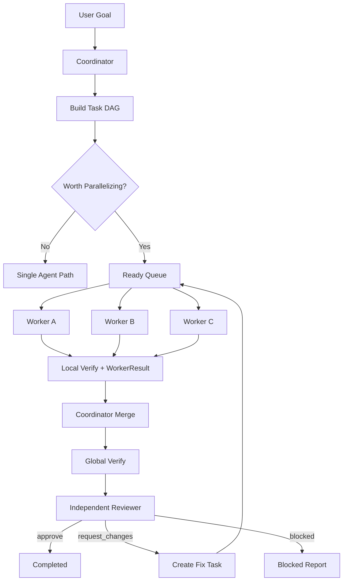

# PaperClaw v0.03：MultiAgent 分工协作 SOP

> 版本：v0.03  
> 状态：已完成（部分边界能力按 MVP 级别实现，未覆盖项见 `artifacts/v0_03/conflict_test_report.md`）  
> 类型：第三个工程实施 SOP  
> 前置：v0.02 Verify / Reflection 通过验收  
> 目标：引入 Coordinator、Worker、Reviewer，实现可控拆解、并行执行、证据交接和独立验收

## 目录

- [1. 核心结论](#1-核心结论)
- [2. 角色模型](#2-角色模型)
- [3. 范围与非目标](#3-范围与非目标)
- [4. 协作控制流](#4-协作控制流)
- [5. Task 与 Message 契约](#5-task-与-message-契约)
- [6. 分解与调度规则](#6-分解与调度规则)
- [7. 工作区与冲突治理](#7-工作区与冲突治理)
- [8. Verify / Review 协作](#8-verify--review-协作)
- [9. 预算、失败与取消](#9-预算失败与取消)
- [10. 分阶段实施](#10-分阶段实施)
- [11. 测试与验收](#11-测试与验收)
- [12. 交付物与完成定义](#12-交付物与完成定义)

---

## 1. 核心结论

v0.03 不建设开放式 Swarm，而建设一个小型工程团队运行模型：

```text
Coordinator
    负责理解目标、拆解任务、建立依赖、分配作用域、汇总结果

Worker
    负责执行一个边界清楚、可独立验收的子任务

Reviewer
    不参与原实现，基于任务契约、Diff、Trace 和 Verify Evidence 独立审查
```

核心原则：

- 不是所有任务都需要多 Agent；
- 只有独立且收益大于调度成本的任务才并行；
- 一个子任务必须有明确输入、作用域、交付物和完成条件；
- Agent 之间通过结构化 Task / Result / Artifact 通信；
- 普通文字输出不能自动视为其他 Agent 已收到；
- 多 Agent 不得绕过 v0.02 Verify Gate；
- 默认一个文件同一时刻只有一个写入拥有者；
- Coordinator 不能把模糊大任务原样扔给 Worker。

### v0.03 进入门槛

MultiAgent 会放大单 Agent 的副作用，因此实现前必须具备：

- `PermissionGuard Lite`：所有 Worker tool call 经过统一入口，只支持 `allow/deny`；默认拒绝工作区外写、破坏性命令和依赖安装；完整 HITL / sandbox 留到 v0.05；
- `EventEnvelope v1`：至少包含 schema_version、event_id、run_id、agent_id、task_id、sequence、event_type 和 payload；
- tool_call_id、idempotency_key 和 attempt 接口；
- 文件原子写入与 expected hash 检查；
- v0.02 Verify Gate；
- 明确声明 v0.03 只保证进程内协作，不承诺 crash 后自动恢复。

---

## 2. 角色模型

### 2.1 Coordinator

职责：

- 读取用户目标和项目约束；
- 判断是否值得拆分；
- 生成 Task DAG；
- 定义每个 Worker 的文件作用域和工具权限；
- 调度 ready task；
- 处理 blocked / failed 结果；
- 汇总 Artifact 和 Evidence；
- 请求 Reviewer；
- 给出最终完成或未完成状态。

禁止：

- 在 Worker 运行时同时修改其拥有的文件；
- 用“研究一下”“处理一下”作为完整任务契约；
- 在未读取 Worker Result 的情况下宣告完成；
- 让 Reviewer 直接修复代码并同时充当独立审查者。

### 2.2 Worker

职责：

- 只处理分配的一个 Task；
- 在允许的文件和工具作用域内行动；
- 先读取相关上下文再修改；
- 运行 Task 要求的局部 Verify；
- 输出结构化 WorkerResult；
- 明确记录修改文件、测试、风险和未完成事项。

Worker 不拥有全局任务完成权。

### 2.3 Reviewer

职责：

- 使用只读上下文审查需求、Diff、测试和 Evidence；
- 检查功能、安全、兼容、注释、文档和测试真实性；
- 输出 `approve / request_changes / blocked`；
- 每个 finding 绑定文件、位置、证据和优先级。

Reviewer 默认不修改实现。需要修复时，由 Coordinator 创建新的 Worker Task。

### 2.4 可选角色

v0.03 只预留、不强制实现：

- Explorer：只读扫描代码库；
- Test Worker：运行独立测试；
- Research Worker：外部资料检索；
- Domain Reviewer：学术或安全专项审查。

---

## 3. 范围与非目标

### 3.1 In Scope

- Coordinator / Worker / Reviewer；
- Task DAG 和依赖；
- Agent 作用域和工具白名单；
- 最多 3 个并发 Agent；
- 结构化消息和结果；
- 文件写入所有权；
- Artifact 交接；
- 局部 Verify + 全局 Verify；
- 独立 Reviewer；
- 失败、取消、重试和超时；
- MultiAgent Trace；
- 顺序模式与并行模式对照测试。

### 3.2 Out of Scope

- 无中心 Swarm；
- Agent 自由复制自己；
- 无限递归委派；
- 跨机器分布式执行；
- Git worktree 自动隔离；
- 多用户协作；
- 长期组织记忆；
- Agent 之间自然语言无限讨论；
- 多 Agent 同时修改同一文件；
- 自动 PR / push；
- SeededResearch 专用团队。

### 3.3 既有实现参考（执行前必读）

完整索引见 [`PaperClaw_参考项目与可复用模块索引.md`](../docs/reference/PaperClaw_参考项目与可复用模块索引.md)。本 SOP 执行前至少阅读：

| 参考项目 | 必读路径 | 借鉴目标 | 禁止照搬 |
|---|---|---|---|
| AutoResearchClaw | `researchclaw/agents/benchmark_agent/orchestrator.py`、`validator.py` | 角色 I/O 与独立 Validator | 科研阶段角色常量 |
| AutoResearchClaw | `researchclaw/collaboration/publisher.py`、`subscriber.py`、`dedup.py` | 发布订阅、去重、幂等 | 与原 repository 强耦合实现 |
| AutoResearchClaw | `researchclaw/hitl/collaboration.py` | Human 作为特殊协作者 | 直接复制交互状态 |
| academic-research-skills | `academic-paper-reviewer/` | 多视角 Reviewer 与报告契约 | 多个版本混用或整仓 Prompt 注入 |

执行时记录参考仓库 commit / dirty 状态，并在 `implementation_summary.md` 说明实际借鉴点。

---

## 4. 协作控制流



---

## 5. Task 与 Message 契约

### 5.1 AgentTask

```python
@dataclass
class AgentTask:
    task_id: str
    parent_task_id: str | None
    title: str
    objective: str
    acceptance_criteria: list[str]
    dependencies: list[str]

    allowed_paths: list[str]
    writable_paths: list[str]
    allowed_tools: list[str]

    input_artifact_ids: list[str]
    expected_artifacts: list[str]

    max_steps: int
    timeout_seconds: int
    priority: int
```

### 5.2 WorkerResult

```python
@dataclass
class WorkerResult:
    task_id: str
    status: str  # completed | failed | blocked | cancelled
    summary: str
    changed_files: list[str]
    artifact_ids: list[str]
    verification_result: VerificationResult
    unresolved_items: list[str]
    handoff_notes: list[str]
```

### 5.3 AgentMessage

```python
@dataclass
class AgentMessage:
    message_id: str
    sender_id: str
    recipient_id: str
    message_type: str
    task_id: str
    payload: dict
    sequence: int
```

支持的消息类型：

```text
task.assigned
task.accepted
task.progress
task.completed
task.failed
task.blocked
artifact.published
clarification.requested
clarification.answered
cancel.requested
review.requested
review.completed
```

消息必须通过 Runtime 消息通道发送。Agent 普通最终文本不等于团队消息。

---

## 6. 分解与调度规则

### 6.1 何时拆分

满足以下条件才拆分：

- 有两个以上可独立验收的子任务；
- 子任务之间没有强顺序依赖；
- 预计总耗时或认知负荷明显高于调度成本；
- 文件写入作用域可以隔离；
- 每个子任务都有独立发现或交付价值。

以下情况保持单 Agent：

- 单任务预计小于 60 秒；
- 多步骤依赖同一局部上下文；
- 多个 Agent 必须频繁修改相同文件；
- 工作只是一次简单读取或修改；
- 拆分后无法定义独立验收条件。

### 6.2 DAG 校验

Task DAG 必须：

- 无环；
- dependency 都存在；
- writable path 不冲突；
- 每个叶子任务有 acceptance criteria；
- 每个 Task 有预算和超时；
- 至少一个终局汇总任务。

### 6.3 并发上限

- 默认最多 3 个 Worker 并发（含非用户 Agent）；
- 硬上限由 `TeamBudget.max_agents` 控制，当前默认 3；
- v0.03 禁止 Worker 再生成子 Agent；
- 独立测试可以并行，依赖性测试必须串行；
- Coordinator 在 Worker 运行时处理其他 ready task、文档一致性和结果准备，不空转等待。

---

## 7. 工作区与冲突治理

### 7.1 文件写入所有权

```python
@dataclass
class FileLease:
    path: str
    owner_agent_id: str
    task_id: str
    acquired_at: datetime
    expires_at: datetime
```

规则：

- 一个文件同一时间只能有一个 writer；
- 只读 Agent 不需要 write lease；
- 写工具执行前检查 lease；
- Task 结束、失败或取消时释放 lease；
- lease 超时不能自动视为安全覆盖，必须重新读取 FileSnapshot；
- 越权写入作为 `scope_violation` 失败。

### 7.2 合并策略

v0.03 不引入自动 Git merge。Coordinator 只接受：

- 不重叠文件修改；
- 明确顺序依赖后的串行修改；
- Worker 输出 Patch Artifact，由 Coordinator 创建专门 Apply Task。

禁止多个 Worker 同时直接改同一文件后再“取最后一个版本”。

FileLease 不能替代外部修改检测。每次 FileWrite / FileEdit 还必须携带读取时的 `expected_hash`，执行前 compare-and-swap；不一致时强制重新读取和规划。写入采用同目录临时文件、flush 后 `os.replace`，避免进程中断留下截断文件。

### 7.3 Artifact 优先

Agent 之间传递：

- Diff；
- 结构化 Result；
- Test Report；
- Trace；
- 设计决策；
- 文件引用。

避免传递整段无结构聊天历史。

---

## 8. Verify / Review 协作

### 8.1 局部 Verify

每个 Worker 对自己的 acceptance criteria 负责，输出 VerificationResult。局部通过不代表全局通过。

### 8.2 全局 Verify

Coordinator 合并后运行：

- 全局测试；
- 跨模块接口验证；
- 文档与实现一致性检查；
- 路径和权限检查；
- 所有 Task Claim 覆盖检查。

### 8.3 Reviewer 独立性

Reviewer 不接收原 Worker 的自由推理，只接收：

- 用户目标；
- Task DAG；
- Diff / File Manifest；
- Verification Evidence；
- Trace；
- 已知限制。

Reviewer Finding：

```python
@dataclass
class ReviewFinding:
    finding_id: str
    severity: str  # blocker | high | medium | low
    title: str
    evidence: str
    file: str | None
    line: int | None
    requested_change: str
```

只有 blocker/high 默认阻止完成；medium/low 进入已知问题或后续 Task。

---

## 9. 预算、失败与取消

### 9.1 团队预算

```python
@dataclass
class TeamBudget:
    max_agents: int
    max_total_steps: int
    max_total_model_calls: int
    max_wall_time_seconds: int
    max_fix_rounds: int
```

子任务预算必须计入团队总预算，不能因拆 Agent 绕过限制。

### 9.2 失败传播

| Worker 状态 | Coordinator 行为 |
|---|---|
| completed | 检查 Result 和 Evidence |
| failed retryable | 最多创建一次受控 retry |
| failed non-retryable | 阻塞依赖任务 |
| blocked | 判断能否换方案或请求用户 |
| cancelled | 释放 lease，取消依赖任务 |

### 9.3 取消

取消父任务时：

1. 停止新任务分配；
2. 向活跃 Worker 发 cancel；
3. 终止相关 Shell；
4. 收集已完成 Artifact；
5. 释放 FileLease；
6. 保存团队停止原因。

### 9.4 v0.03 恢复边界

- Task、Message、Lease 和 dedup ledger 在 v0.03 可以是进程内实现；
- 接口中必须预留 `operation_id / idempotency_key / attempt / artifact_hash`；
- 超时后结果未知的 write/bash 标记 `unknown_outcome`，不得自动重试；
- 进程崩溃后的 durable recovery 属于 v0.04；
- 文档和演示不得声称 v0.03 已支持 crash resume。

---

## 10. 分阶段实施

### Phase A：协议

- [x] A1. 定义 AgentTask、WorkerResult、AgentMessage、ReviewFinding。
- [x] A2. 定义 Task DAG validator。
- [x] A3. 定义 Agent Role 和 Tool Scope。
- [x] A4. 定义团队预算与停止原因。
- [x] A5. 冻结 EventEnvelope v1 与向前兼容规则。
- [x] A6. 定义 PermissionGuard Lite 和 tool idempotency 接口。

### Phase B：Coordinator

- [x] B1. 实现是否拆分的决策 Gate。
- [x] B2. 实现 Task DAG 生成和确定性校验。
- [x] B3. 实现 ready queue 和依赖状态。
- [x] B4. 实现最多 3 Agent 的并发调度。
- [x] B5. 实现 Result 收集和全局状态汇总。

### Phase C：Worker Runtime

- [x] C1. 为 Worker 建立独立 LoopState 和预算。
- [x] C2. 实现路径、工具和任务作用域。
- [x] C3. 实现 WorkerResult 和 Artifact 发布。
- [x] C4. 接入 v0.02 局部 Verify。
- [x] C5. Worker 禁止自行继续委派。

### Phase D：工作区治理

- [x] D1. 实现 FileLease。
- [x] D2. 写工具执行前检查 owner。
- [x] D3. 任务结束和取消时释放 lease。
- [x] D4. 实现冲突检测和 FileSnapshot 重读。
- [x] D5. 测试两个 Worker 争用同一文件。
- [x] D6. 实现 atomic replace 与 expected_hash CAS。
- [ ] D7. 覆盖用户外部编辑、junction/symlink 和 TOCTOU 测试。

### Phase E：Reviewer

- [x] E1. 实现只读 Reviewer Context。
- [x] E2. 实现结构化 Finding。
- [ ] E3. blocker/high 转为 Fix Task。
- [ ] E4. 限制最多两轮 fix-review。
- [x] E5. Reviewer 不直接修改原实现。

### Phase F：集成与可观察性

- [x] F1. 加入 agent/task/message/artifact 事件。
- [x] F2. CLI 显示 Agent、Task、状态和依赖。
- [x] F3. Offline fixture 对比单 Agent 与 MultiAgent。
- [x] F4. 完成一条真正可并行的编码任务。
- [x] F5. 完成一条不值得拆分并正确保持单 Agent 的任务。

### Phase G：留档

- [x] G1. 更新 README 和架构说明。
- [x] G2. 生成 `artifacts/v0_03/`。
- [x] G3. 运行 completion hook。
- [x] G4. 独立审查调度、写冲突和 Evidence 汇总。

---

## 11. 测试与验收

| 编号 | 场景 | 通过标准 |
|---|---|---|
| M-01 | 两个独立只读任务 | 并行完成 |
| M-02 | 两个独立文件修改 | 各自拥有 lease，合并成功 |
| M-03 | 两个任务写同一文件 | DAG 或 lease 阶段拒绝并行 |
| M-04 | Task DAG 有环 | validator 拒绝 |
| M-05 | Worker 越权路径 | scope_violation |
| M-06 | Worker 超时 | 取消并释放 lease |
| M-07 | 父任务取消 | 所有子任务有界停止 |
| M-08 | 局部测试通过、全局失败 | 不允许完成 |
| M-09 | Reviewer blocker | 创建 Fix Task |
| M-10 | Reviewer 多轮不通过 | 达到上限后 blocked |
| M-11 | 简单任务 | 保持单 Agent，不强拆 |
| M-12 | 普通文本未发消息 | 其他 Agent 不应收到 |
| M-13 | Worker 提交越权 Bash | PermissionGuard Lite 拒绝 |
| M-14 | 用户在 Worker 写前修改文件 | expected_hash 冲突，不覆盖 |
| M-15 | Tool 超时且结果未知 | 标记 unknown_outcome，不自动重试 |

验收门槛：

- 写入冲突造成的数据丢失：0；
- 越权写入成功：0；
- DAG 死锁：0；
- 子任务预算绕过：0；
- Reviewer blocker 未处理却完成：0；
- 所有 Agent 行为可通过 task_id / agent_id / event sequence 追踪。

---

## 12. 交付物与完成定义

```text
artifacts/v0_03/
├── implementation_summary.md
├── multiagent_contract.md
├── task_dag_examples.json
├── collaboration_trace.json
├── conflict_test_report.md
├── reviewer_findings.json
└── file_manifest.txt
```

完成定义：

- [x] Coordinator 能判断是否值得拆分；
- [x] Task DAG 有确定性 validator；
- [x] Worker 有独立作用域和预算；
- [x] 多 Agent 通过结构化消息通信；
- [x] 文件写入有所有权和冲突保护；
- [x] 局部 Verify 与全局 Verify 分离；
- [x] Reviewer 独立且只读；
- [ ] Fix Review 轮数有上限；
- [ ] 取消、超时和失败能正确传播；
- [x] 简单任务不会被强制多 Agent 化；
- [x] 工程化注释覆盖调度、lease、失败传播和预算逻辑；
- [x] 交付物与 completion hook 齐全。

下一阶段 `v0.04` 才引入 Context Engineering，为不同 Agent 提供按角色裁剪、可压缩和可恢复的上下文。
