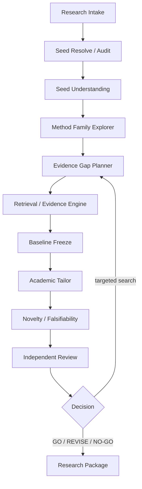

# PaperClaw v0.09：SeededResearch 学术裁缝垂直切片 SOP 草案

> 状态：后期 SOP 草案，待 v0.08 Evidence Engine 稳定后冻结  
> 目标：以“研究方向 + 少量真假混杂种子论文”为输入，交付可追溯、可复现、可证伪并允许 NO-GO 的增量研究包

> 执行前参考：[`PaperClaw_参考项目与可复用模块索引.md`](../../docs/reference/PaperClaw_参考项目与可复用模块索引.md) 中 SeededResearch、Academic Tailoring、Novelty Review、PaperAgent Re8.0、Draftpaper-loop 清单。

## 目录

- [产品定位与范式选择](#1-产品定位)
- [数据契约与遗漏检查](#3-核心数据契约)
- [Pipeline、Skill 与实验 Gate](#5-pipeline-草案)
- [运行模式、风险与 Eval](#8-三运行模式)
- [实施阶段、Gate 与交付](#11-初步实施阶段)

## 1. 产品定位

SeededResearch 是 PaperClaw 的第一个复杂 Research domain，不是第二套 Runtime：

```text
PaperClaw Harness
→ SeededResearch Domain Adapter
→ deterministic stage backbone
→ bounded Worker tasks
→ Verify / Review Gate
→ Research Package
```

保留双入口：

```text
topic_only
seeded_research（推荐）
```

两者最终共享 Evidence、Tailor、Review、Eval 和输出契约。

## 2. 技术选型与范式选择

| 范式 | 用途 | 判断 |
|---|---|---|
| 确定性 Chain | Stage、状态、Gate、预算、恢复 | 主干 |
| ReAct | 在白名单内选择下一 Evidence 动作 | Full Agent 有界启用 |
| Reflection | Seed/Tailor/Final Gate 自审 | 最多 2 轮 |
| MultiAgent | Seed resolve、Retrieval lane 并发 | 只拆独立任务 |
| Skill Adapter | Tailor、Novelty、Review domain policy | 只建议，不绕过 Validator |
| Offline Replay | CI、模型回归、错误 DOI fixture | 必须支持 |

Tailor 保持单一决策者，Reviewer 独立；多个 Worker 不能分别生成方案后由模型随意拼接。

## 3. 核心数据契约

```text
ResearchContract
SeedInput
ScholarlyWorkIdentity
PaperVersionRelation
SourceArtifact
ClaimRecord
EvidenceLink
EvidenceConflict
EvidenceGap
MethodFamilyCard
BaselineCard
ModuleCard
CompatibilityMatrix
ExperimentSpec
DecisionLedger
ReviewFinding
ResearchPackage
```

Claim 与 Evidence 是多对多：

```text
Claim
  ↔ EvidenceLink
      ↔ SourceArtifact + exact locator
```

exact locator 至少支持页码、章节、表格、图、Repo 文件和 commit。

## 4. 用户尚未覆盖的关键问题

### 4.1 “论文 verified”粒度过粗

身份真实不等于：

- PDF 已读；
- 方法描述已核验；
- 实验数值已核验；
- Repo 与论文一致；
- 结论适用于当前任务。

必须复用 v0.08 Evidence 状态机，Domain 不另建布尔 `verified`。

### 4.2 论文版本与撤稿

需要处理：

- arXiv / conference / journal version；
- correction / erratum；
- retraction；
- 同名或近似标题；
- Repo main 与 paper commit 不同；
- Dataset / split / metric 协议变化。

### 4.3 Baseline Freeze

BaselineCard 必须包含：

```text
paper identity/version
repo URL/commit/license
environment lock
checkpoint
dataset/split/preprocessing
seed policy
reported metric
reproduced metric
deviation
reproduction verdict
```

无法复现时只能 `REVISE / NO-GO` 或交付 Reproduction Gap Plan，不能继续假设它可靠。

### 4.4 Evidence Gap 停止标准

搜索不能按“搜到 N 篇”结束，而按：

- gap satisfaction；
- required lane coverage；
- 新证据边际贡献；
- conflict 是否解决；
- 预算是否耗尽；
- 剩余问题是否必须由实验或用户解决。

### 4.5 不确定性传播

上游 `ambiguous / metadata_only / conflicted` 不能在 Tailor 或 Narrative 中静默变成事实。每个 Claim、Module、Baseline 和 Story sentence 保留 Evidence 状态。

### 4.6 合法降级交付

找不到可辩护创新时仍可输出：

- Seed Audit Report；
- Evidence Gap Report；
- Reproduction Plan；
- Baseline Comparison Plan；
- Negative / Boundary Study Plan；
- Engineering / Application Contribution；
- NO-GO Review；
- Human Clarification Request。

不能为了“完成任务”强行生成 A+B+C 创新方案。

## 5. Pipeline 草案



Review 回搜必须绑定 gap_id，并受轮数和搜索预算约束。

## 6. Skill Adapter

### Academic Method Tailoring

输入：BaselineCard、ModuleCard、EvidenceLink、Compatibility、用户约束。  
输出：GO/REVISE/NO-GO、最小拼接、实验矩阵、缺失证据。

### Paper Novelty Design

输入：Problem、Method、Evidence、closest work。  
输出：Problem–Method–Insight、falsifier、Reviewer attacks、Evolution Log。

### Academic Reviewer

输入：Research Package、Claim–Evidence、实验计划。  
输出：结构化 Finding，不直接修改 Evidence 状态。

Skill output 必须经过 Schema / Evidence Validator。Skill 缺失 reference 时不得编造内容。

## 7. 方法兼容与实验 Gate

CompatibilityMatrix 不只检查 shape：

```text
task semantics
input/output meaning
scale / normalization
ordering / mask
gradient flow
loss interaction
training objective
compute / latency
license
failure mode
```

实验至少包含：

```text
Frozen Baseline
Module A
Module B
A+B
leave-one-out
interaction ablation
strong comparison
resource / latency comparison
failure cases
multiple seeds / uncertainty
```

性能提升只是 Evidence，不自动等于 Insight。

## 8. 三运行模式

| 模式 | 联网 | ReAct/Reflection | 用途 |
|---|---|---|---|
| Full Agent | online | 有界开启 | 真实研究方案 |
| Lite Chain | online/cache-first | 关闭或单次 Review | 快速演示、低成本 |
| Offline Replay | 禁止 | fixture | CI、Prompt/Model 回归 |

三模式共享同一顶层 Schema，Lite / Offline 不能关闭身份核验、Evidence 状态和 Validator。

## 9. 风险推演与预案

| 场景 | 预案 / 合法输出 |
|---|---|
| 假 DOI / 错标题 | Seed Audit Report，不进入 Evidence |
| 身份真但全文不可访问 | Metadata-only Research Map |
| PDF 扫描/加密/注入 | parse_failed / untrusted；OCR optional，不提升权限 |
| Repo 删除/无 License | Reproduction Gap / NO-GO |
| Baseline 无法复现 | REVISE / Reproduction Plan |
| 不同 split 指标不可比 | EvidenceConflict，禁止公平比较 Claim |
| 模块 shape 对但语义错 | Reject Module / alternative route |
| 创新证据不足 | Engineering / Boundary contribution |
| 找到高度相似工作 | Novelty Gate blocked，用户决定 pivot |
| Tailor 与 Reviewer 持续冲突 | 达到 2 轮后 NO-GO / Human Gate |
| 预算耗尽 | 输出 unresolved gaps，不伪造完整性 |
| 锚定种子忽略更优路线 | 强制无锚点、竞争和反证 lane |

## 10. Eval

- Seed identity accuracy；
- Fake paper leakage = 0；
- Seed role accuracy；
- Evidence Gap satisfaction；
- Competing / counter-evidence coverage；
- Baseline reproducibility；
- Claim–Evidence alignment；
- Unsupported Claim rate；
- Module provenance / license completeness；
- Compatibility completeness；
- Falsifier coverage；
- Reviewer catch rate；
- GO/REVISE/NO-GO calibration；
- Full/Lite/Offline schema parity；
- cost / latency / tool calls。

## 11. 初步实施阶段

1. ResearchContract、Seed、Identity、Claim/Evidence Schema；
2. Seed Resolve / Version / Retraction / PDF fixture；
3. Method Family + Evidence Gap；
4. v0.08 RetrievalEngine 接入；
5. Baseline Freeze / Reproduction Gap；
6. Tailor / Novelty Skill Adapter；
7. Reviewer / bounded targeted search；
8. ResearchPackage、Eval 和三个跨域案例。

## 12. GO / 降级 / NO-GO

- `GO`：身份、Baseline、Claim、Evidence、Compatibility 和实验计划全部达到 Gate。
- `REVISE`：缺失项可通过有限检索、复现或用户输入补齐。
- `NO-GO`：身份、许可、复现、公平性、兼容或可证伪性失败。
- `降级`：输出 Evidence / Reproduction / Boundary / Engineering package。

## 13. 预期交付

```text
artifacts/v0_09/
├── research_contract.json
├── seed_audit.json
├── evidence_gap_report.md
├── baseline_card.json
├── compatibility_matrix.json
├── experiment_matrix.json
├── novelty_falsifiers.json
├── reviewer_findings.json
├── research_package.md
└── eval_report.md
```

## 14. 明确延期

- 自动运行大规模训练；
- 自动生成或宣称实验结果；
- 全学科方法 ontology；
- 云端 PDF 权限系统；
- 自动论文写作全流程；
- 无人工 Gate 的高风险外部下载与代码执行；
- 将 Academic Skill 直接变成 Runtime 核心。

## 15. 参考

- `G:\PaperAgent\Plan\PaperAgent_Re8.0_SeededResearch学术裁缝MVP策划案.md`
- [`PaperClaw_参考项目与可复用模块索引.md`](../../docs/reference/PaperClaw_参考项目与可复用模块索引.md)
- [`PaperClaw_v0.08_RetrievalRAG与EvidenceEngine_SOP草案.md`](PaperClaw_v0.08_RetrievalRAG与EvidenceEngine_SOP草案.md)
- `C:\Users\ZYF\.codex\skills\academic-method-tailoring\SKILL.md`
- `C:\Users\ZYF\.agents\skills\paper-novelty-design-v1\SKILL.md`
