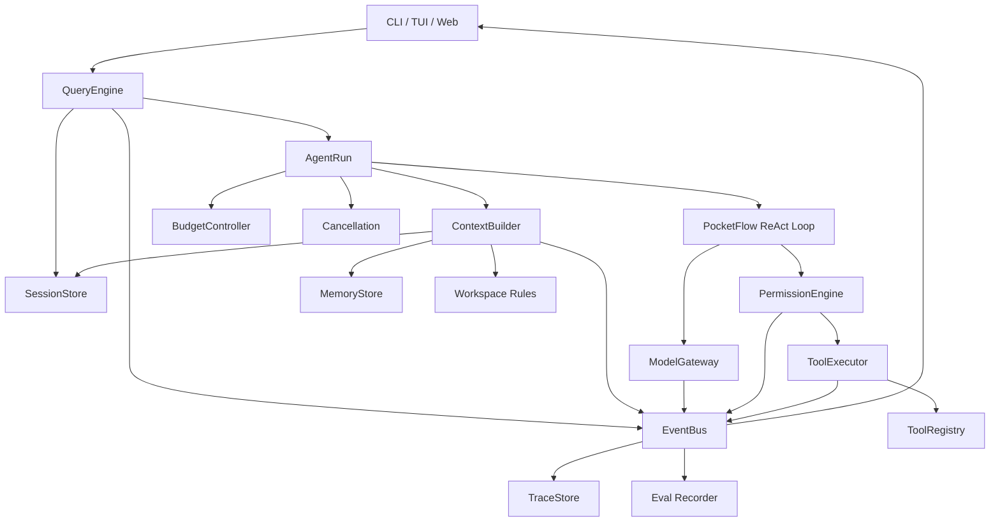

# PaperClaw QueryEngine 设计讨论稿

> 状态：设计讨论稿，尚未进入实施  
> 日期：2026-07-13  
> 目标：参考 Claude Code 的会话级任务编排思想，为 PaperClaw 定义轻量、可观察、可测试的 QueryEngine  
> 前置：先完成 `v0.01` 最小 PocketFlow ReAct Agent 和基础工具，再根据真实 Trace 冻结接口

> **MVP 边界更新（2026-07-14）**：本文保留长期设计空间，但不再视为 v0.05 的一次性交付清单。v0.05 只实现薄 QueryEngine façade、AgentRun、最小预算、基础事件和结构化 RunResult；async streaming、后台 Shell、完整 Permission、Provider Gateway、Replay 与 exporter 均按需后置。

## 目录

- [1. 核心结论](#1-核心结论)
- [2. 名称与职责边界](#2-名称与职责边界)
- [3. 生命周期模型](#3-生命周期模型)
- [4. 总体架构](#4-总体架构)
- [5. QueryEngine 依赖与公开接口](#5-queryengine-依赖与公开接口)
- [6. 状态分层](#6-状态分层)
- [7. submit 生命周期](#7-submit-生命周期)
- [8. PocketFlow 与 QueryEngine 的关系](#8-pocketflow-与-queryengine-的关系)
- [9. Runtime Event](#9-runtime-event)
- [10. ContextBuilder 集成](#10-contextbuilder-集成)
- [11. Permission 与文件状态](#11-permission-与文件状态)
- [12. 预算、中断与恢复](#12-预算中断与恢复)
- [13. Retrieval Query 分层](#13-retrieval-query-分层)
- [14. 错误模型](#14-错误模型)
- [15. 版本演进建议](#15-版本演进建议)
- [16. 待冻结设计决定](#16-待冻结设计决定)
- [17. 非目标](#17-非目标)
- [18. 参考资料](#18-参考资料)

---

## 1. 核心结论

PaperClaw 的 QueryEngine 应定义为：

> 会话级 Agent 任务编排器。一个 QueryEngine 对应一段 conversation；每次用户提交创建一个 AgentRun，QueryEngine 持续协调 Context、模型、PocketFlow Agent Loop、工具、权限、预算、事件和 Session，直到任务完成、中断或达到运行边界。

QueryEngine 不是：

- 单次模型 API Request Handler；
- 搜索关键词生成器；
- 工具实现集合；
- Prompt 字符串拼接函数；
- PocketFlow 的替代品；
- 数据库 Repository；
- TUI Controller。

它的价值在于把一次用户输入转化为一个可观察、可取消、可恢复、受预算约束的 AgentRun。

---

## 2. 名称与职责边界

PaperClaw 同时存在两种容易混淆的 Query：

1. **Agent Query**：用户向 Agent 提交一次任务；
2. **Retrieval Query**：搜索论文、代码、数据集或知识库的检索表达式。

建议固定以下命名：

```text
QueryEngine
    会话级 Agent 编排器

RetrievalEngine
    执行论文、网页、代码和 RAG 检索

QueryCompiler
    把 Research Intent / Evidence Gap 编译成具体检索表达式
```

示例：

```python
query_engine.submit("创建 hello.py 并运行")
retrieval_engine.search(retrieval_request)
query_compiler.compile(research_intent)
```

这个命名边界必须从项目早期保持稳定，避免后续将 Agent Runtime 与论文搜索模块混为一体。

---

## 3. 生命周期模型

Claude Code 的重要启发是：QueryEngine 管理的是 conversation，而不是一次模型请求。PaperClaw 进一步区分三层生命周期：

| 层级 | 生命周期 | 主要状态 |
|---|---|---|
| Application | 进程级 | Provider、Tool Registry、数据库连接、全局配置 |
| Conversation | 多轮会话 | 消息、Task State、权限历史、文件状态、累计 usage、Checkpoint |
| Run | 一次用户提交 | 当前目标、step、预算、abort、临时 Context、停止原因 |

关系如下：

```text
Application
  └── Conversation
        └── QueryEngine
              ├── AgentRun 1：用户任务 A
              ├── AgentRun 2：用户追问 B
              └── AgentRun 3：继续未完成任务
```

一次 Run 完成后，不是所有临时状态都进入 Conversation。只有消息、已确认决策、Task State、权限决定、文件状态、usage 和 Checkpoint 等需要跨轮保留的内容才合并回会话。

---

## 4. 总体架构



职责概要：

- PocketFlow：单轮 action routing 和 ReAct 控制流；
- QueryEngine：整个用户任务生命周期；
- ContextBuilder：决定每个 step 模型看到什么；
- PermissionEngine：工具调用前的强制权限判断；
- ToolExecutor：统一工具执行、超时和错误转换；
- EventBus：向 CLI、TUI、Trace、Replay 和 Eval 暴露过程；
- SessionStore：持久化 conversation 和可恢复状态。

---

## 5. QueryEngine 依赖与公开接口

### 5.1 依赖注入

QueryEngine 应编排服务，而不是直接实现所有能力：

```python
class QueryEngine:
    def __init__(
        self,
        config: QueryEngineConfig,
        session_store: SessionStore,
        context_builder: ContextBuilder,
        agent_loop: AgentLoop,
        event_bus: EventBus,
        budget_controller: BudgetController,
    ):
        ...
```

QueryEngine 不应：

- 直接读取或修改文件；
- 直接运行 Shell；
- 自己拼接全部 Prompt；
- 自己实现路径安全；
- 自己执行向量检索；
- 自己编写数据库 SQL；
- 自己渲染 TUI；
- 自己判断论文真实性。

### 5.2 建议公开接口

```python
class QueryEngine:
    async def submit(
        self,
        user_input: str | list[ContentBlock],
        options: SubmitOptions | None = None,
    ) -> AsyncIterator[RuntimeEvent]:
        ...

    async def cancel(self, run_id: str) -> None:
        ...

    async def resume(self, conversation_id: str) -> None:
        ...

    async def compact(self, conversation_id: str) -> Checkpoint:
        ...

    async def get_state(self) -> ConversationSnapshot:
        ...
```

`submit()` 应返回事件流，而不是最终字符串：

```python
async for event in engine.submit("创建 hello.py 并运行"):
    render(event)
```

同一事件流可以被不同消费者使用：

- CLI：打印关键事件；
- TUI：更新 Chat、Tools、Context 和 Trace 面板；
- 测试：断言事件序列和最终状态；
- Offline Replay：记录并重放；
- Eval：计算过程和结果指标。

---

## 6. 状态分层

### 6.1 ConversationState

跨多轮保留：

```python
@dataclass
class ConversationState:
    conversation_id: str
    workspace_root: Path

    messages: list[Message]
    task_state: TaskState

    permission_history: list[PermissionDecision]
    file_state: dict[str, FileSnapshot]
    discovered_resources: set[str]

    cumulative_usage: Usage
    last_checkpoint_id: str | None

    created_at: datetime
    updated_at: datetime
```

### 6.2 RunState

一次 `submit()` 独享：

```python
@dataclass
class RunState:
    run_id: str
    conversation_id: str
    user_input: UserInput

    status: RunStatus
    step_count: int
    started_at: datetime

    current_tool_call: ToolCall | None
    current_context_snapshot_id: str | None

    usage: Usage
    stop_reason: StopReason | None
    error: RunError | None
```

### 6.3 LoopState

PocketFlow 内部只保存短期控制状态：

```python
@dataclass
class LoopState:
    history: list[ActionObservation]
    current_action: AgentAction | None
    final_answer: str | None
```

PocketFlow 的 `shared` 不应保存整个 Session、数据库连接、模型 client、TUI 状态或其他不可序列化对象。

---

## 7. submit 生命周期

一次 `submit()` 建议遵循：

```text
1. 接收用户输入
2. 创建 AgentRun
3. 保存 user message
4. 检查 Session 和 workspace
5. 创建运行预算
6. 编译当前 Context
7. 启动 PocketFlow ReAct Loop
8. 调用模型
9. 解析 action
10. 工具调用前进行 Permission 判断
11. 执行工具
12. 将 Observation 追加到 Loop
13. 更新 Conversation State
14. 重新编译下一轮 Context
15. 继续循环或结束
16. 保存最终消息、usage 和 stop reason
17. 生成 Checkpoint 或评估记录
18. 发出 run.completed
```

伪代码：

```python
async def submit(self, user_input, options=None):
    run = await self._start_run(user_input, options)

    try:
        yield RunStarted.from_run(run)

        async for event in self.agent_loop.run(
            run=run,
            build_context=self.context_builder.build,
        ):
            await self._apply_event(event)
            yield event

        await self._complete_run(run)
        yield RunCompleted.from_run(run)

    except RunCancelled:
        await self._cancel_run(run)
        yield RunCancelledEvent.from_run(run)

    except Exception as exc:
        await self._fail_run(run, exc)
        yield RunFailed.from_exception(run, exc)
```

---

## 8. PocketFlow 与 QueryEngine 的关系

`v0.01` 的 PocketFlow ReAct Loop：

```text
DecideAction
    ↓
Tool Node
    ↓
Observation
    ↓
DecideAction
```

QueryEngine 包在 Agent Loop 外部：

```text
QueryEngine.submit()
    ↓
准备 Run / Context / Budget
    ↓
调用 PocketFlow Agent Loop
    ↓
接收并处理 Runtime Event
    ↓
保存 Session / Trace / Usage
    ↓
继续、压缩、中断或完成
```

必须保持以下边界：

- PocketFlow Flow 不管理 Conversation；
- PocketFlow Node 不直接写 Session 数据库；
- PocketFlow Node 不控制 TUI；
- PocketFlow Node 只负责一次 action 的决策或执行；
- QueryEngine 决定任务是否继续、暂停、压缩、取消或结束。

这样可以防止 PocketFlow `shared` 演化成不可治理的全局状态。

---

## 9. Runtime Event

建议在 TUI 之前冻结最小事件协议：

```python
RuntimeEventType = Literal[
    "run.started",
    "context.compiled",
    "model.started",
    "model.delta",
    "model.completed",
    "tool.proposed",
    "permission.requested",
    "permission.allowed",
    "permission.denied",
    "tool.started",
    "tool.completed",
    "tool.failed",
    "context.compacted",
    "run.completed",
    "run.cancelled",
    "run.failed",
]
```

统一事件：

```python
@dataclass
class RuntimeEvent:
    event_id: str
    event_type: str
    conversation_id: str
    run_id: str
    sequence: int
    timestamp: datetime
    payload: dict
```

约束：

- 每个 Run 的 `sequence` 单调递增；
- 不只依赖时间戳排序；
- 事件 payload 可序列化；
- Secret 和超长工具输出在进入事件前必须过滤或引用化；
- Trace 保存真实事件，不根据最终答案反向伪造过程。

事件协议将成为 TUI、Offline Replay、Agent Eval 和故障复现的共同基础。

---

## 10. ContextBuilder 集成

Context 不能只在 `submit()` 开始时构建一次。工具 Observation 会改变下一轮模型所需信息：

```text
Step 1
用户任务 + 项目规则

Step 2
用户任务 + 项目规则 + FileRead Observation

Step 3
用户任务 + 项目规则 + Read 摘要 + Grep Observation
```

建议接口：

```python
context = await context_builder.build(
    conversation=conversation,
    run=run,
    loop_history=loop.history,
    budget=budget.remaining_context_tokens,
)
```

每次生成 `ContextSnapshot`：

```python
@dataclass
class ContextSnapshot:
    snapshot_id: str
    items: list[ContextItem]
    rendered_messages: list[ModelMessage]
    total_tokens: int
    excluded_items: list[ExcludedContextItem]
```

ContextSnapshot 应能解释：

- 哪些信息进入模型窗口；
- 哪些信息被排除；
- 排除原因是什么；
- 每个 section 消耗多少 token；
- 是否发生压缩；
- 压缩后关键约束是否保留。

---

## 11. Permission 与文件状态

### 11.1 Permission History

权限决定需要跨 step 保留，避免重复询问或重复尝试已经拒绝的动作：

```python
@dataclass
class PermissionDecision:
    scope: str
    tool_name: str
    decision: Literal[
        "allow_once",
        "allow_session",
        "deny_once",
        "deny_session",
    ]
    argument_fingerprint: str
    reason: str
```

权限缓存不能只按工具名判断。拒绝一次破坏性 Bash 命令，不代表整个 Session 都不能运行 `pytest`。

### 11.2 FileSnapshot

“先读再改”不能只依赖 Prompt，应使用乐观并发控制：

```python
@dataclass
class FileSnapshot:
    path: str
    content_hash: str
    modified_at: datetime
```

编辑前检查当前文件 hash 是否仍与读取时一致。如果用户、IDE 或其他进程已修改文件，拒绝盲目覆盖：

```text
FILE_CHANGED_SINCE_READ
Please read the file again before editing.
```

这一机制既防止覆盖用户修改，也能为并发 Agent 和 Session Resume 提供基础。

---

## 12. 预算、中断与恢复

### 12.1 多维预算

QueryEngine 不应只限制 step：

```python
@dataclass
class RunBudget:
    max_steps: int
    max_model_calls: int
    max_tool_calls: int
    max_tokens: int
    max_cost_usd: Decimal | None
    max_wall_time_seconds: int
```

每轮开始前由 BudgetController 返回：

```text
continue
compact_then_continue
stop_step_limit
stop_token_limit
stop_cost_limit
stop_timeout
```

一次模型调用可能消耗大量 token，一次 Bash 也可能长时间占用进程，因此单一 `max_steps` 不足以保证有界执行。

### 12.2 Run Status

建议区分：

```text
pending
running
waiting_permission
completed
failed
cancelled
interrupted
```

- `cancelled`：用户明确终止；
- `interrupted`：进程退出、系统异常或连接中断，理论上可恢复。

### 12.3 中断处理

中断时需要分别处理：

- 模型流：取消生成；
- Bash：终止子进程；
- Permission：取消等待中的请求；
- Session：避免半写入状态；
- Event：记录真实 stop reason；
- Resume：保存可以恢复的最后一致 Checkpoint。

---

## 13. Retrieval Query 分层

SeededResearch 中，模型可以判断：

- 当前缺少哪类 Evidence；
- 应搜索论文、Repo、Dataset 还是已有 Memory；
- 是找竞争方法、机制模块还是反证；
- 是否需要继续搜索。

但最终检索字符串不应完全由模型自由生成。推荐链路：

```text
Research Intent
    ↓
Evidence Gap
    ↓
模型选择 Search Lane
    ↓
QueryCompiler
    ↓
Backend-specific Query
    ↓
RetrievalEngine
```

模型输出结构化意图：

```json
{
  "gap_id": "gap-12",
  "lane": "competing_baseline",
  "task": "concrete crack segmentation",
  "constraints": ["small dataset", "pixel-level localization"],
  "exclude_terms": ["YOLO"]
}
```

QueryCompiler 再确定性生成查询：

```text
"concrete crack segmentation" benchmark small dataset baseline
"pixel-level crack segmentation" U-Net DeepLab SegFormer comparison
```

随后针对 Semantic Scholar、Crossref、arXiv、GitHub、Dataset Web 等后端分别编译。

### 13.1 从 PaperAgent 继承的经验

- 原始用户主题必须保存在 `raw_topic`，任何 repair 都不能覆盖它；
- 模型适合选择检索意图、lane 和约束，不适合独占最终 query 字符串；
- 最终 query 尽量由任务 atoms、方法族、Evidence Gap 和后端模板确定性生成；
- 禁止 `ToolPlan.query` 出现占位符式或与原主题漂移的文本；
- Query、检索结果、筛选、角色分类和最终 Claim 都应保留来源链；
- Skill 或 Seed 注入的候选不能在后续筛选阶段无理由丢失。

---

## 14. 错误模型

统一错误结构：

```python
@dataclass
class RunError:
    code: str
    message: str
    retryable: bool
    source: str
    details: dict
```

建议错误码：

```text
MODEL_RATE_LIMITED
MODEL_OUTPUT_INVALID
MODEL_UNAVAILABLE
TOOL_ACTION_UNKNOWN
TOOL_ARGUMENT_INVALID
TOOL_PERMISSION_DENIED
TOOL_TIMEOUT
WORKSPACE_PATH_DENIED
FILE_CHANGED_SINCE_READ
CONTEXT_BUDGET_EXCEEDED
SESSION_WRITE_FAILED
RUN_CANCELLED
RUN_INTERRUPTED
INTERNAL_STATE_INVALID
```

QueryEngine 根据错误类型决定：

```text
retry
repair
ask_user
fallback
compact
stop
```

重试权应集中在 QueryEngine / RetryPolicy，不能由每个 Node 无限制自行 retry，否则预算、Trace 和最终评估都会失真。

---

## 15. 版本演进建议

### v0.01：PocketFlow ReAct

```text
task → decide → tool → observation → decide → done
```

先验证五个工具、action routing、模型输出契约、错误回流和最大步数。

### v0.02：Verify / Reflection

- `done` 改为完成提议；
- 客观 Verification Evidence；
- 有界 Reflection；
- 失败—修复—重验闭环。

### v0.03：MultiAgent

- Coordinator / Worker / Reviewer；
- Task DAG；
- 文件作用域和写入所有权；
- 局部 Verify 与全局 Review。

### v0.04：Session 与 Context

- SQLite Session；
- ContextBuilder；
- ContextSnapshot；
- Task State；
- Checkpoint；
- Session Resume；
- FileSnapshot。

### v0.05：QueryEngine / Harness

- 一个 Conversation 对应一个 QueryEngine；
- `submit()` 和 AgentRun；
- 复用现有 FlowRunner / Context / Session / Tool / Permission；
- 最小 Runtime Event；
- step / model-call / tool-call 预算；
- 节点边界 cooperative stop；
- 结构化 RunResult 与工具错误回流。

v0.05 不要求 async streaming、后台 Shell、完整 PermissionDecision、wall-time / cost budget、Provider capability、Replay 或 exporter。增强候选见 `Plan/drafts/PaperClaw_v0.05.1_Harness增强候选池.md`。

### v0.06：Claw 交互层

- Textual optional TUI；
- Chat、Prompt、RunStatus 和关键 Tool Timeline；
- Worker thread 包装同步 QueryEngine；
- `/new`、cooperative `/cancel`、`/quit`；
- CLI fallback。

Permission Dialog、Shell streaming、Context / Trace / MultiAgent 面板和 Session Picker 均属于 `Plan/drafts/PaperClaw_v0.06.1_Claw交互增强候选池.md`，不进入 v0.06 MVP Gate。

### v0.07：Trace、Replay 与 Eval

- append-only TraceStore；
- deterministic replay；
- LangSmith optional exporter；
- Agent / Context / MultiAgent Eval。

### v0.08：Retrieval、RAG 与 Evidence

- QueryCompiler；
- RetrievalEngine；
- Evidence Gap；
- RAG Eval；
- Evidence 状态机。

### v0.09：SeededResearch

- Research domain adapter。

### v0.10：Reliability / Security / Release

- migration / backup / crash recovery；
- security / secret / permission hardening；
- packaging / CI / license / SBOM；
- reproducible offline release。

完整顺序见 `Plan/PaperClaw_v0.02-v0.10_SOP总路线与风险推演.md`；具体接口仍须依据每个前置版本的真实 Trace 调整。

---

## 16. 待冻结设计决定

以下是当前推荐但尚未实施验证的决定：

1. 一个 QueryEngine 对应一个 Conversation，不对应一次模型请求；
2. 一次用户提交创建一个独立 AgentRun；
3. PocketFlow 管 action routing，QueryEngine 管任务生命周期；
4. QueryEngine 只编排服务，不直接实现工具和数据库逻辑；
5. 所有运行过程通过结构化 Runtime Event 暴露；
6. Context 每个 step 可以重新编译，并生成 ContextSnapshot；
7. Permission 在工具执行前强制判断，不依赖 Prompt；
8. 文件修改前验证 FileSnapshot，落实“先读再改”；
9. Agent Query 与 Retrieval Query 分开命名；
10. 研究检索由模型选择意图，QueryCompiler 确定性生成最终 query；
11. Run 同时受 step、token、tool、cost 和 wall time 预算约束；
12. QueryEngine 从第一版开始支持 Offline Replay 所需的可序列化事件。

这些决定应在 `v0.01` 运行后用真实问题验证，而不是仅凭设计稿直接冻结。

---

## 17. 非目标

本设计讨论稿暂不定义：

- QueryEngine 的最终 Python package 路径；
- 数据库表和 migration；
- 完整 Event Schema；
- Provider-specific 流式协议；
- Permission 风险分类表；
- TUI 组件实现；
- Retrieval backend 细节；
- SeededResearch Graph 节点；
- 多 Agent 调度；
- MCP 生命周期；
- 分布式执行。

这些内容应在对应工具、范式和基础契约准备好后分别形成设计或 SOP。

---

## 18. 参考资料

- [Claude Code 核心循环：QueryEngine](https://xuanyuancode.com/learn-claude-code/tutorials/cc5)
- [PocketFlow 官方仓库](https://github.com/The-Pocket/PocketFlow)
- [PocketFlow Coding Agent 示例](https://github.com/The-Pocket/PocketFlow/tree/main/cookbook/pocketflow-coding-agent)
- [`PaperClaw_v0.01_最小ReAct编码Agent_SOP.md`](../../Plan/PaperClaw_v0.01_最小ReAct编码Agent_SOP.md)
- [`PaperClaw_上下文系统与提示词工程骨架.md`](PaperClaw_上下文系统与提示词工程骨架.md)
- [`PaperClaw_项目方向路径与约束.md`](PaperClaw_项目方向路径与约束.md)

一句话总结：

> PaperClaw QueryEngine 是会话级任务编排器：它把一次用户输入转化为一个有 Context、有预算、有工具权限、有事件轨迹、能够中断和恢复的 AgentRun；PocketFlow 是其中负责 ReAct action routing 的轻量执行内核。
