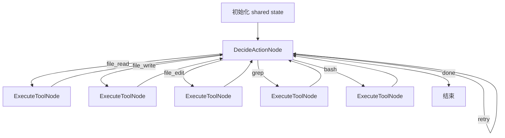

# PaperClaw v0.01：最小 ReAct Coding Agent 初学者学习笔记

> 面向对象：第一次系统学习 Agent 设计、工具调用和 Agent Runtime 的开发者  
> 分析版本：PaperClaw v0.01 收尾提交 `f1fab61264cd85710b1e7b9d9cbae2a557b01127`  
> 学习重点：**单 Agent 的最小闭环、工具系统、状态管理、结构化输出、安全边界、可测试性**

---

## 0. 先给结论：v0.01 到底做了什么

PaperClaw v0.01 实现了一个非常小、但结构完整的 Coding Agent。

它能够反复执行以下循环：

```plain text
理解当前任务和历史
        ↓
模型选择一个动作
        ↓
Runtime 校验动作
        ↓
执行一个工具
        ↓
把工具结果写入历史
        ↓
再次让模型决策
        ↓
模型提出 done 或达到停止条件
```

它不是“让大模型一次性生成全部代码”，而是把大模型放进一个受控运行时中，让模型每轮只能选择一个动作。

v0.01 已实现：

- 最小 ReAct 循环；
- 五个工作区工具；
- 严格 JSON 动作协议；
- 统一工具注册与执行接口；
- 工作区路径隔离；
- 文件覆盖和精确替换约束；
- PowerShell 命令超时与输出截断；
- 非法输出重试；
- 最大步数停止；
- OpenAI-compatible 模型适配器；
- CLI；
- FakeModel 离线测试。

v0.01 尚未实现：

- 真正的 Permission Engine；
- Session；
- 长期 Memory；
- Context 压缩；
- 持久化 Trace；
- Multi-Agent；
- RAG；
- TUI；
- 可靠的完成验证。

---

# 第一部分：理解 Agent 的基本组成

## 1. 普通大模型调用和 Agent 有什么不同

普通大模型调用通常是：

```plain text
输入 Prompt → 模型生成文本 → 结束
```

Agent 则是：

```plain text
输入任务
  ↓
模型判断下一步做什么
  ↓
调用外部工具
  ↓
获得真实环境反馈
  ↓
根据反馈继续判断
  ↓
直到完成或停止
```

Agent 的关键不是“模型更聪明”，而是模型被放入了一个循环，并获得了：

1. **工具**：能读文件、改文件、运行命令；
2. **状态**：知道之前做过什么；
3. **控制流**：决定下一步去哪个节点；
4. **停止规则**：防止无限循环；
5. **安全边界**：限制它能操作的范围；
6. **可观察性**：记录过程，方便调试。

---

## 2. PaperClaw v0.01 的四层结构

可以把 v0.01 分成四层：

```plain text
┌─────────────────────────────────────────┐
│ CLI 层                                  │
│ 接收任务、workspace、max_steps、输出结果 │
├─────────────────────────────────────────┤
│ Agent Runtime / Flow 层                 │
│ DecideAction → ExecuteTool → DecideAction│
├─────────────────────────────────────────┤
│ Tool 层                                 │
│ file_read / write / edit / grep / bash  │
├─────────────────────────────────────────┤
│ Model Adapter 层                        │
│ OpenAI-compatible HTTP API              │
└─────────────────────────────────────────┘
```

对应代码：

| 层 | 主要文件 |
|---|---|
| CLI | `src/paperclaw/cli.py` |
| Flow | `src/paperclaw/agent/flow.py` |
| Node | `src/paperclaw/agent/nodes.py` |
| Prompt | `src/paperclaw/agent/prompts.py` |
| Parser | `src/paperclaw/agent/parser.py` |
| State | `src/paperclaw/agent/state.py` |
| Tool Contract | `src/paperclaw/tools/base.py` |
| Tool Registry | `src/paperclaw/tools/registry.py` |
| 文件工具 | `src/paperclaw/tools/file_*.py` |
| 搜索工具 | `src/paperclaw/tools/grep.py` |
| 命令工具 | `src/paperclaw/tools/bash.py` |
| 模型接口 | `src/paperclaw/models/base.py` |
| 模型适配器 | `src/paperclaw/models/adapters/openai_compat.py` |

---

# 第二部分：v0.01 的控制流设计

## 3. 为什么使用 PocketFlow

v0.01 使用 PocketFlow 的：

- `Node`
- `Flow`
- `shared`
- action routing

这里不要先把 PocketFlow 想复杂。

对初学者来说，可以理解为：

- `Node`：一个处理步骤；
- `Flow`：把步骤连接起来；
- `shared`：所有步骤共享的运行状态；
- action routing：一个节点返回不同字符串，决定下一步走向哪里。

例如：

```plain text
DecideActionNode 返回 "file_read"
    ↓
进入 file_read 对应的 ExecuteToolNode

ExecuteToolNode 返回 "default"
    ↓
重新进入 DecideActionNode
```

---

## 4. v0.01 的流程图



核心代码逻辑可以简化为：

```python
decide = DecideActionNode(model, registry)

for tool_name in registry.names:
    execute = ExecuteToolNode(registry)
    decide - tool_name >> execute
    execute >> decide

decide - "retry" >> decide
decide - "done" >> end
```

这是一种非常典型的 Agent Runtime 结构：

```plain text
决策节点 + 工具节点 + 循环边 + 结束边
```

---

## 5. 为什么每轮只允许一个动作

v0.01 的 Prompt 明确要求：

```plain text
Select exactly one action.
```

模型每轮只能返回一个 JSON 对象。

例如：

```json
{
  "action": "file_read",
  "arguments": {
    "path": "app.py"
  },
  "reason": "先读取当前实现"
}
```

而不是：

```json
{
  "actions": [
    {"action": "file_read"},
    {"action": "file_edit"},
    {"action": "bash"}
  ]
}
```

### 单动作设计的优点

1. 每一步都有真实 Observation；
2. 出错后可以恢复；
3. Trace 更清晰；
4. 权限判断更容易；
5. 每个工具调用都能独立测试；
6. 模型不能一次性规划并假设后续都成功。

### 缺点

- 调用模型次数更多；
- 长任务速度较慢；
- History 会不断增长；
- 缺少显式规划时，模型可能试错。

对于 v0.01，选择单动作是正确的，因为版本目标是建立最小、可测试、可解释的地基。

---

# 第三部分：状态设计

## 6. `shared` 是 Agent 的运行时内存

v0.01 没有数据库，也没有长期 Session。

它使用一个 Python `dict` 保存本次运行状态：

```python
{
    "task": ...,
    "workspace": ...,
    "history": [],
    "current_tool_call": None,
    "step_count": 0,
    "max_steps": 12,
    "invalid_output_count": 0,
    "result": None,
    "verification": None,
    "verification_status": "unverified",
    "remaining_issues": [],
    "stop_reason": None,
    "event_handler": None,
}
```

这个状态有三类信息。

### 6.1 任务信息

```plain text
task
workspace
```

说明 Agent 要做什么，以及只能在哪个目录工作。

### 6.2 循环控制信息

```plain text
step_count
max_steps
invalid_output_count
current_tool_call
stop_reason
```

用于防止无限运行，并在节点之间传递当前动作。

### 6.3 过程与结果信息

```plain text
history
result
verification
verification_status
remaining_issues
```

用于给模型提供上下文，也用于最终输出和调试。

---

## 7. 为什么不能只保存聊天记录

很多初学者会把 Agent 状态设计为：

```python
messages = [
    {"role": "user", "content": "..."},
    {"role": "assistant", "content": "..."},
    {"role": "tool", "content": "..."}
]
```

这种方式简单，但存在问题：

- 工具结果结构容易丢失；
- 不方便判断某一步是否成功；
- 不方便查询最后一次写文件发生在哪一步；
- 不方便做自动验证；
- 不方便做重放、评测和权限审计。

v0.01 使用结构化 `HistoryEntry`：

```python
@dataclass
class HistoryEntry:
    step: int
    tool: str
    arguments: dict
    reason: str
    result: ToolResult
```

这是非常重要的 Agent 工程思想：

> 不要把所有运行信息都塞进自然语言。关键事实应该保存为结构化字段。

---

## 8. `ToolCall`、`DoneAction` 和 `HistoryEntry`

### 8.1 `ToolCall`

```python
@dataclass
class ToolCall:
    action: str
    arguments: dict
    reason: str
```

表示模型希望执行的动作。

例如：

```python
ToolCall(
    action="file_edit",
    arguments={
        "path": "app.py",
        "old_text": "return 1",
        "new_text": "return 2"
    },
    reason="修复返回值"
)
```

### 8.2 `DoneAction`

```python
@dataclass
class DoneAction:
    result: str
    verification: str = ""
    remaining_issues: list[str] = []
```

表示模型认为任务已完成。

注意：v0.01 会比较直接地接受这个动作，这也是 v0.02 要修复的核心问题。

### 8.3 `HistoryEntry`

保存真正执行过的工具调用和结果。

它不是模型的“想法”，而是 Runtime 记录的事实。

---

# 第四部分：Prompt 与动作协议

## 9. v0.01 的 Prompt 由哪些部分组成

`build_prompt()` 把以下内容组合起来：

```plain text
[Identity]
[Rules]
[Workspace]
[Tools]
[Task]
[History]
[Output Contract]
```

### 9.1 Identity

告诉模型它是什么：

```plain text
You are the minimal coding agent operating inside one workspace.
```

### 9.2 Rules

核心规则：

```plain text
Observe before modifying.
Select exactly one action.
Never claim an unexecuted result.
Do not install dependencies.
```

### 9.3 Workspace

告诉模型工作区和 Shell 环境：

```plain text
某个绝对路径
Windows PowerShell
```

### 9.4 Tools

把 Tool Registry 中的工具名称和描述序列化给模型。

### 9.5 Task

用户任务。

### 9.6 History

之前所有结构化工具调用和结果。

### 9.7 Output Contract

要求模型只返回一个 JSON 对象。

---

## 10. 为什么要严格要求 JSON

Agent Runtime 必须将模型输出转换为程序动作。

如果模型随意输出：

```plain text
我认为应该先看看 app.py，然后修改返回值。
```

程序很难可靠判断：

- 要调用哪个工具；
- 参数是什么；
- 是否真的只调用一个工具；
- 是否已经完成。

因此 v0.01 要求：

```json
{
  "action": "file_read",
  "arguments": {
    "path": "app.py"
  },
  "reason": "先观察文件"
}
```

这叫作 **结构化输出契约**。

---

## 11. Parser 为什么故意不做太宽松的修复

`_load_object()` 只接受：

1. 完整 JSON；
2. 单个 Markdown JSON code fence。

例如这两种可以接受：

```json
{"action":"file_read","arguments":{"path":"app.py"},"reason":"read"}
```

以及：

`````plain text
```json
{"action":"file_read","arguments":{"path":"app.py"},"reason":"read"}
```
`````

但下面这种不会被“猜测修复”：

```plain text
好的，我来读取文件：
{"action":"file_read","arguments":{"path":"app.py"}}
接下来我会修改。
```

### 这样设计的原因

过度宽松的 Parser 会导致：

- Runtime 猜错模型意图；
- 多个 JSON 时选择错误；
- 安全边界不明确；
- 测试难以覆盖；
- 模型输出质量下降，因为系统总替它修。

v0.01 的原则是：

> 输出不符合契约，就明确失败并有限重试，而不是进行不可控猜测。

---

## 12. 非法输出如何恢复

如果模型输出非法：

```plain text
I will read app.py.
```

Runtime 会：

1. 增加 `invalid_output_count`；
2. 向 History 写入一条失败记录；
3. 发出 `invalid_model_output` 事件；
4. 返回 `"retry"`；
5. 再次调用模型。

最多允许两次非法输出。

超过上限后：

```plain text
stop_reason = invalid_model_output
```

这叫 **有界重试**。

Agent 设计中，任何自动重试都应该有上限。

---

# 第五部分：工具系统

## 13. 为什么工具需要统一接口

v0.01 定义了统一 Tool Protocol：

```python
class Tool(Protocol):
    name: str
    description: str

    def validate(self, arguments: dict) -> None:
        ...

    def execute(self, arguments: dict, context: ToolContext) -> ToolResult:
        ...
```

每个工具都必须有：

- 名称；
- 描述；
- 参数校验；
- 执行函数；
- 统一结果。

这样 `ExecuteToolNode` 不需要知道每个工具的内部细节。

它只做：

```python
tool = registry.get(call.action)
result = safe_execute(tool, call.arguments, context)
```

这体现了软件工程中的：

- 接口隔离；
- 依赖倒置；
- 策略可替换；
- 统一错误边界。

---

## 14. `ToolContext`

```python
@dataclass(frozen=True)
class ToolContext:
    workspace: Path
    output_limit: int = 20_000
```

Context 不是模型提供的，而是 Runtime 提供的。

这是安全设计的重要原则：

> 可信运行时信息不能由模型自己填写。

例如，模型不能在参数中说：

```json
{
  "workspace": "C:\\"
}
```

真正的 workspace 由 Runtime 注入。

---

## 15. `ToolResult`

```python
@dataclass
class ToolResult:
    ok: bool
    output: str
    error_code: str | None
    metadata: dict
```

### 为什么不直接返回字符串

只返回字符串：

```plain text
file not found
```

Runtime 无法可靠知道：

- 成功还是失败；
- 是参数错误、路径错误还是命令错误；
- 是否应该重试；
- exit code 是多少；
- 输出是否被截断。

结构化结果可以表达：

```json
{
  "ok": false,
  "output": "path does not exist: app.py",
  "error_code": "validation_error",
  "metadata": {}
}
```

---

## 16. `safe_execute()` 是工具异常边界

```python
def safe_execute(tool, arguments, context):
    try:
        tool.validate(arguments)
        return tool.execute(arguments, context)
    except ToolValidationError as exc:
        return ToolResult(False, str(exc), "validation_error")
    except Exception as exc:
        return ToolResult(False, "...", "internal_error")
```

它保证：

> 单个工具崩溃，不应该直接让整个 Agent Runtime 崩溃。

这是一种防御性边界。

工具失败应该成为 Observation，交给下一轮模型处理。

---

## 17. Tool Registry

Registry 保存：

```plain text
工具名称 → 工具对象
```

主要作用：

1. 防止工具名重复；
2. 根据 action 找工具；
3. 向 Prompt 提供工具列表；
4. 允许未来替换工具集合；
5. 让 Flow 动态为每个工具建立路由。

增加新工具的大致步骤：

```python
class ListFilesTool:
    name = "list_files"
    description = "List files in the workspace."

    def validate(...):
        ...

    def execute(...):
        ...
```

然后注册：

```python
ToolRegistry([
    FileReadTool(),
    FileWriteTool(),
    ListFilesTool(),
])
```

---

# 第六部分：五个工具的设计

## 18. `file_read`

作用：

- 读取 UTF-8 文本文件；
- 支持起始行和结束行；
- 默认最多读取约 500 行；
- 输出带行号；
- 有输出长度上限。

示例：

```json
{
  "action": "file_read",
  "arguments": {
    "path": "src/app.py",
    "start_line": 1,
    "end_line": 120
  },
  "reason": "读取目标模块"
}
```

### 设计价值

- 行号便于后续定位；
- 分段读取避免上下文爆炸；
- UTF-8 严格解码，避免把二进制文件误当文本；
- 输出截断避免工具输出占满 Prompt。

---

## 19. `file_write`

作用：

- 创建文件；
- 或显式覆盖文件。

关键约束：

```plain text
文件已存在 + overwrite=false → 拒绝
```

模型必须明确传：

```json
{
  "path": "app.py",
  "content": "...",
  "overwrite": true
}
```

### 为什么需要显式 overwrite

如果没有这个约束，模型可能在不了解原文件内容时直接覆盖。

显式授权至少能够：

- 让 Prompt 中的行为更清晰；
- 在 Trace 中看到它有意覆盖；
- 防止默认误覆盖；
- 便于未来接 Permission Engine。

---

## 20. `file_edit`

作用：

```plain text
将一个唯一出现的 old_text 替换为 new_text
```

关键检查：

```plain text
old_text 必须恰好出现一次
```

出现 0 次：

- 说明模型看到的内容可能过期；
- 或参数写错。

出现多次：

- 说明替换目标不够精确；
- 可能误改多个位置。

因此直接返回 conflict。

### 这是一个很好的 Agent 工具设计

模型修改文件时，最危险的是“模糊修改”。

唯一精确替换可以把修改行为限制为：

```plain text
我明确知道旧内容是什么
并且它只在一个位置出现
```

虽然能力有限，但可解释性很高。

---

## 21. `grep`

作用：

- 在工作区搜索正则表达式；
- 支持 glob；
- 限制最大结果数；
- 跳过 `.git`、虚拟环境、`node_modules`、构建目录等；
- 跳过无法 UTF-8 解码的文件。

示例：

```json
{
  "action": "grep",
  "arguments": {
    "pattern": "def answer",
    "path": ".",
    "glob": "*.py",
    "max_results": 50
  },
  "reason": "定位函数定义"
}
```

### 为什么 Agent 需要搜索工具

如果没有 grep，模型只能：

- 猜文件名；
- 依次读取大量文件；
- 或通过 Bash 绕过专用工具。

专用搜索工具能提供更稳定、可控的输出。

---

## 22. `bash`

虽然名称叫 Bash，但 v0.01 实际运行：

```plain text
Windows PowerShell
```

主要能力：

- 固定 cwd 为 workspace；
- 非交互模式；
- 禁止 stdin；
- 环境变量 allowlist；
- 最长 60 秒；
- 默认 30 秒；
- stdout/stderr 捕获；
- 输出截断；
- 超时后终止进程树；
- 最小 denylist。

示例：

```json
{
  "action": "bash",
  "arguments": {
    "command": "python hello.py",
    "timeout_seconds": 30
  },
  "reason": "运行程序验证输出"
}
```

---

## 23. Bash 安全设计为什么只是“最小边界”

denylist 会阻止部分明显危险命令，例如：

- 安装依赖；
- 递归删除；
- 格式化磁盘；
- 关机；
- 启动交互进程；
- 某些危险 shell 组合。

但字符串正则无法真正理解命令语义。

例如模型仍可能：

- 通过 Python 脚本改写文件；
- 使用其他命令绕开 denylist；
- 访问工作区外的路径；
- 访问网络；
- 读取环境中可见的敏感信息；
- 组合未被识别的危险语法。

因此 v0.01 文档明确承认：

> Bash denylist 不是完整 Permission Engine，也不是 OS Sandbox。

这是一个很重要的学习点：

> “有一些安全检查”不等于“系统安全”。

---

## 24. 工作区路径边界

文件工具调用 `resolve_workspace_path()`。

核心逻辑：

```python
root = workspace.resolve()
resolved = (root / raw_path).resolve()
resolved.relative_to(root)
```

如果 `resolved` 不在 `root` 里面，就拒绝。

因此：

```plain text
../secret.txt
```

会被拒绝。

### 为什么先 `resolve()` 再判断

如果只检查字符串中有没有 `..`，可能被以下情况绕过：

- 符号链接；
- 混合路径分隔符；
- 绝对路径；
- `a/../b`；
- Windows 路径格式。

先解析最终路径，再判断它是否属于 workspace，安全性更高。

---

# 第七部分：模型适配层

## 25. `ChatModel` Protocol

```python
class ChatModel(Protocol):
    def complete(self, prompt: str) -> ModelTurn:
        ...
```

Agent Runtime 只依赖这个接口。

它不关心：

- OpenAI；
- DeepSeek；
- 本地模型；
- 测试 FakeModel；
- 其他兼容网关。

这让模型可以替换。

---

## 26. `ModelTurn`

```python
@dataclass
class ModelTurn:
    content: str
    reasoning: str = ""
```

`content`：

- 真正用于 Parser 的结构化输出。

`reasoning`：

- 仅用于调试观察；
- 不作为可信状态；
- 不作为工具参数；
- 不作为完成证据。

这是正确的边界：

> 模型推理文本是模型生成内容，不应自动被 Runtime 当作事实。

---

## 27. OpenAI-compatible Adapter

适配器通过：

```plain text
POST {base_url}/chat/completions
```

发送：

```json
{
  "model": "...",
  "messages": [
    {
      "role": "user",
      "content": "完整 Agent Prompt"
    }
  ],
  "temperature": 0
}
```

配置来自环境变量：

```plain text
PAPERCLAW_API_KEY
PAPERCLAW_BASE_URL
PAPERCLAW_MODEL
PAPERCLAW_TIMEOUT_SECONDS
```

### 为什么 temperature 设为 0

Agent 输出需要稳定的 JSON 和动作选择。

低随机性通常能：

- 降低格式错误；
- 增强可复现性；
- 方便测试；
- 减少无意义探索。

但 temperature 0 仍不保证完全确定，因为服务端实现、模型版本和并发环境都可能影响输出。

---

# 第八部分：Node 的执行机制

## 28. `DecideActionNode`

职责：

1. 检查是否达到 `max_steps`；
2. 构造 Prompt；
3. 调用模型；
4. 解析模型输出；
5. 决定下一条 Flow 路由。

### `prep`

准备 Prompt。

如果达到最大步数，返回 `None`。

### `exec`

调用模型。

### `post`

处理模型输出，并返回 action 字符串。

PocketFlow 的 `prep → exec → post` 可以理解为：

```plain text
准备输入 → 执行核心操作 → 更新状态并选择下一条边
```

---

## 29. `ExecuteToolNode`

职责：

1. 从 shared 取出 `current_tool_call`；
2. 建立可信 `ToolContext`；
3. 获取工具；
4. 校验并执行；
5. 写入 History；
6. 清空当前动作；
7. 发出事件；
8. 回到决策节点。

注意：

```plain text
工具失败也会回到 DecideActionNode
```

因为工具失败是 Observation，不一定是整个任务失败。

例如第一次读错路径后，模型可以在下一轮换正确路径。

---

# 第九部分：完成与停止

## 30. v0.01 如何判断 verified

v0.01 的规则非常弱：

```python
has_successful_command = any(
    entry.tool == "bash" and entry.result.ok
    for entry in history
)

verification_status = (
    "verified"
    if parsed.verification and has_successful_command
    else "unverified"
)
```

也就是只要：

1. 模型填写了 verification 文本；
2. 历史中存在某个成功的 Bash；

就标记为 verified。

### 问题

假设模型做了：

```plain text
file_write hello.py
bash: echo ok
done: verification="echo ok"
```

Bash 成功了，但它没有运行 `hello.py`。

v0.01 仍可能标记 verified。

这就是 v0.02 的直接动机。

---

## 31. 停止条件

v0.01 至少有以下停止原因：

| stop_reason | 含义 |
|---|---|
| `done` | 模型提出完成 |
| `max_steps` | 达到最大步骤 |
| `invalid_model_output` | 连续非法输出 |
| 工具失败 | 通常不直接停止，而是进入下一轮 |

### 为什么需要 `max_steps`

没有最大步数时，Agent 可能：

- 一直读同一个文件；
- 重复运行失败命令；
- 不断生成非法 JSON；
- 陷入修复循环；
- 消耗大量 Token 和费用。

任何 Agent Loop 都必须有预算。

预算可以是：

- 最大步骤；
- 最大时间；
- 最大模型调用数；
- 最大 Token；
- 最大工具调用数；
- 最大费用。

v0.01 先实现最简单的 `max_steps`。

---

# 第十部分：可观察性

## 32. Event Handler

v0.01 的节点会发出：

```plain text
reasoning
tool_call
tool_result
invalid_model_output
done
stop
```

CLI 通过 `--verbose-events` 决定是否显示。

例如：

```plain text
[step 1] thinking
...

[step 1] tool -> file_read
reason: inspect current code

[step 1] result <- file_read (ok)
...
```

### Event 和 State 的区别

- State：运行的权威数据；
- Event：对运行过程的观察。

Event Handler 不应改变 Agent 决策逻辑。

这为未来接入以下系统预留了接口：

- TUI；
- Web UI；
- Trace 存储；
- 日志平台；
- 调试器；
- 评测系统。

---

# 第十一部分：测试设计

## 33. 为什么 Agent 必须使用 FakeModel 测试

真实模型存在：

- 输出不稳定；
- 网络依赖；
- API 成本；
- 服务不可用；
- 模型升级；
- 难以复现。

FakeModel 可以预先返回固定动作序列。

例如：

```python
FakeModel([
    action("file_write", {...}),
    action("bash", {...}),
    done(),
])
```

这使测试能够精确验证：

```plain text
第 1 轮写文件
第 2 轮运行程序
第 3 轮完成
```

### Agent 测试应分层

1. 工具单元测试；
2. Parser 单元测试；
3. Registry 单元测试；
4. Flow 集成测试；
5. 真实模型 Smoke Test。

---

## 34. v0.01 测试覆盖的典型场景

### 正常流程

```plain text
file_write → bash → done
```

### 读取后修改

```plain text
file_read → file_edit → bash → done
```

### 搜索后修改

```plain text
grep → file_read → file_edit → bash → done
```

### 路径错误后恢复

```plain text
读取 ../nope 失败
        ↓
读取 ok.txt 成功
        ↓
继续
```

### 未知 action 修复

```plain text
unknown action
        ↓
写入 invalid_model_output history
        ↓
模型重新输出正确 action
```

### 连续非法输出停止

```plain text
bad
still bad
        ↓
invalid_model_output
```

### 最大步骤停止

```plain text
不断写文件
        ↓
达到 max_steps
        ↓
停止
```

---

## 35. v0.01 的测试结果

收尾阶段记录：

```plain text
27 passed
1 skipped
0 failed
```

覆盖包括：

- 文件工具成功和失败路径；
- 路径逃逸；
- symlink 逃逸；
- Bash 失败；
- Bash 超时；
- 非法 JSON；
- 未知 action；
- Agent Loop；
- 最大步数。

真实模型 Smoke Test 也暴露了一个重要问题：

> 模型可以通过 Bash 改写文件，从而绕过 `file_write` 的 overwrite 规则。

这说明工具层规则如果没有统一 Permission 层，可能被另一个更强工具绕过。

---

# 第十二部分：完整运行示例

## 36. 任务

```plain text
创建 hello.py，使其输出 PaperClaw v0.01 OK，并运行验证
```

---

## 37. 第 0 步：初始化状态

```python
state = {
    "task": "创建 hello.py ...",
    "workspace": Path(...),
    "history": [],
    "step_count": 0,
    "max_steps": 8,
    ...
}
```

---

## 38. 第 1 轮：模型选择写文件

模型输出：

```json
{
  "action": "file_write",
  "arguments": {
    "path": "hello.py",
    "content": "print('PaperClaw v0.01 OK')"
  },
  "reason": "创建目标程序"
}
```

Runtime：

1. Parser 验证 JSON；
2. 确认 `file_write` 在 Registry；
3. 路由到 ExecuteToolNode；
4. 验证 path 和 content；
5. 检查路径位于 workspace；
6. 写文件；
7. 保存 ToolResult。

History：

```json
[
  {
    "step": 1,
    "tool": "file_write",
    "arguments": {
      "path": "hello.py",
      "content": "print('PaperClaw v0.01 OK')"
    },
    "reason": "创建目标程序",
    "result": {
      "ok": true,
      "output": "wrote ...",
      "metadata": {
        "created": true
      }
    }
  }
]
```

---

## 39. 第 2 轮：模型运行文件

模型看到 History 后输出：

```json
{
  "action": "bash",
  "arguments": {
    "command": "python hello.py"
  },
  "reason": "运行程序并检查输出"
}
```

工具输出：

```plain text
PaperClaw v0.01 OK
```

History 增加一条 Bash 结果。

---

## 40. 第 3 轮：模型提出完成

```json
{
  "action": "done",
  "arguments": {
    "result": "hello.py 已创建并可正常运行",
    "verification": "python hello.py 输出 PaperClaw v0.01 OK",
    "remaining_issues": []
  },
  "reason": "任务完成"
}
```

Runtime 发现：

- verification 文本非空；
- 历史中有成功 Bash；

因此：

```plain text
verification_status = verified
stop_reason = done
```

然后结束。

---

# 第十三部分：v0.01 的优点

## 41. 架构足够小

没有一开始引入：

- LangGraph；
- 多 Agent；
- 数据库；
- 复杂规划；
- 长期记忆；
- RAG；
- 任务队列。

初学者可以完整理解每个文件。

---

## 42. 结构化契约明确

关键对象都被结构化：

- ToolCall；
- ToolResult；
- HistoryEntry；
- DoneAction；
- Runtime State。

这比“所有东西都放在 messages”更利于演进。

---

## 43. 工具和控制流解耦

增加工具时，不需要重写决策节点。

替换模型时，不需要修改工具。

CLI 也不负责 Agent 内部逻辑。

---

## 44. 错误被转化为 Observation

工具失败不会直接炸掉 Runtime。

模型可以根据失败结果继续行动。

这正是 Agent 与普通脚本的重要区别。

---

## 45. 有基本的预算和边界

- `max_steps`；
- 非法输出上限；
- Bash 超时；
- 输出长度上限；
- workspace 边界；
- overwrite 显式授权；
- 精确编辑。

这些是 Agent Runtime 的基础设施。

---

# 第十四部分：v0.01 的不足

## 46. 完成验证不可靠

成功 Bash 不等于完成任务。

问题包括：

- `echo ok` 可以冒充验证；
- 验证可能发生在修改之前；
- Bash 成功不表示测试通过全部要求；
- 模型 verification 文本是自报；
- 没有 Claim 和 Evidence。

---

## 47. Prompt 中的 History 会无限增长

每轮都把完整 History 放入 Prompt。

长任务会：

- 消耗 Token；
- 淹没关键信息；
- 增加模型注意力负担；
- 降低后期决策质量。

后续需要：

- ContextItem；
- 摘要；
- 滑动窗口；
- 关键事实提取；
- Checkpoint。

---

## 48. Bash 能力过强

Bash 可以绕过：

- file_write 的 overwrite 规则；
- file_edit 的唯一替换规则；
- 文件路径工具的部分约束。

因此真正的安全策略应该位于更高层：

```plain text
Agent Action
    ↓
Permission / Policy Layer
    ↓
Tool Execution
    ↓
Sandbox / OS Boundary
```

---

## 49. 没有持久 Session

程序退出后，本次运行状态就消失。

不能：

- 恢复任务；
- 查看历史 Session；
- 重放；
- 比较不同运行；
- 长时间执行。

---

## 50. 没有显式 Plan

v0.01 每轮直接决策。

复杂任务中可能出现：

- 盲目试错；
- 重复读取；
- 修改前缺少全局理解；
- 局部修复破坏其他模块。

不过 v0.01 暂时不加入 Planner 是合理的，因为需要先证明最小闭环稳定。

---

# 第十五部分：初学者最容易犯的错误

## 51. 错误一：把 Agent 等同于 Prompt

Agent 不只是一个很长的 Prompt。

真正的 Agent 还需要：

- Runtime；
- 状态；
- 工具；
- 控制流；
- 错误处理；
- 安全边界；
- 预算；
- 测试；
- Trace。

---

## 52. 错误二：让模型直接返回任意 Python 代码执行

这种做法能力强，但边界模糊。

更稳妥的方式是：

```plain text
模型选择有限动作
        ↓
Runtime 校验参数
        ↓
受控工具执行
```

---

## 53. 错误三：只测试真实模型

真实模型测试不能替代 FakeModel。

正确组合：

```plain text
大量确定性离线测试
+
少量真实模型 Smoke Test
```

---

## 54. 错误四：工具报错就终止全部任务

很多工具错误是可恢复的。

例如：

- 文件名猜错；
- old_text 不唯一；
- 测试失败；
- 命令参数错误。

应将错误返回给模型，让模型决定是否修复。

---

## 55. 错误五：没有停止预算

任何循环都可能失控。

至少需要：

- 最大步数；
- 重试上限；
- 工具超时；
- 输出上限。

---

## 56. 错误六：把模型说的话当作事实

例如：

```plain text
“测试已经通过”
```

只是文本。

真正的事实应该来自：

- Bash exit code；
- 测试输出；
- 文件内容；
- 文件 hash；
- 外部 API；
- 数据库；
- Runtime 记录。

这一点在 v0.02 会成为核心。

---

# 第十六部分：建议的代码阅读顺序

## 57. 第一遍：只看主流程

1. `agent/flow.py`
2. `agent/nodes.py`
3. `agent/state.py`

目标：

- 看懂循环；
- 看懂 action routing；
- 看懂 shared state。

---

## 58. 第二遍：看模型输出如何变成动作

1. `agent/prompts.py`
2. `agent/parser.py`
3. `models/base.py`
4. `models/adapters/openai_compat.py`

目标：

- 看懂 Prompt；
- 看懂 JSON Contract；
- 看懂模型抽象。

---

## 59. 第三遍：看工具系统

1. `tools/base.py`
2. `tools/registry.py`
3. `tools/paths.py`
4. `tools/file_read.py`
5. `tools/file_write.py`
6. `tools/file_edit.py`
7. `tools/grep.py`
8. `tools/bash.py`

目标：

- 看懂统一工具接口；
- 看懂校验和执行分离；
- 看懂安全边界。

---

## 60. 第四遍：看测试

1. `tests/conftest.py`
2. `tests/integration/test_minimal_react_loop.py`
3. `tests/unit/test_file_tools.py`
4. `tests/unit/test_grep_bash.py`
5. `tests/unit/test_parser_registry.py`

目标：

- 看懂 FakeModel；
- 看懂 Agent 如何确定性测试；
- 看懂错误路径。

---

# 第十七部分：动手练习

## 61. 练习一：增加 `list_files` 工具

要求：

- 只能列出 workspace 内文件；
- 支持 `path`；
- 支持 `glob`；
- 限制最大结果数；
- 跳过 `.git` 和虚拟环境；
- 返回结构化 metadata。

思考：

- 它和 `grep` 有哪些公共逻辑；
- 是否应该抽取统一目录遍历器；
- 如何防止输出过长。

---

## 62. 练习二：给 ToolResult 增加持续时间

目标：

```json
{
  "duration_ms": 12
}
```

要求：

- 所有工具都有；
- 不依赖模型；
- 测试成功和失败路径；
- 不破坏当前 JSON 输出。

---

## 63. 练习三：加入 `max_tool_errors`

当前工具失败可以无限重试，直到 `max_steps`。

可以增加：

```plain text
consecutive_tool_error_count
max_consecutive_tool_errors
```

思考：

- 成功调用后是否清零；
- 哪些错误属于模型可修复；
- 哪些错误应立即停止。

---

## 64. 练习四：改造 Prompt History

只保留：

- 最近 6 条 History；
- 所有失败记录；
- 最后一次文件修改；
- 最后一次测试结果。

观察：

- Token 是否下降；
- Agent 是否仍能完成任务；
- 是否会忘记早期重要信息。

---

## 65. 练习五：修复 v0.01 的假验证问题

不要直接看 v0.02，先自行设计。

至少回答：

1. 如何判断命令与修改文件相关；
2. 如何判断命令发生在最后一次修改之后；
3. 如何保存 exit code；
4. 如何区分“验证已运行但失败”和“没有验证”；
5. 模型是否有权决定 Evidence。

---

# 第十八部分：面试式问题

## 66. 为什么 Tool 参数要先 validate 再 execute

参考回答：

- 防止无效参数进入副作用逻辑；
- 错误类型更明确；
- 便于测试；
- 便于未来权限审查；
- Tool 实现可以假设参数满足基础契约。

---

## 67. 为什么 HistoryEntry 要保存 arguments

因为后续需要：

- 重放；
- 审计；
- 构建验证计划；
- 判断修改了哪些文件；
- 分析失败；
- 生成 Trace；
- 评测模型行为。

---

## 68. 为什么 `reason` 不能作为安全依据

`reason` 是模型自由文本。

模型可能说：

```plain text
只是读取文件
```

但 action 实际是 Bash 删除命令。

安全判断必须基于：

- action；
- arguments；
- 解析后的命令语义；
- Tool；
- Runtime Context。

---

## 69. 为什么不能把 Bash 完全删除

Coding Agent 常需要：

- 运行测试；
- 运行程序；
- 构建；
- Git；
- 调用项目工具；
- 查看编译错误。

问题不是“要不要 Bash”，而是：

- 如何分类命令；
- 如何授权；
- 如何隔离；
- 如何记录；
- 如何停止；
- 如何验证。

---

## 70. 为什么 v0.01 不直接做 Multi-Agent

因为单 Agent 的基础设施尚未稳定时，多 Agent 只会放大问题：

- 状态更复杂；
- 通信更复杂；
- 成本更高；
- 错误归因更难；
- Trace 更难读；
- 并发冲突更多。

正确顺序通常是：

```plain text
单 Agent Runtime
→ 验证与反思
→ 状态与 Trace
→ 权限和预算
→ 再考虑 Multi-Agent
```

---

# 第十九部分：核心术语表

| 术语 | 含义 |
|---|---|
| Agent | 能根据环境反馈反复决策和行动的系统 |
| Runtime | 驱动 Agent 循环、状态和工具的运行时 |
| ReAct | Reasoning + Acting 的循环模式 |
| Tool | Agent 可以调用的外部能力 |
| Observation | 工具执行后返回给 Agent 的结果 |
| State | 本次运行的结构化状态 |
| History | 已执行动作和结果的记录 |
| Action Routing | 根据 action 选择下一个节点 |
| Structured Output | 按固定 JSON 等格式输出 |
| Tool Registry | 管理工具名称与实现的注册表 |
| Tool Context | Runtime 注入给工具的可信上下文 |
| Tool Result | 工具的结构化执行结果 |
| Bounded Retry | 有最大次数的重试 |
| Workspace Boundary | 限制文件操作只能发生在工作区 |
| Smoke Test | 对真实环境进行的小规模连通性验证 |
| FakeModel | 返回预设动作的测试模型 |
| Permission Engine | 对动作进行允许、拒绝、询问和策略判断的系统 |
| Sandbox | 在 OS 或容器层隔离执行环境 |

---

# 第二十部分：v0.01 最值得学的十点

1. Agent 的核心是 Runtime，不是单独 Prompt。
2. 每轮只执行一个动作，能获得真实 Observation。
3. 模型输出必须经过结构化解析和校验。
4. 工具要统一接口，而不是在节点里堆 if/else。
5. 可信 Context 应由 Runtime 注入。
6. 工具失败应转化为结构化 Observation。
7. 关键事实应保存为结构化 History。
8. 所有循环和重试都必须有上限。
9. 文件工具和 Bash 必须考虑安全边界。
10. FakeModel 是 Agent 工程可测试性的关键。

---

# 附录 A：本版本源码索引

## 核心实现

```plain text
src/paperclaw/agent/flow.py
src/paperclaw/agent/nodes.py
src/paperclaw/agent/parser.py
src/paperclaw/agent/prompts.py
src/paperclaw/agent/state.py
src/paperclaw/tools/base.py
src/paperclaw/tools/registry.py
src/paperclaw/tools/paths.py
src/paperclaw/tools/file_read.py
src/paperclaw/tools/file_write.py
src/paperclaw/tools/file_edit.py
src/paperclaw/tools/grep.py
src/paperclaw/tools/bash.py
src/paperclaw/models/base.py
src/paperclaw/models/adapters/openai_compat.py
src/paperclaw/cli.py
```

## 测试

```plain text
tests/conftest.py
tests/integration/test_minimal_react_loop.py
tests/unit/test_file_tools.py
tests/unit/test_grep_bash.py
tests/unit/test_parser_registry.py
```

## 交付记录

```plain text
artifacts/v0_01/implementation_summary.md
artifacts/v0_01/known_limitations.md
artifacts/v0_01/test_report.md
artifacts/v0_01/demo_trace.json
artifacts/v0_01/real_smoke_trace.json
```

---

# 附录 B：参考版本

- 仓库：`https://github.com/ZyfNO2/PaperClaw`
- v0.01 收尾提交：`f1fab61264cd85710b1e7b9d9cbae2a557b01127`
- 当时测试基线：`27 passed, 1 skipped`
- PocketFlow 固定上游提交：`43ef382bb0c9dae8167528618bb40f5a3f9a28a5`
