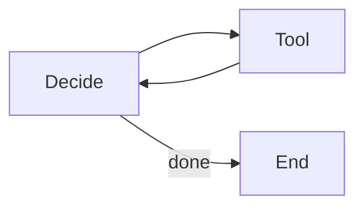
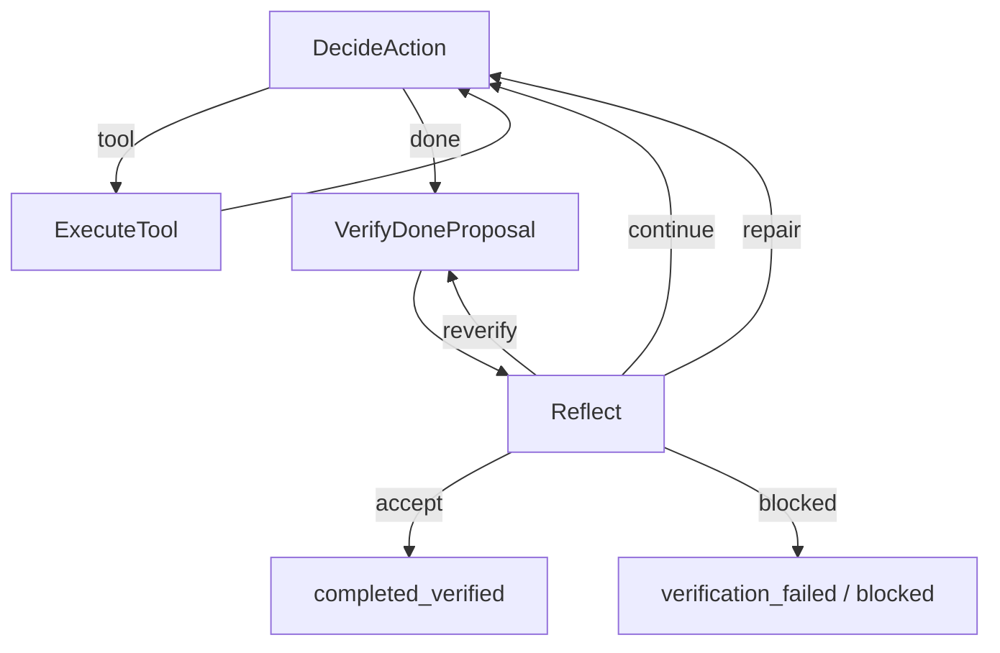

# PaperClaw v0.02：Verify 与 Reflection Gate 初学者学习笔记

> 面向对象：已经理解基本 Agent Loop，希望学习“证据驱动完成协议”和最小自纠错闭环的开发者  
> 分析版本：PaperClaw v0.02 主体提交 `9cca7a3ab407e49bb1564d68a8f91a619a42e420`  
> 前置版本：v0.01 收尾提交 `f1fab61264cd85710b1e7b9d9cbae2a557b01127`  
> 学习重点：**DoneProposal、Verify、Evidence、Reflection、Gate、失败闭环、Trace**

---

## 0. 先给结论：v0.02 解决了什么

v0.01 的 Agent 已经能：

```plain text
Reason → Act → Observation → Reason → done
```

但它有一个严重问题：

> `done` 基本上等于“模型说自己完成了”。

v0.01 的 verified 判断只要求：

1. 模型填写了 verification 文本；
2. History 中存在一个成功 Bash。

因此下面这种情况也可能被认为完成：

```plain text
写入 hello.py
运行 echo ok
模型说：验证成功
```

`echo ok` 没有验证 `hello.py`。

v0.02 将完成流程改为：

```plain text
模型提出 DoneProposal
        ↓
Runtime 构建 VerificationPlan
        ↓
Verify 执行确定性检查并生成 Evidence
        ↓
Reflection 只能根据 Evidence 做有界判断
        ↓
accept / continue / repair / reverify / blocked
```

核心原则：

> Verify 负责产生事实，Reflection 负责基于事实做决策。  
> Reflection 不能修改事实，也不能用“解释得很合理”替代验证。

---

# 第一部分：为什么 Agent 需要完成门槛

## 1. 模型自报完成为什么不可靠

大模型擅长生成看起来合理的文本，但它可能：

- 忘记执行测试；
- 混淆旧输出和新输出；
- 忽略失败命令；
- 把无关成功命令当验证；
- 修改文件后没有重新测试；
- 声称文件已写入，但真实文件内容不同；
- 把部分成功描述成全部成功。

模型的语言陈述不是客观证据。

例如：

```json
{
  "action": "done",
  "arguments": {
    "result": "所有测试已通过",
    "verification": "pytest 已成功"
  }
}
```

Runtime 不能仅凭这段 JSON 相信测试真的通过。

---

## 2. 什么叫 Gate

Gate 可以理解为“完成门”。

```plain text
模型想结束
    ↓
必须满足一组规则
    ↓
通过才能结束
```

在 v0.02 中，只有同时满足：

1. Verify 结果为 `passed`；
2. Reflection 决策为 `accept`；

Runtime 才会：

```plain text
stop_reason = completed_verified
```

---

## 3. Verify 和 Reflection 不是一回事

| 组件 | 主要问题 | 输入 | 输出 | 自由度 |
|---|---|---|---|---|
| Verify | 事实是什么 | 文件、History、命令结果 | Evidence / VerificationResult | 低 |
| Reflection | 下一步怎么做 | 任务、Plan、Result、近期 History | ReflectionDecision | 有限 |
| 模型 Done | 我认为做完了吗 | 当前 Prompt | DoneProposal | 高 |

### Verify 例子

```plain text
hello.py 是否存在？
hello.py 是否包含最后写入的内容？
文件 hash 是否一致？
最后一次修改之后是否运行了相关命令？
命令 exit code 是否为 0？
pytest 失败了几个？
```

### Reflection 例子

```plain text
证据是否足够接受完成？
失败后应继续、修复还是阻塞？
下一步最小动作是什么？
是否重复了同一种失败？
```

---

# 第二部分：v0.02 的整体架构

## 4. 控制流变化

### v0.01



### v0.02 Gate 开启



最关键的变化：

```plain text
done 不再直接连到 End
```

而是：

```plain text
done → Verify → Reflect → End 或继续
```

---

## 5. 为什么用 Feature Flag

CLI 新增：

```plain text
--enable-verification-gate
```

默认关闭。

### Gate 关闭

保留 v0.01 行为：

```plain text
done → 直接结束
```

### Gate 开启

启用：

```plain text
done_proposed → verify → reflect
```

### Feature Flag 的工程价值

1. 保持旧版本可复现；
2. 降低一次性大改风险；
3. 允许对比实验；
4. 旧测试继续运行；
5. 便于逐步灰度；
6. 出问题时可回退。

Agent Runtime 的核心路径变化很大时，Feature Flag 是常见做法。

---

# 第三部分：从 DoneAction 到 DoneProposal

## 6. 语义变化

v0.01：

```plain text
DoneAction = 最终完成
```

v0.02：

```plain text
DoneProposal = 模型提出“我认为可以完成”
```

结构：

```python
@dataclass
class DoneProposal:
    result: str
    claimed_verification: str = ""
    remaining_issues: list[str] = []
```

注意字段名：

```plain text
claimed_verification
```

它不是：

```plain text
verified_evidence
```

这里明确表达：

> 这是模型声称的验证，不是 Runtime 已确认的证据。

---

## 7. 为什么语义命名重要

在工程中，错误命名会导致错误使用。

如果仍叫：

```plain text
DoneAction
```

开发者容易默认：

```plain text
解析成功 = 已完成
```

改成：

```plain text
DoneProposal
```

能强迫后续代码思考：

```plain text
这只是提议，谁负责批准？
```

Agent 系统中的对象名称应区分：

- Intent；
- Proposal；
- Plan；
- Execution；
- Observation；
- Evidence；
- Decision；
- Final Result。

---

# 第四部分：Verification Contract

## 8. 五个核心数据对象

v0.02 新增：

1. `TaskClaim`
2. `VerificationCheck`
3. `VerificationPlan`
4. `VerificationEvidence`
5. `VerificationResult`

这五个对象形成：

```plain text
验收要求
  ↓
检查定义
  ↓
检查计划
  ↓
观察证据
  ↓
汇总结果
```

---

## 9. `TaskClaim`

```python
@dataclass
class TaskClaim:
    claim_id: str
    description: str
    checkable: bool
    required: bool
    source: ClaimSource
```

Claim 是一个“必须被证明或明确未覆盖的验收主张”。

例如：

```plain text
claim-file-exists:hello.py
```

描述：

```plain text
hello.py exists inside the workspace
```

### 字段解释

#### `claim_id`

机器可引用的稳定 ID。

#### `description`

人类可读说明。

#### `checkable`

当前 Runtime 是否有能力自动检查。

#### `required`

是否为完成任务的必要条件。

#### `source`

来源：

- `user`
- `inferred`
- `project_rule`

v0.02 当前大部分 Claim 来自 Runtime History 推断和项目规则。

---

## 10. 为什么 Claim 很重要

如果没有 Claim，Verify 只会收集零散检查结果。

有 Claim 后，系统可以回答：

- 哪些要求已通过；
- 哪些要求失败；
- 哪些要求没有覆盖；
- Reflection 是否删掉了失败要求；
- 完成结果是否满足 Definition of Done。

这为未来支持用户明确验收标准打下基础。

例如用户任务：

```plain text
创建 hello.py，输出 OK，并添加测试
```

未来可以拆成：

```plain text
C1: hello.py 存在
C2: 运行 hello.py 输出 OK
C3: 测试文件存在
C4: pytest 通过
```

---

## 11. `VerificationCheck`

```python
@dataclass
class VerificationCheck:
    check_id: str
    claim_ids: list[str]
    check_type: CheckType
    arguments: dict
    required: bool
```

Check 是一个确定性检查定义。

v0.02 支持的类型声明包括：

```plain text
file_exists
file_contains
file_hash
command
tests
history
```

当前真正落地的主要是：

- `file_exists`
- `file_contains`
- `file_hash`
- `history`

### 一个 Check 可以覆盖多个 Claim

数据模型允许：

```plain text
一个测试命令 → 覆盖多个验收 Claim
```

虽然 v0.02 基线大多是一对一，但这个设计为后续扩展保留了空间。

---

## 12. `VerificationPlan`

```python
@dataclass
class VerificationPlan:
    task_claims: list[TaskClaim]
    checks: list[VerificationCheck]
    generated_from: str
    created_after_step: int
```

Plan 是“本次完成提议要执行哪些检查”。

v0.02 的 Plan 不是由模型自由生成，而是 Runtime 基于 History 构建。

这是刻意选择。

### 为什么不让模型生成全部验证计划

如果模型既负责：

- 实现；
- 声称完成；
- 决定验收条件；
- 选择验证方式；
- 判断验证是否成功；

它可能自然地选择对自己有利的检查。

因此 v0.02 先从 Runtime 可控事实构造最小计划。

---

## 13. `VerificationEvidence`

```python
@dataclass
class VerificationEvidence:
    evidence_id: str
    check_id: str
    status: passed | failed | error | skipped
    observed: str
    source_tool: str | None
    source_step: int | None
    exit_code: int | None
    timestamp: datetime
```

Evidence 是实际观察到的事实。

例如：

```json
{
  "evidence_id": "ev-4",
  "check_id": "check-verification-command",
  "status": "passed",
  "observed": "{\"command\":\"python hello.py\",\"exit_code\":0}",
  "source_tool": "bash",
  "source_step": 2,
  "exit_code": 0,
  "timestamp": "..."
}
```

### Evidence 的核心约束

> Reflection 可以解释 Evidence，但不能修改 Evidence。

---

## 14. `VerificationResult`

```python
@dataclass
class VerificationResult:
    status: passed | failed | incomplete | error
    checks: list[VerificationEvidence]
    passed_claim_ids: list[str]
    failed_claim_ids: list[str]
    uncovered_claim_ids: list[str]
    verified_after_last_write: bool
    summary: str
```

### 四种状态

#### `passed`

所有必要 Claim 均有通过证据，且验证发生在最后一次修改之后。

#### `failed`

至少一个必要 Claim 有失败证据。

#### `incomplete`

没有明确失败，但存在：

- 未覆盖 Claim；
- 或没有最后修改后的有效验证。

#### `error`

验证系统本身出现错误。

---

# 第五部分：Verification Plan 如何构建

## 15. 基于 Runtime History，而不是模型自述

`build_verification_plan(shared)` 遍历：

```plain text
shared["history"]
```

它寻找成功的：

```plain text
file_write
file_edit
```

然后构建文件相关 Claim 和 Check。

---

## 16. 对 `file_write` 生成哪些检查

假设 History 中有：

```python
HistoryEntry(
    step=1,
    tool="file_write",
    arguments={
        "path": "hello.py",
        "content": "print('ok')"
    },
    result=ToolResult(ok=True, ...)
)
```

Plan 会生成：

### 16.1 文件存在 Claim

```plain text
claim-file-exists:hello.py
```

Check：

```plain text
file_exists hello.py
```

### 16.2 最新内容 Claim

```plain text
claim-file-contains:hello.py:1
```

Check：

```plain text
hello.py 是否包含 step 1 写入的 content
```

### 16.3 文件 hash Claim

```plain text
claim-file-hash:hello.py:1
```

Check：

```plain text
hello.py 当前字节 hash 是否与写入内容一致
```

---

## 17. 为什么同时检查 contains 和 hash

### `file_contains`

优点：

- 对人类易理解；
- 可以检查某段内容；
- 适合编辑操作。

缺点：

- 文件可能包含目标内容，但还多了错误内容；
- 不能证明完整文件一致。

### `file_hash`

优点：

- 可以证明完整文件与写入内容完全一致。

缺点：

- 对局部编辑不适用；
- 换行符可能受平台影响；
- 对格式化后的等价内容过于严格。

v0.02 的选择：

- `file_write`：contains + hash；
- `file_edit`：contains；
- 编辑后取消旧 hash 约束。

这说明验证设计需要与操作语义匹配。

---

## 18. 为什么只保留每个文件的最新内容检查

如果一个文件被多次修改：

```plain text
step 1: 写入 v1
step 3: 编辑为 v2
step 5: 编辑为 v3
```

完成时不应继续要求：

```plain text
文件仍包含 v1
文件仍包含 v2
```

而应验证最新状态。

因此实现使用：

```plain text
latest_content_check_by_path
latest_hash_check_by_path
```

为每个文件保留最新检查。

这是“状态最终值”与“历史中间值”的区别。

---

## 19. 项目规则 Claim：必须有相关验证命令

无论修改了什么，Plan 都会增加：

```plain text
claim-verification-command
```

描述：

```plain text
a relevant verification command ran after the last write and reported success
```

Check 类型：

```plain text
history
```

这不是检查新执行一个命令，而是检查 History 中是否已经有合格验证命令。

---

# 第六部分：相关命令和时序检查

## 20. 为什么“命令成功”还不够

下面命令都可能 exit code 0：

```plain text
echo ok
pwd
python -c "print('ok')"
```

但它们不一定验证刚修改的文件。

v0.02 用简单规则判断相关性：

```python
if "pytest" in command:
    relevant = True

if command contains any touched filename:
    relevant = True

otherwise:
    relevant = False
```

因此：

```plain text
python hello.py
```

与 `hello.py` 相关。

```plain text
pytest -q
```

视为测试命令。

```plain text
echo ok
```

不相关。

---

## 21. 为什么要检查验证时序

场景：

```plain text
step 1: 写 hello.py 为 v1
step 2: python hello.py，成功
step 3: 把 hello.py 改成 v2
step 4: done
```

step 2 的成功不能证明 step 3 修改后的版本正确。

因此 Verify 计算：

```plain text
last_write_step
```

只接受：

```plain text
bash.step >= last_write_step
```

并设置：

```plain text
verified_after_last_write
```

这是一条极其重要的 Agent 验证原则：

> Evidence 必须对应当前产物版本，而不是旧版本。

---

## 22. “已验证但失败”和“未验证”要区分

假设：

```plain text
pytest -q
exit_code = 1
```

这表示：

- 验证确实运行了；
- 但验证结果失败。

因此：

```plain text
verified_after_last_write = True
status = failed
```

而不是：

```plain text
verified_after_last_write = False
```

这两个概念不同：

| 情况 | 验证运行了吗 | 结果 |
|---|---:|---|
| 没运行测试 | 否 | incomplete / failed |
| 运行了测试，失败 | 是 | failed |
| 运行了测试，通过 | 是 | passed |

---

# 第七部分：命令元数据

## 23. BashTool 在 v0.02 增加了什么

v0.01 已保存：

- exit code；
- duration；
- timeout；
- truncated。

v0.02 增加更完整的 metadata：

```plain text
command
command_class
cwd
started_at
finished_at
exit_code
timed_out
duration_ms
truncated
```

超时时还包括：

```plain text
cleanup_failed
```

---

## 24. `command_class`

当前分类很小：

```plain text
包含 pytest → pytest
否则 → shell
```

虽然简单，但它体现了一个方向：

> Runtime 不应只保存命令字符串，还应保存对命令用途的结构化分类。

未来可以扩展：

```plain text
read
search
list
test
build
package
git
write
destructive
unknown
```

这些分类可以同时服务：

- Verify；
- Permission；
- Trace；
- UI；
- 费用预算；
- 风险策略。

---

## 25. pytest 摘要解析

v0.02 从 pytest 输出中尽量提取：

```plain text
passed_count
failed_count
skipped_count
duration_seconds
failed_test_names
```

例如：

```plain text
1 failed, 3 passed, 1 skipped in 0.34s
```

会被解析为：

```json
{
  "passed_count": 3,
  "failed_count": 1,
  "skipped_count": 1,
  "duration_seconds": 0.34,
  "failed_test_names": [
    "tests/test_app.py::test_fail"
  ]
}
```

### 为什么叫 best-effort

pytest 输出可能：

- 被截断；
- 使用插件改变格式；
- 颜色控制符；
- 版本格式不同；
- 中途崩溃；
- 没有正常 footer。

因此 Parser 不应该编造统计。

无法解析时保留：

```plain text
None
```

而不是猜数字。

---

# 第八部分：Verify Engine

## 26. Verify 执行过程

```plain text
读取 VerificationPlan
        ↓
逐个执行 Check
        ↓
生成 VerificationEvidence
        ↓
把 Evidence 映射回 Claim
        ↓
计算 passed / failed / uncovered
        ↓
生成 VerificationResult
```

---

## 27. 文件存在检查

```plain text
路径存在并且是文件 → passed
否则 → failed
```

---

## 28. 文件内容检查

```plain text
文件包含预期 substring → passed
否则 → failed
```

---

## 29. 文件 hash 检查

计算：

```plain text
sha256(file bytes)
```

与预期 hash 比较。

实现还处理了 Windows 换行转换问题。

因为：

```python
Path.write_text()
```

在文本模式下可能根据平台处理换行。

如果预期 hash 直接对原始 Python 字符串计算，可能与实际落盘字节不同。

因此 `_content_sha256_for_file_write()` 会按平台换行规则归一化。

这是一个典型的工程细节：

> 验证应该针对真实落盘结果，而不是只针对调用前的内存字符串。

---

## 30. History 检查

Verify 寻找：

```plain text
最后一次文件写/改之后
最近的一条
相关 Bash
```

然后把 Bash 的结构化摘要写入 Evidence。

如果找不到：

```plain text
status = failed
observed = no relevant verification command was found after the last write
```

如果找到但 exit code 非 0：

```plain text
status = failed
```

如果找到且成功：

```plain text
status = passed
```

---

## 31. VerificationResult 状态计算

简化逻辑：

```python
if failed_claim_ids:
    status = "failed"
elif uncovered_claim_ids or not verified_after_last_write:
    status = "incomplete"
else:
    status = "passed"
```

这里体现了：

- 失败优先；
- 没失败但证据不足，不能算通过；
- 只有全部覆盖且时序正确才算通过。

---

# 第九部分：Reflection Gate

## 32. Reflection 看什么

Reflection Prompt 只包含：

- 原始任务；
- VerificationPlan；
- VerificationResult；
- 最近 6 条 History。

它不依赖隐藏 Chain-of-Thought。

它也不能自行发明新的 Evidence。

Prompt 规则包括：

```plain text
Use only the supplied evidence.
Do not relax required claims.
Prefer the smallest next step.
If evidence is sufficient, accept.
If the same failure keeps repeating, block.
```

---

## 33. ReflectionDecision

```python
@dataclass
class ReflectionDecision:
    decision: accept | continue | repair | reverify | blocked
    evidence_ids: list[str]
    failed_claim_ids: list[str]
    next_action: str | None
    reason_code: str
    confidence: float
```

---

## 34. 五种决策

### `accept`

证据充分，可以完成。

### `continue`

任务还需要继续一般行动。

### `repair`

当前实现有问题，应进行最小修复。

### `reverify`

实现可能已经正确，但需要重新运行 Verify。

### `blocked`

无法在当前边界内继续，或重复失败达到上限。

---

## 35. 为什么通过时不再调用模型 Reflection

如果 Verify 已经是：

```plain text
passed
```

Runtime 直接生成：

```python
ReflectionDecision(
    decision="accept",
    evidence_ids=[...],
    reason_code="verification_passed",
    confidence=0.99
)
```

这样做可以：

- 节省一次模型调用；
- 避免模型把成功结果反而否决；
- 增强确定性；
- 减少成本；
- 保持完成路径简单。

Reflection 模型主要用于处理失败和不完整状态。

---

# 第十部分：Reflection 防篡改验证

## 36. 为什么 Reflection 输出还要再校验

即使 Prompt 说：

```plain text
不要伪造证据
```

模型仍可能输出错误 JSON 或不合规决策。

因此 Parser 后还有：

```plain text
validate_reflection_decision()
```

这叫 **双层约束**：

```plain text
Prompt 软约束
+
Runtime 硬校验
```

安全和正确性不能只依赖 Prompt。

---

## 37. 禁止引用未知 Evidence

如果 Reflection 输出：

```json
{
  "evidence_ids": ["ev-999"]
}
```

而 Verify 只生成：

```plain text
ev-1
ev-2
ev-3
```

Validator 拒绝。

原因：

> Reflection 不能伪造不存在的证据。

---

## 38. Verify 未通过时禁止 accept

如果：

```plain text
verification_result.status = failed
```

而 Reflection 输出：

```plain text
decision = accept
```

Validator 拒绝。

原因：

> Reflection 不能投票推翻确定性 Verify。

---

## 39. 不能删减 failed_claim_ids

假设 Verify 失败 Claim：

```plain text
C2
C4
```

Reflection 如果只返回：

```plain text
C2
```

Validator 拒绝。

原因：

> 模型不能通过省略失败项，让问题看起来变少。

---

## 40. Reflection 不能直接修改什么

它不能修改：

- History；
- VerificationPlan；
- VerificationEvidence；
- ToolResult；
- failed claims。

它只能产生一个新的 Decision。

这是“事实”和“判断”分层的核心。

---

# 第十一部分：有界 Reflection

## 41. 为什么 Reflection 也可能死循环

失败后：

```plain text
Reflect → repair → Decide → done → Verify → Reflect
```

如果模型一直做无效修复，就可能循环。

v0.02 使用两种限制。

---

## 42. 最大 Reflection 轮数

State 中：

```plain text
max_reflection_rounds = 2
```

超过上限：

```plain text
decision = blocked
reason_code = reflection_limit
```

---

## 43. Failure Signature

失败签名：

```plain text
verification status
+
failed_claim_ids
+
uncovered_claim_ids
```

例如：

```plain text
failed|claim-verification-command|
```

如果连续出现相同签名：

```plain text
failure_signature_count += 1
```

达到上限后：

```plain text
blocked
reason_code = repeated_failure
```

### 为什么签名比只数轮数更好

只数轮数不能区分：

- 是否真的有新进展；
- 是否换了失败类型；
- 是否修复了部分问题。

Failure Signature 能识别“同一种失败重复发生”。

---

# 第十二部分：Node 级实现

## 44. `DecideActionNode` 的变化

v0.01 解析到 done 后：

```plain text
直接结束
```

v0.02 解析到 `DoneProposal` 后：

1. 写入 `shared["done_proposal"]`；
2. 保存模型声称的结果；
3. 发出 `done_proposed`；
4. 返回 `"done"`；
5. Flow 根据 Feature Flag 决定：
   - 直接结束；
   - 或进入 Verify。

---

## 45. `VerifyDoneProposalNode`

### `prep`

- 取得 DoneProposal；
- 构建 VerificationPlan。

### `exec`

当前只透传 Plan。

### `post`

- 保存 Plan；
- 发出 plan/start 事件；
- 执行 Verify；
- 保存 Result；
- 发出每条 Evidence；
- 发出 completed 事件；
- 进入 Reflect。

严格来说，当前 Verify 的主要执行发生在 `post()`，未来可以继续拆分。

---

## 46. `ReflectNode`

### `prep`

1. 没有 VerificationResult → 内部错误；
2. Result passed → 直接构造 accept；
3. 增加 Reflection 轮数；
4. 检查轮数上限；
5. 注册 Failure Signature；
6. 检查重复失败；
7. 构造 Reflection Prompt。

### `exec`

- 如果 prep 已经返回 Decision，直接使用；
- 否则调用模型。

### `post`

- 解析 Reflection JSON；
- 运行防篡改 Validator；
- 保存 Decision；
- 根据 Decision 路由。

---

## 47. Reflection 路由

```plain text
accept
  → stop_reason = completed_verified
  → done

repair / continue
  → 清空 stop_reason
  → 返回 DecideAction

reverify
  → 返回 VerifyDoneProposal

blocked
  → verification_failed 或 blocked_environment
  → done
```

---

# 第十三部分：State 的变化

## 48. v0.02 新增状态

```plain text
run_id
event_sequence
trace_events
done_proposal
verification_plan
verification_result
reflection_decision
reflection_round_count
max_reflection_rounds
last_failure_signature
failure_signature_count
verification_gate_enabled
```

这些状态可以按职责分组。

### Trace

```plain text
run_id
event_sequence
trace_events
```

### 完成协议

```plain text
done_proposal
verification_plan
verification_result
reflection_decision
```

### 循环治理

```plain text
reflection_round_count
max_reflection_rounds
last_failure_signature
failure_signature_count
```

---

## 49. 为什么把这些状态放进 shared

因为不同 Node 需要共享：

- Decide 产生 Proposal；
- Verify 读取 Proposal 和 History；
- Reflect 读取 Result；
- CLI 输出最终结构；
- Trace 记录全部过程。

v0.02 尚未引入数据库，因此 shared 是本次运行的权威状态。

---

# 第十四部分：Trace 与可观察性

## 50. v0.02 的内存 Trace

每个事件包含：

```json
{
  "run_id": "run-...",
  "sequence": 7,
  "step": 3,
  "event_type": "verification.completed",
  "timestamp": "...",
  "payload": {}
}
```

主要事件：

```plain text
done.proposed
verification.planned
verification.started
verification.check.completed
verification.completed
reflection.started
reflection.completed
run.completed
run.blocked
```

---

## 51. 为什么需要 sequence

Timestamp 可能：

- 精度有限；
- 多个事件时间相同；
- 跨系统时钟不一致。

`sequence` 提供本次 run 内的稳定顺序。

---

## 52. 为什么 Event Type 使用层级命名

例如：

```plain text
verification.check.completed
```

比：

```plain text
check_done
```

更适合后续：

- 过滤；
- 聚合；
- UI 分组；
- 事件总线；
- 监控指标；
- OpenTelemetry 风格映射。

---

## 53. 内存 Trace 的局限

当前：

- 进程退出后丢失；
- 不支持数据库查询；
- 不支持重放；
- 不支持跨 Session；
- 不支持敏感字段脱敏；
- 不支持权限分级；
- 不支持大规模日志治理。

但对 v0.02 来说，它足以支持：

- 调试；
- 导出 artifact；
- 测试；
- 对比成功和失败路径。

---

# 第十五部分：三个完整场景

## 54. 场景一：正确完成

任务：

```plain text
创建 hello.py 并运行验证
```

流程：

```plain text
step 1 file_write hello.py
step 2 bash python hello.py
step 3 done proposal
        ↓
Verify:
  file exists = passed
  file contains = passed
  file hash = passed
  relevant command after write = passed
        ↓
VerificationResult = passed
        ↓
Reflection = accept
        ↓
completed_verified
```

---

## 55. 场景二：`echo ok` 冒充验证

流程：

```plain text
step 1 file_write hello.py
step 2 bash echo ok
step 3 done proposal
```

Verify：

```plain text
file exists = passed
file contains = passed
file hash = passed
verification command = failed
```

原因：

```plain text
echo ok 与 hello.py 不相关
```

Result：

```plain text
status = failed
failed_claim_ids = [claim-verification-command]
```

Reflection 只能：

- repair；
- continue；
- reverify；
- blocked。

不能 accept。

---

## 56. 场景三：修改后使用旧验证

流程：

```plain text
step 1 写入 v1
step 2 运行程序，成功
step 3 修改为 v2
step 4 done
```

Verify：

```plain text
last_write_step = 3
最后相关 Bash 在 step 2
```

因此：

```plain text
verified_after_last_write = false
```

Result 失败。

模型必须重新运行：

```plain text
python hello.py
```

---

# 第十六部分：失败后修复闭环

## 57. 最小自纠错流程

示例：

```plain text
step 1: file_write hello.py
step 2: bash echo ok
step 3: done
```

Verify 失败。

Reflection：

```json
{
  "decision": "repair",
  "evidence_ids": ["ev-1", "ev-2", "ev-3", "ev-4"],
  "failed_claim_ids": ["claim-verification-command"],
  "next_action": "运行 python hello.py",
  "reason_code": "verification_failed",
  "confidence": 0.95
}
```

Flow 回到 DecideAction。

然后：

```plain text
step 4: bash python hello.py
step 5: done
```

再次 Verify：

```plain text
passed
```

最终：

```plain text
completed_verified
```

这就是 v0.02 的最小自纠错闭环。

---

# 第十七部分：测试设计

## 58. 新增测试重点

v0.02 将测试从“Agent 能否行动”扩展到：

```plain text
Agent 能否被证据约束
```

重点包括：

- 无关成功命令不能通过；
- 修改后旧验证不能通过；
- pytest 失败不能 accept；
- Reflection 能请求 repair；
- repair 后重新验证可以通过；
- 相同失败重复出现会阻塞；
- 未知 evidence 被拒绝；
- failed claims 不能被删减；
- Gate 关闭时 v0.01 兼容路径仍通过。

---

## 59. 测试：相关命令成功

```plain text
file_write hello.py
bash python hello.py
done
```

断言：

```plain text
stop_reason == completed_verified
verification_result.status == passed
verified_after_last_write == true
reflection_decision.decision == accept
```

---

## 60. 测试：无关成功命令

```plain text
file_write hello.py
bash echo ok
done
```

断言：

```plain text
stop_reason == verification_failed
failed_claim_ids 包含 claim-verification-command
```

---

## 61. 测试：Reflection repair 后成功

动作序列：

```plain text
write
echo ok
done
reflect repair
python hello.py
done
```

断言：

```plain text
completed_verified
```

这类测试证明 Flow 路由，而不只测试单个函数。

---

## 62. 测试：重复失败上限

动作序列：

```plain text
write
echo ok
done
repair
done
```

由于没有真正执行新的相关命令，Failure Signature 重复。

Runtime 生成：

```plain text
blocked
```

---

## 63. 测试：pytest 摘要

输入：

```plain text
1 failed, 1 passed, 1 skipped in 0.34s
```

断言提取：

```plain text
failed_count = 1
passed_count = 1
skipped_count = 1
duration_seconds = 0.34
failed_test_names = [...]
```

---

## 64. v0.02 测试结果

主体提交记录：

```plain text
44 passed
1 skipped
```

真实模型受控演示完成：

```plain text
失败 pytest
→ 修复
→ 重跑 pytest
→ Verify passed
→ Reflection accept
→ completed_verified
```

---

# 第十八部分：v0.02 最重要的 Agent 设计思想

## 65. 模型不是最终裁判

模型可以：

- 提出；
- 规划；
- 解释；
- 建议下一步。

但完成事实应来自 Runtime 和工具。

---

## 66. 事实、判断和动作要分层

推荐分层：

```plain text
Action
  模型想做什么

Observation
  工具实际返回什么

Evidence
  哪些 Observation 能证明哪些 Claim

Decision
  根据 Evidence 下一步怎么做
```

如果把它们混在一个自由文本里，系统会难以审计。

---

## 67. Prompt 约束不等于 Runtime 约束

Prompt：

```plain text
不要伪造 Evidence
```

只能降低错误概率。

真正保证来自：

```python
validate_reflection_decision()
```

原则：

> 重要不变量必须写进代码，而不应只写进 Prompt。

---

## 68. Evidence 必须有来源

Evidence 保存：

- source_tool；
- source_step；
- exit_code；
- timestamp。

这样才能回答：

```plain text
这条结论是从哪里来的？
什么时候发生的？
对应哪次工具执行？
```

---

## 69. Evidence 必须对应当前版本

“验证过”不够。

还要问：

```plain text
是在最后一次修改之后验证的吗？
```

这是 Coding Agent、数据分析 Agent、科研 Agent 都必须处理的问题。

---

## 70. Reflection 必须有边界

无限自我反思可能：

- 消耗成本；
- 产生幻觉；
- 重复失败；
- 改变验收标准；
- 变成无效长文本。

因此 Reflection 应该：

- 使用结构化输入；
- 使用结构化输出；
- 有轮数上限；
- 有重复失败检测；
- 不能修改 Evidence；
- 优先最小下一步。

---

# 第十九部分：v0.02 仍然有哪些不足

## 71. Claim 主要来自操作历史，而不是完整用户需求

当前 Plan 重点验证：

```plain text
Agent 写过或改过的文件
```

但用户任务中的自然语言约束可能没有被完整拆解。

例如：

```plain text
实现一个性能至少提升 20% 的算法
```

当前 Verify 不会自动理解和验证“提升 20%”。

未来需要：

- 用户验收标准解析；
- 项目规则加载；
- 显式 DoD；
- domain-specific verifier；
- 人工确认。

---

## 72. 命令相关性判断较粗糙

当前规则：

```plain text
pytest → 相关
命令包含文件名 → 相关
```

可能出现误判。

例如：

```plain text
python -c "print('hello.py')"
```

包含文件名，但没有执行文件。

未来可以：

- 命令 AST 解析；
- shell tokenization；
- 识别解释器和目标文件；
- 测试框架插件；
- 项目命令白名单；
- 运行产物关联。

---

## 73. Verify 没有独立执行新测试

当前主要检查 History 中已有命令。

这意味着模型仍需主动运行测试。

未来 Verify 可以根据 Plan：

- 调用测试工具；
- 运行项目预定义命令；
- 进入只读验证 Sandbox；
- 生成临时验证任务；
- 对结果签名。

---

## 74. 文件检查没有统一复用路径策略

文件工具通过专门的 workspace path resolver。

Verify 中的文件路径检查使用：

```python
(workspace / relative_path).resolve()
```

更成熟实现应统一复用安全路径组件，并显式检查：

```plain text
resolved path 是否仍位于 workspace
```

避免验证层和工具层的路径语义不一致。

---

## 75. Reflection 输出错误会直接 internal_error

当前非法 Reflection 输出会停止。

未来可以考虑：

- 有界 Reflection JSON repair；
- 确定性 fallback 决策；
- 默认 blocked；
- 专门错误事件；
- 模型重试一次。

但不能为了“尽量继续”而削弱证据约束。

---

## 76. 没有持久 Trace 和 Session

v0.02 Trace 只在内存。

不能：

- 断点恢复；
- 跨运行比较；
- 回放；
- 长任务；
- 团队审计；
- 统计评测。

---

## 77. Bash 仍可绕过文件工具策略

即使 Verify 更强，执行权限问题仍存在。

Verify 解决：

```plain text
是否真的完成
```

Permission 解决：

```plain text
是否允许这样做
```

两者不是一回事。

---

# 第二十部分：Verify、Reflection、Permission 的区别

| 组件 | 解决的问题 |
|---|---|
| Permission | 这个动作允许执行吗 |
| Tool Validation | 参数是否合法 |
| Sandbox | 即使执行，能影响哪些资源 |
| Verify | 动作之后，目标真的达成了吗 |
| Reflection | 根据 Verify 结果，下一步怎么办 |
| Eval | 大量运行中，系统整体表现如何 |

不要把这些模块混成一个“大模型判断器”。

---

# 第二十一部分：建议的代码阅读顺序

## 78. 第一遍：看流程变化

1. `agent/flow.py`
2. `agent/nodes.py`

重点：

```plain text
done 如何从终点改为 Gate 入口
```

---

## 79. 第二遍：看数据契约

1. `agent/verification.py`
2. `agent/state.py`

重点：

- Claim；
- Check；
- Plan；
- Evidence；
- Result；
- Decision。

---

## 80. 第三遍：看 Verify

1. `agent/verify.py`
2. `tools/bash.py`

重点：

- Plan 如何从 History 构建；
- 文件检查；
- 时序；
- 相关命令；
- pytest 摘要；
- metadata。

---

## 81. 第四遍：看 Reflection

1. `agent/reflect.py`
2. `agent/parser.py`
3. `agent/nodes.py` 中 `ReflectNode`

重点：

- Prompt 边界；
- Decision Parser；
- Runtime Validator；
- 路由；
- Failure Signature。

---

## 82. 第五遍：看 Trace 和测试

1. `agent/events.py`
2. `tests/unit/test_verification_contracts.py`
3. `tests/unit/test_verify_engine.py`
4. `tests/integration/test_minimal_react_loop.py`
5. `artifacts/v0_02/verify_reflection_trace.json`

---

# 第二十二部分：动手练习

## 83. 练习一：增加 `command_output_contains` Check

目标：

```plain text
不仅要求命令成功，还要求输出包含用户指定文本
```

数据结构：

```json
{
  "check_type": "command_output_contains",
  "arguments": {
    "source_step": 2,
    "substring": "PaperClaw v0.02 OK"
  }
}
```

思考：

- 如何绑定到具体 HistoryEntry；
- 输出被截断时怎么办；
- 大小写是否敏感；
- 是否需要正则。

---

## 84. 练习二：从任务文本提取显式 Claim

任务：

```plain text
创建 hello.py，输出 OK，并保证 pytest 通过
```

尝试生成：

```plain text
C1 hello.py exists
C2 hello.py execution outputs OK
C3 pytest passes
```

注意：

- 模型生成 Claim 后仍需 Runtime 校验；
- 用户原文必须保留；
- 不确定 Claim 应标为 inferred；
- 不应让模型偷偷降低要求。

---

## 85. 练习三：让 Verify 主动运行只读测试

设计一个：

```plain text
VerificationToolRunner
```

约束：

- 只允许运行测试类命令；
- 固定 cwd；
- 禁止写操作；
- 超时；
- 输出截断；
- 记录完整 metadata；
- 与原 Agent Bash History 区分。

---

## 86. 练习四：改进命令分类

至少支持：

```plain text
pytest
python_file
build
git_read
git_write
package_install
destructive
unknown
```

不要只使用简单字符串包含。

可以学习：

- `shlex`；
- PowerShell Parser；
- AST；
- 命令 token；
- 重定向和管道。

---

## 87. 练习五：增加 Evidence Provenance

为 Evidence 增加：

```plain text
run_id
artifact_path
artifact_hash
producer
verification_version
```

思考：

- Evidence 是否可跨 Session 复用；
- 文件变化后旧 Evidence 如何失效；
- 如何防止 Trace 被修改。

---

## 88. 练习六：设计 `human_review` 决策

增加：

```plain text
decision = human_review
```

适用：

- Verify 无法自动检查；
- 高风险修改；
- 环境缺少依赖；
- 用户要求人工确认；
- 证据矛盾。

需要设计：

- 暂停状态；
- 恢复入口；
- 人工输入契约；
- Trace；
- 超时和取消。

---

# 第二十三部分：常见错误

## 89. 错误一：让 Reflection 自己运行任意工具

如果 Reflection 直接拥有全部工具，它可能：

- 修改 Evidence 对应的文件；
- 边验证边改；
- 绕过 Verify；
- 产生不可审计路径。

更清晰的设计是：

```plain text
Reflection 只做决策
→ 决策路由回 Agent 或 Verify
```

---

## 90. 错误二：Verify 仍然使用模型自由文本

如果 Verify 只是问模型：

```plain text
请判断任务是否完成
```

那仍然是 LLM-as-a-Judge，不是客观验证。

LLM Judge 可以辅助，但不应替代：

- exit code；
- 文件；
-测试；
- hash；
- 数据库事实；
- API 返回。

---

## 91. 错误三：测试通过就自动认为用户需求全部满足

测试可能不完整。

因此需要：

```plain text
tests passed
```

和：

```plain text
all required claims covered
```

两个维度。

---

## 92. 错误四：失败后让模型重新定义 Claim

模型可能把：

```plain text
性能提升 20%
```

改成：

```plain text
程序能够运行
```

然后宣布通过。

Claim 一旦进入验收协议，应由：

- 用户；
- 项目规则；
- 受控 Planner；

决定，Reflection 不能随意删除。

---

## 93. 错误五：没有区分旧 Evidence 和当前 Artifact

文件修改后，旧测试结果可能失效。

必须记录：

- step；
- artifact version；
- hash；
- timestamp；
- last write。

---

# 第二十四部分：面试式问题

## 94. 为什么 `DoneProposal` 比 `DoneAction` 更合理

因为模型只能提出完成意图，最终完成必须由 Runtime Gate 决定。

它把“模型判断”和“系统事实”分开。

---

## 95. Verify 为什么应尽量确定性

确定性检查：

- 可复现；
- 可测试；
- 可审计；
- 低成本；
- 不容易被 Prompt Injection 影响。

LLM 可以帮助生成验证计划，但执行和事实确认应尽量确定性。

---

## 96. Reflection 为什么不能修改 Evidence

否则模型可以通过重写证据，让失败变成功。

正确模式：

```plain text
Evidence immutable
Decision append-only
```

---

## 97. 为什么要保留 `uncovered_claim_ids`

没有失败不等于成功。

某些必要要求可能根本没有被检查。

`uncovered` 能表达：

```plain text
系统不知道
```

而不是错误地归为 passed。

---

## 98. 为什么 Failure Signature 有用

它能检测：

```plain text
同一种失败是否在重复
```

比单纯总轮数更接近真实进展判断。

---

## 99. Verify 和 Eval 有什么不同

Verify：

```plain text
判断一次具体 Run 是否满足完成条件
```

Eval：

```plain text
在一组任务上统计 Agent 的整体性能
```

例如：

- 成功率；
- 平均步骤；
- Token；
- 修复次数；
- 假完成率；
- Permission 拒绝率。

---

## 100. v0.02 为什么仍然是单 Agent

Verify 和 Reflection 是 Runtime 角色，不一定需要独立 Agent。

先在单 Agent 中建立：

- Evidence；
- Gate；
- Retry；
- Trace；

比直接增加多个聊天角色更重要。

---

# 第二十五部分：核心术语表

| 术语 | 含义 |
|---|---|
| DoneProposal | 模型提出的完成声明，不是最终完成 |
| Claim | 需要被证明的验收主张 |
| Check | 对 Claim 执行的检查定义 |
| VerificationPlan | 本轮完成提议的验证工作列表 |
| Evidence | Verify 产生的客观观察记录 |
| VerificationResult | Evidence 汇总后的通过、失败或不完整状态 |
| Reflection | 基于 Evidence 决定下一步 |
| Gate | 完成前必须通过的门槛 |
| Provenance | Evidence 的来源信息 |
| Stale Verification | 产物修改后仍使用旧验证结果 |
| Failure Signature | 用于识别重复失败的稳定签名 |
| Bounded Reflection | 有轮数和停止规则的反思 |
| Feature Flag | 控制新路径是否启用的开关 |
| Immutable Evidence | Reflection 不可修改的证据 |
| completed_verified | Verify 通过且 Reflection 接受后的完成状态 |
| uncovered claim | 必须验收但没有证据覆盖的 Claim |

---

# 第二十六部分：v0.02 最值得学的十二点

1. `done` 应该是 Proposal，不应天然等于完成。
2. 模型自述不能作为客观 Evidence。
3. 完成协议应拆成 Claim、Check、Evidence、Result。
4. Verify 负责事实，Reflection 负责决策。
5. Reflection 不能推翻失败的确定性 Verify。
6. Prompt 约束必须由 Runtime Validator 加固。
7. Evidence 应记录来源、步骤、时间和 exit code。
8. 验证必须发生在最后一次修改之后。
9. “验证失败”和“没有验证”是两种状态。
10. Reflection 和重试必须有上限。
11. 重复 Failure Signature 应触发阻塞。
12. Feature Flag 能保护旧路径并支持渐进演进。

---

# 附录 A：v0.01 → v0.02 文件变化概览

v0.02 主体提交相对 v0.01：

- 修改核心 Agent Flow、Node、Parser、State；
- 新增 Verify Contract；
- 新增 Verify Engine；
- 新增 Reflection 模块；
- 扩展 Bash metadata；
- 增加 Trace；
- 增加 CLI Gate 开关；
- 新增 Verification 单元测试；
- 扩展 Agent 集成测试；
- 保留 v0.01 兼容路径。

关键新增文件：

```plain text
src/paperclaw/agent/verification.py
src/paperclaw/agent/verify.py
src/paperclaw/agent/reflect.py
tests/unit/test_verification_contracts.py
tests/unit/test_verify_engine.py
artifacts/v0_02/verification_contract.md
artifacts/v0_02/verify_reflection_trace.json
```

---

# 附录 B：本版本源码索引

## 核心实现

```plain text
src/paperclaw/agent/flow.py
src/paperclaw/agent/nodes.py
src/paperclaw/agent/parser.py
src/paperclaw/agent/state.py
src/paperclaw/agent/events.py
src/paperclaw/agent/verification.py
src/paperclaw/agent/verify.py
src/paperclaw/agent/reflect.py
src/paperclaw/tools/bash.py
src/paperclaw/cli.py
```

## 测试

```plain text
tests/integration/test_minimal_react_loop.py
tests/unit/test_verification_contracts.py
tests/unit/test_verify_engine.py
tests/unit/test_parser_registry.py
```

## 交付记录

```plain text
artifacts/v0_02/implementation_summary.md
artifacts/v0_02/verification_contract.md
artifacts/v0_02/test_report.md
artifacts/v0_02/failure_cases.md
artifacts/v0_02/verify_reflection_trace.json
artifacts/v0_02/real_demo_state.json
```

---

# 附录 C：参考版本

- 仓库：`https://github.com/ZyfNO2/PaperClaw`
- v0.01 基线：`f1fab61264cd85710b1e7b9d9cbae2a557b01127`
- v0.02 主体提交：`9cca7a3ab407e49bb1564d68a8f91a619a42e420`
- v0.02 收尾提交：`bda276b98cd97111025133ae1d5a990c210d8aef`
- v0.02 测试基线：`44 passed, 1 skipped`
